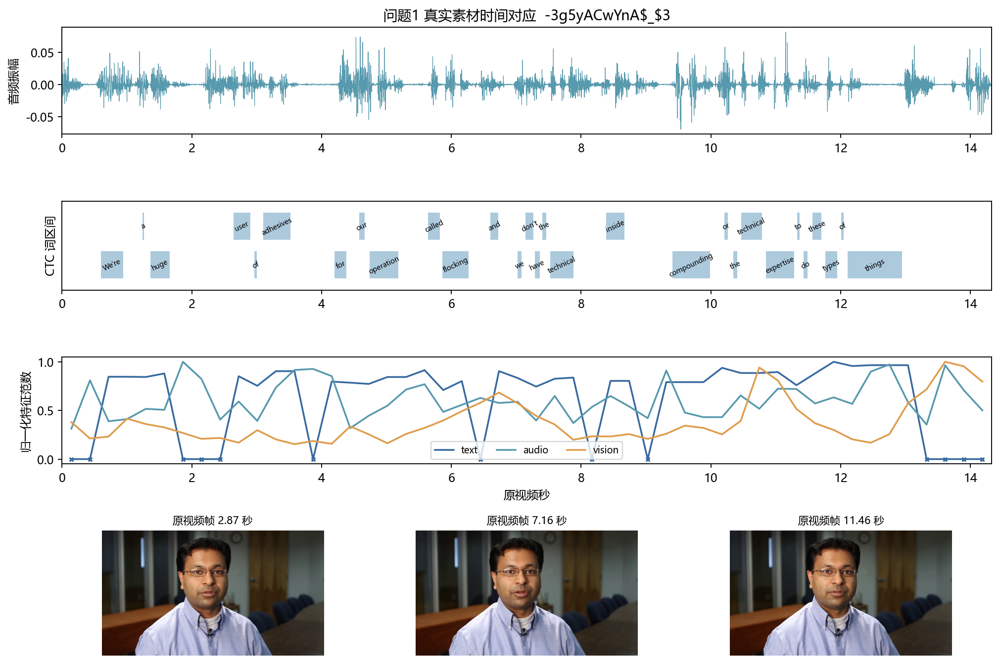
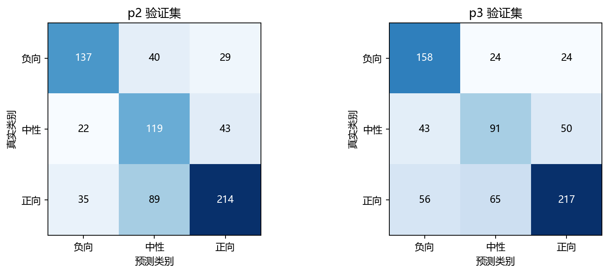
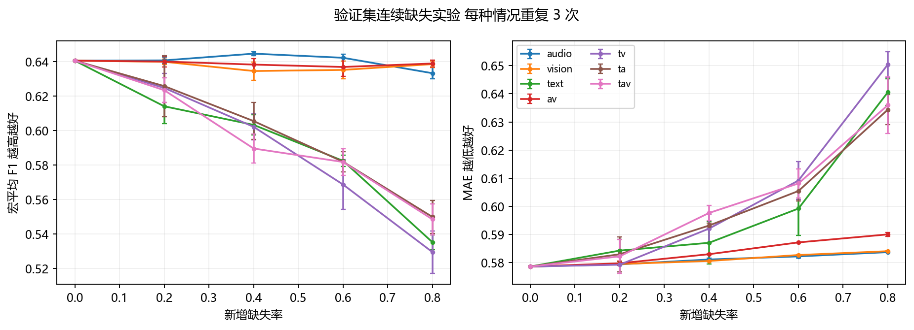

# 基于有效位置掩码和输入扰动解释的多模态情感预测

## 摘要

针对原始视频时序组织、局部模态缺失和预测依据复核三个问题，建立以可核验输入接口为基础的建模流程。问题1使用冻结 BERT、声学描述符和视觉像素网格描述符，并用冻结语音识别模型的 CTC 强制对齐结果将词映射到物理时间窗；完整保存100条样本及其有效掩码。问题2区分填充位置和观测缺失，通过模态专属 Transformer、有效比例门控与人工遮蔽重建学习三分类及强度回归。问题3采用输入删除实验估计模态和局部片段对预测的作用，将关键位置映射回词区间。模型仅使用附件2训练集学习情感参数，验证集选择训练轮次与决策偏置，独立测试集用于最终评价。问题2测试集宏平均 F1 为 0.6485、MAE 为 0.6145；问题3相应为 0.5874 与 0.6322。自动时间定位和删除作用都存在解释边界，因此另行报告对齐质量与配对删除检验。

关键词：多模态情感预测；有效掩码；连续缺失；CTC 时间对齐；输入扰动

## 一 问题分析与数据约定

附件1为100个视频片段、来自37个原视频；附件2按官方划分使用训练3395条、验证728条、测试727条；附件3含30个无标签缺失样本，附件4含20个无标签解释样本。全程使用 aligned 版本。标签定义为 y<0 负向、y=0 中性、y>0 正向，回归范围为[-3,3]。正文主报告三分类 Accuracy 和宏平均 F1；CSV中的辅助二分类将零归入非负类。

预训练 BERT 和 wav2vec2 仅作冻结特征提取与时间定位，不在额外情感数据集上训练或微调。问题1自建的74维音频和35维视觉特征，与附件2同维但定义不同，不能宣称等价于其官方特征，故分别进行评估。问题2和问题3直接读取附件2的数值特征；附件3的整数 text_bert 通过相同 BERT 的最后一层直接编码。8条训练或验证样本的接口核查中，直接编码与官方 text 的 RMSE 约为10⁻⁶；沿词轴插值会破坏这一对应。

主要假设为：附件2 aligned 三模态的位置与有效文本词元相对应；给定转写描述对应音轨；人工连续遮蔽能够近似局部信息不可用。前两项通过字段核对、词元编号比对和对齐质量记录检查；第三项仍有外部有效性局限。音频噪声与遮挡也可能造成非零损坏，本研究的置零实验不能覆盖全部真实故障。

## 二 问题1 特征提取与物理时间对齐

### 2.1 特征定义

文本使用冻结 bert-base-uncased 的768维最后层隐状态。对转写的每个词，依据字符偏移聚合其 BERT 子词。音频以16 kHz单声道解码，窗长25 ms、步长10 ms，构造 MFCC 及一二阶差分39维、对数能量及差分与过零率3维、对数基频及一二阶差分3维、谱形7维、谱对比7维、色度12维、谱统计3维，共74维。音高在无声或噪声区可能不可靠，相关输出不解释为精确生理测量。

视觉以10 fps抽帧并检测人脸，使用样本内检测框的中位数形成固定裁剪区域，缩放至56×40灰度图。以有效帧的逐像素中位数图为参考，计算7×5网格内平均绝对像素差，并以90分位值归一化、截断到[0,5]。未检出人脸的帧不进入时间窗均值。该35维量是外观变化描述符，不能等同于面部动作单元或精确表情强度；头动和光照仍会影响它。

### 2.2 对齐模型与存储

对冻结 wav2vec2-base-960h 在16 kHz音轨上的 CTC 对数概率，建立插入 blank 的字符状态序列。动态规划递推为 D(t,s)=log pₜ(cₛ)+max(D(t−1,s),D(t−1,s−1),D(t−1,s−2))，跨两状态转移仅在非 blank 且标签不重复时允许。回溯最优单调路径获得词的起止区间。数字逐位展开并保留原文本字符偏移，可能与真实读法不同，列为自动对齐局限。

对视频时长T建立50个物理时间窗 Iⱼ=[jT/50,(j+1)T/50)。音视频特征对落入该窗且有效的帧取均值。文本按词区间与时间窗的交叠时长加权：xⱼᵗ=Σᵢ|Iⱼ∩Wᵢ|hᵢ / Σᵢ|Iⱼ∩Wᵢ|。无有效帧或无交叠词的窗为零，同时有效掩码为0；不通过重复特征伪造观测。这里50个时间窗与附件2的50个词元存储位置是两种接口。

每条NPZ保留 text(50,768)、audio(50,74)、vision(50,35)，三类mask，51个time_edges和6项meta（音频有效时长、音频帧数、视频帧数、词数、标签、人脸检出比例）；schema_version 为 physical_time_bins_v2。原始标签不改动，失败样本仍保留并记录原因。本次100条处理异常数为 0。有效时长由实际16 kHz解码音轨计算，范围 2.228～29.110 秒；题面描述的时长范围与这一测量口径不同，本研究保留实测值，不修改源文件。

### 2.3 典型样本和有效性检查

典型样本编号为 -3g5yACwYnA$_$3，转写为“We're a huge user of adhesives for our operation, called flocking, and we don't have the technical inside compounding or the technical expertise to do these types of things.”。下图同时展示音频波形、自动词区间、时间窗特征范数和原视频帧，零范数及叉号提示该窗没有相应观测。时间定位为自动估计，尚未逐词人工核验。

对100条样本，以原视频video_id为分组，使用随机种子2026、2027、2028的五折 StratifiedGroupKFold。每折仅在训练折拟合标准化、逻辑回归和Ridge，分类C=0.3，回归α=10；同一原视频不会同时进入训练与验证。以下为三次完整折外预测指标的平均，误差条展示不同分组种子的标准差，不解释为独立置信区间。

| feature   | acc                 | f1_macro            | mae                | pearson              |
|:----------|:--------------------|:--------------------|:-------------------|:---------------------|
| audio     | 0.48666666666666664 | 0.40612619445409437 | 0.9039640132586162 | -0.10857777745570603 |
| fusion    | 0.6066666666666666  | 0.4492148926302031  | 0.6846772451450427 | 0.28657667917330937  |
| text      | 0.5766666666666667  | 0.4306030121231157  | 0.6756861230731012 | 0.32324212606420594  |
| vision    | 0.3566666666666667  | 0.3216617165555487  | 0.6426388141512871 | 0.14414294308509748  |

100条样本较少且视觉描述符较粗，这一实验反映内部有效性，不能据此断言与官方特征等效。原版随机片段划分的结果与本表协议不同，不作直接提升比例比较。

### 2.4 全量特征汇总

下表所有样本均含文本、语音、视觉三模态，维度统一为50×768、50×74、50×35；time_bin_s为对齐粒度，三个valid列为非填充有效时间窗数。该表与 data/p1_summary_v2.csv 及100条NPZ逐一对应。

| sample_id        | duration_s   | time_bin_s         | text_valid   | audio_valid   | vision_valid   | face_detection_rate   | processing_status   |
|:-----------------|:-------------|:-------------------|:-------------|:--------------|:---------------|:----------------------|:--------------------|
| -3g5yACwYnA$_$13 | 5.399125     | 0.1079825          | 32           | 50            | 50             | 1.0                   | ok                  |
| -3g5yACwYnA$_$3  | 14.327875    | 0.2865575          | 37           | 50            | 50             | 1.0                   | ok                  |
| -3g5yACwYnA$_$2  | 9.2313125    | 0.18462625         | 23           | 50            | 50             | 1.0                   | ok                  |
| -3g5yACwYnA$_$9  | 8.696125     | 0.1739225          | 37           | 50            | 50             | 1.0                   | ok                  |
| -3nNcZdcdvU$_$5  | 7.7885625    | 0.15577125         | 40           | 50            | 0              | 0.0                   | ok                  |
| -HwX2H8Z4hY$_$2  | 3.9158125    | 0.07831625         | 20           | 50            | 0              | 0.0                   | ok                  |
| -HwX2H8Z4hY$_$5  | 5.5440625    | 0.11088125         | 40           | 50            | 2              | 0.0535714285714285    | ok                  |
| -HwX2H8Z4hY$_$6  | 3.256        | 0.06512            | 28           | 50            | 3              | 0.0909090909090909    | ok                  |
| -HwX2H8Z4hY$_$9  | 7.6363125    | 0.15272625         | 43           | 50            | 0              | 0.0                   | ok                  |
| -NFrJFQijFE$_$1  | 5.658875     | 0.1131775          | 33           | 50            | 0              | 0.0                   | ok                  |
| -NFrJFQijFE$_$2  | 6.6983125    | 0.13396625         | 41           | 50            | 0              | 0.0                   | ok                  |
| -THoVjtIkeU$_$12 | 14.8055625   | 0.29611125         | 44           | 50            | 19             | 0.174496644295302     | ok                  |
| -THoVjtIkeU$_$2  | 4.230875     | 0.0846175          | 35           | 50            | 4              | 0.0930232558139534    | ok                  |
| -THoVjtIkeU$_$6  | 7.982875     | 0.1596575          | 41           | 50            | 11             | 0.1604938271604938    | ok                  |
| -UuX1xuaiiE$_$1  | 10.2675      | 0.20535            | 40           | 50            | 0              | 0.0                   | ok                  |
| -UuX1xuaiiE$_$0  | 3.575875     | 0.0715175          | 40           | 50            | 17             | 0.4594594594594595    | ok                  |
| -UuX1xuaiiE$_$3  | 4.038375     | 0.0807675          | 30           | 50            | 33             | 0.8048780487804879    | ok                  |
| -UuX1xuaiiE$_$6  | 7.9438125    | 0.15887625         | 39           | 50            | 39             | 0.7283950617283951    | ok                  |
| -a55Q6RWvTA$_$3  | 22.0833125   | 0.44166625         | 45           | 50            | 0              | 0.0                   | ok                  |
| -aNfi7CP8vM$_$7  | 8.5376875    | 0.17075375         | 40           | 50            | 50             | 0.9655172413793104    | ok                  |
| -aqamKhZ1Ec$_$0  | 10.8901875   | 0.21780375         | 42           | 50            | 48             | 0.9181818181818182    | ok                  |
| -dxfTGcXJoc$_$1  | 16.018125    | 0.3203625          | 46           | 50            | 0              | 0.0062111801242236    | ok                  |
| -dxfTGcXJoc$_$0  | 20.410375    | 0.4082074999999999 | 45           | 50            | 1              | 0.0097560975609756    | ok                  |
| -dxfTGcXJoc$_$2  | 16.6331875   | 0.33266375         | 48           | 50            | 50             | 0.9580838323353292    | ok                  |
| -dxfTGcXJoc$_$6  | 12.6284375   | 0.25256875         | 45           | 50            | 11             | 0.1259842519685039    | ok                  |
| -egA8-b7-3M$_$26 | 5.9205625    | 0.11841125         | 37           | 50            | 42             | 0.8333333333333334    | ok                  |
| -egA8-b7-3M$_$17 | 7.09525      | 0.141905           | 33           | 50            | 46             | 0.9041095890410958    | ok                  |
| -egA8-b7-3M$_$18 | 8.2656875    | 0.16531375         | 40           | 50            | 47             | 0.8690476190476191    | ok                  |
| -egA8-b7-3M$_$16 | 5.483        | 0.10966            | 39           | 50            | 41             | 0.8                   | ok                  |
| -egA8-b7-3M$_$13 | 4.023875     | 0.0804775          | 32           | 50            | 28             | 0.7142857142857143    | ok                  |
| -egA8-b7-3M$_$1  | 10.15625     | 0.203125           | 38           | 50            | 46             | 0.8431372549019608    | ok                  |
| -egA8-b7-3M$_$6  | 6.183125     | 0.1236625          | 39           | 50            | 47             | 0.9193548387096774    | ok                  |
| -egA8-b7-3M$_$9  | 4.936125     | 0.0987224999999999 | 37           | 50            | 44             | 0.9019607843137256    | ok                  |
| -egA8-b7-3M$_$20 | 6.4744375    | 0.1294887499999999 | 38           | 50            | 48             | 0.9545454545454546    | ok                  |
| -iRBcNs9oI8$_$3  | 5.53825      | 0.1107649999999999 | 23           | 50            | 0              | 0.0                   | ok                  |
| -iRBcNs9oI8$_$7  | 4.00575      | 0.0801149999999999 | 41           | 50            | 0              | 0.0                   | ok                  |
| -iRBcNs9oI8$_$6  | 2.8204375    | 0.05640875         | 20           | 50            | 0              | 0.0                   | ok                  |
| -iRBcNs9oI8$_$9  | 3.3740625    | 0.0674812499999999 | 19           | 50            | 0              | 0.0                   | ok                  |
| -iRBcNs9oI8$_$8  | 8.0260625    | 0.16052125         | 40           | 50            | 0              | 0.0                   | ok                  |
| -lzEya4AM_4$_$5  | 7.5696875    | 0.15139375         | 34           | 50            | 0              | 0.0                   | ok                  |
| -lzEya4AM_4$_$6  | 14.740375    | 0.2948075          | 43           | 50            | 3              | 0.0337837837837837    | ok                  |
| -mJ2ud6oKI8$_$1  | 6.0545       | 0.12109            | 50           | 50            | 0              | 0.0                   | ok                  |
| -mJ2ud6oKI8$_$2  | 5.7016875    | 0.11403375         | 50           | 50            | 0              | 0.0                   | ok                  |
| -mJ2ud6oKI8$_$6  | 2.228125     | 0.0445625          | 36           | 50            | 0              | 0.0                   | ok                  |
| -mJ2ud6oKI8$_$9  | 6.90875      | 0.138175           | 38           | 50            | 17             | 0.3428571428571428    | ok                  |
| -mJ2ud6oKI8$_$8  | 4.171375     | 0.0834275          | 37           | 50            | 0              | 0.0                   | ok                  |
| -mqbVkbCndg$_$0  | 6.3855       | 0.12771            | 35           | 50            | 49             | 0.9692307692307692    | ok                  |
| -t217m2on-s$_$2  | 5.6301875    | 0.11260375         | 30           | 50            | 0              | 0.0                   | ok                  |
| -t217m2on-s$_$7  | 17.026375    | 0.3405275          | 41           | 50            | 0              | 0.0                   | ok                  |
| -tANM6ETl_M$_$3  | 6.603625     | 0.1320725          | 42           | 50            | 1              | 0.0149253731343283    | ok                  |
| -tPCytz4rww$_$11 | 5.3785625    | 0.10757125         | 37           | 50            | 0              | 0.0                   | ok                  |
| -tPCytz4rww$_$10 | 4.6788125    | 0.09357625         | 34           | 50            | 0              | 0.0                   | ok                  |
| -tPCytz4rww$_$12 | 11.7361875   | 0.23472375         | 39           | 50            | 0              | 0.0                   | ok                  |
| -tPCytz4rww$_$16 | 7.1391875    | 0.14278375         | 30           | 50            | 0              | 0.0                   | ok                  |
| -tPCytz4rww$_$18 | 6.5688125    | 0.13137625         | 33           | 50            | 0              | 0.0                   | ok                  |
| -vxjVxOeScU$_$4  | 9.0370625    | 0.18074125         | 39           | 50            | 22             | 0.3516483516483517    | ok                  |
| -wMB_hJL-3o$_$7  | 5.9755625    | 0.11951125         | 38           | 50            | 1              | 0.0166666666666666    | ok                  |
| -wny0OAz3g8$_$1  | 6.7765625    | 0.13553125         | 43           | 50            | 5              | 0.088235294117647     | ok                  |
| -wny0OAz3g8$_$0  | 3.274        | 0.06548            | 37           | 50            | 20             | 0.6060606060606061    | ok                  |
| -wny0OAz3g8$_$3  | 6.099875     | 0.1219975          | 42           | 50            | 9              | 0.180327868852459     | ok                  |
| -wny0OAz3g8$_$2  | 6.5226875    | 0.13045375         | 41           | 50            | 32             | 0.582089552238806     | ok                  |
| -wny0OAz3g8$_$5  | 6.7414375    | 0.13482875         | 42           | 50            | 8              | 0.1739130434782608    | ok                  |
| -wny0OAz3g8$_$7  | 7.9105       | 0.15821            | 49           | 50            | 6              | 0.1234567901234567    | ok                  |
| -wny0OAz3g8$_$9  | 6.0435       | 0.1208699999999999 | 48           | 50            | 28             | 0.4838709677419355    | ok                  |
| -571d8cVauQ$_$0  | 4.9923125    | 0.09984625         | 35           | 50            | 38             | 0.7692307692307693    | ok                  |
| -571d8cVauQ$_$5  | 15.11525     | 0.302305           | 44           | 50            | 21             | 0.2679738562091503    | ok                  |
| -I_e4mIh0yE$_$1  | 7.4443125    | 0.14888625         | 36           | 50            | 50             | 1.0                   | ok                  |
| -I_e4mIh0yE$_$3  | 8.994375     | 0.1798875          | 36           | 50            | 50             | 1.0                   | ok                  |
| -UacrmKiTn4$_$10 | 7.2420625    | 0.14484125         | 37           | 50            | 50             | 1.0                   | ok                  |
| -UacrmKiTn4$_$4  | 4.6819375    | 0.09363875         | 39           | 50            | 47             | 1.0                   | ok                  |
| -hnBHBN8p5A$_$7  | 7.3085625    | 0.14617125         | 35           | 50            | 0              | 0.0                   | ok                  |
| -hnBHBN8p5A$_$6  | 6.3328125    | 0.12665625         | 28           | 50            | 8              | 0.15625               | ok                  |
| -qDkUB0GgYY$_$6  | 4.6146875    | 0.09229375         | 33           | 50            | 46             | 1.0                   | ok                  |
| -uywlfIYOS8$_$4  | 5.881125     | 0.1176225          | 40           | 50            | 49             | 0.9833333333333332    | ok                  |
| -6rXp3zJ3kc$_$8  | 12.738       | 0.25476            | 39           | 50            | 49             | 0.9765625             | ok                  |
| -9y-fZ3swSY$_$0  | 6.757        | 0.1351399999999999 | 38           | 50            | 0              | 0.0                   | ok                  |
| -9y-fZ3swSY$_$4  | 2.6648125    | 0.05329625         | 34           | 50            | 0              | 0.0                   | ok                  |
| -9y-fZ3swSY$_$8  | 4.917        | 0.09834            | 35           | 50            | 0              | 0.0                   | ok                  |
| -AUZQgSxyPQ$_$2  | 22.4045625   | 0.44809125         | 47           | 50            | 50             | 0.9733333333333334    | ok                  |
| -HeZS2-Prhc$_$2  | 8.150875     | 0.1630174999999999 | 37           | 50            | 46             | 0.9146341463414634    | ok                  |
| -MeTTeMJBNc$_$0  | 9.2183125    | 0.1843662499999999 | 38           | 50            | 0              | 0.0                   | ok                  |
| -MeTTeMJBNc$_$13 | 5.2555       | 0.10511            | 33           | 50            | 0              | 0.0                   | ok                  |
| -MeTTeMJBNc$_$7  | 10.4113125   | 0.2082262499999999 | 43           | 50            | 5              | 0.0571428571428571    | ok                  |
| -RfYyzHpjk4$_$11 | 5.074875     | 0.1014974999999999 | 35           | 50            | 7              | 0.1346153846153846    | ok                  |
| -RfYyzHpjk4$_$8  | 4.532375     | 0.0906475          | 38           | 50            | 6              | 0.1304347826086956    | ok                  |
| -RfYyzHpjk4$_$2  | 5.3918125    | 0.10783625         | 42           | 50            | 0              | 0.0                   | ok                  |
| -UUCSKoHeMA$_$0  | 7.73225      | 0.154645           | 34           | 50            | 50             | 0.9873417721518988    | ok                  |
| -ri04Z7vwnc$_$0  | 2.76325      | 0.055265           | 27           | 50            | 0              | 0.0                   | ok                  |
| -ri04Z7vwnc$_$2  | 5.913375     | 0.1182675          | 46           | 50            | 0              | 0.0                   | ok                  |
| -ri04Z7vwnc$_$5  | 3.43975      | 0.068795           | 36           | 50            | 9              | 0.2571428571428571    | ok                  |
| -s9qJ7ATP7w$_$1  | 4.6438125    | 0.09287625         | 33           | 50            | 0              | 0.0                   | ok                  |
| -s9qJ7ATP7w$_$0  | 6.7105625    | 0.13421125         | 39           | 50            | 0              | 0.0                   | ok                  |
| -s9qJ7ATP7w$_$5  | 8.397875     | 0.1679575          | 34           | 50            | 0              | 0.0                   | ok                  |
| -s9qJ7ATP7w$_$4  | 4.246875     | 0.0849375          | 30           | 50            | 0              | 0.0                   | ok                  |
| -s9qJ7ATP7w$_$7  | 6.8385625    | 0.13677125         | 40           | 50            | 4              | 0.0869565217391304    | ok                  |
| -s9qJ7ATP7w$_$6  | 2.3148125    | 0.04629625         | 18           | 50            | 0              | 0.0                   | ok                  |
| -s9qJ7ATP7w$_$8  | 3.18425      | 0.063685           | 32           | 50            | 24             | 0.7272727272727273    | ok                  |
| -yRb-Jum7EQ$_$1  | 29.10975     | 0.582195           | 46           | 50            | 22             | 0.2320819112627986    | ok                  |
| -yRb-Jum7EQ$_$5  | 13.0445625   | 0.26089125         | 43           | 50            | 31             | 0.3636363636363636    | ok                  |
| -yRb-Jum7EQ$_$6  | 11.2425625   | 0.22485125         | 32           | 50            | 20             | 0.2946428571428571    | ok                  |

## 三 问题2 局部缺失鲁棒预测

### 3.1 有效掩码与标准化

令 Sₘⱼ 表示内容支持位置、Oₘⱼ 表示实际观测、Aₘⱼ 表示本轮人工保留。支持掩码从BERT注意力掩码并排除[CLS]、[SEP]和padding得到，实际观测还要求对应数值有限且非全零。模型输入掩码 M=O·A，填充不计入缺失率。均值和标准差仅使用训练集的实际观测位置估计，缺失位置标准化后仍置零。

新增缺失率r以人工遮蔽前可见位置数L为分母，精确删除round(rL)个位置。连续区块由正整数长度和非负间隙组成，内部间隙至少1；只有几何上不可能时将段数截断至min(k,n,L−n+1)。连续性首先定义在有序有效位置上；遇到天然空洞时，存储轴上的实际段数可能不同，因此同时记录实际段数。短序列取整导致实际比率与目标比率不同，CSV保留这一差异。

附件3已删除文本的原始词元总数不可由当前文件确定，故报告的是现存词元支持序列上的观测情况，不声称恢复真实原始文本缺失率。

### 3.2 模型与目标函数

各模态线性映射至96维，加入位置编码，使用一层四头Transformer，前馈维度192、dropout=0.25。注意力池化得到模态表示zₘ，实际观测比例aₘ=ΣMₘ/ΣSₘ参与门控：α=softmax(g(zₘ)+log aₘ)。完全不可用模态在融合中屏蔽；全部不可用时使用有限的退化输出，保证数值稳定，但不将其视为可靠预测。

融合表示z=Σαₘzₘ连接三分类头与回归头。强度为3 tanh(f(z)/3)。目标 L=L_CE+0.6 L_Huber+0.1 L_rec，分类含训练集频数倒数权重与0.05标签平滑，Huber参数β=0.5。重建只针对人工遮蔽且原本可见的位置，先按每模态位置数×特征维数平均，再在参与模态间平均，避免768维文本隐含获得更大的损失权重。

AdamW初始学习率6×10⁻⁴、权重衰减10⁻⁴，batch=64，最多35轮、10%预热和余弦衰减，梯度裁剪1；验证分数F1_macro−MAE/6选择轮次，7轮无改善停止。问题2每条训练样本以0.6概率实施0.1～0.8新增缺失，随机选模态组合和1～3段。固定训练三个种子并等权平均分类概率和回归输出，不依据测试表现挑选种子。单模型参数量为462546。

最终对数分类概率偏置仅在验证集从{−0.2,0,0.2}的负向、中性二维网格中选择，正向固定为0。保存的p2和p3偏置分别为 [-0.2, 0.0, 0.0] 与 [0.2, -0.2, 0.0]。所有测试指标在这一选择之后计算，未使用专项测试集的标签或伪标签。

### 3.3 基础结果与对照

| model   | split   | acc                | f1_macro           | mae                | pearson            |
|:--------|:--------|:-------------------|:-------------------|:-------------------|:-------------------|
| p2      | valid   | 0.6456043956043956 | 0.640607787274454  | 0.5785987973213196 | 0.6700041150481799 |
| p2      | test    | 0.6753782668500687 | 0.6485242985549113 | 0.6144672632217407 | 0.6912329605433559 |
| p3      | valid   | 0.6401098901098901 | 0.624163167105614  | 0.5764209628105164 | 0.6664704342201268 |
| p3      | test    | 0.6327372764786795 | 0.5873897935744702 | 0.632160484790802  | 0.6802727673285868 |

线性基线使用各模态有效位置均值，训练集拟合标准化；逻辑回归C在0.01、0.1、1中选择，Ridge α在1、10、100、1000中选择，二者分别以验证F1和MAE选择。其验证结果如下；线性基线与主模型的能力应按实际指标判断，不能预设复杂网络更优。

| model   | C    | ridge_alpha   | acc                | f1_macro           | mae                | pearson            |
|:--------|:-----|:--------------|:-------------------|:-------------------|:-------------------|:-------------------|
| text    | 0.01 | 1000.0        | 0.603021978021978  | 0.5904838328561085 | 0.6285227042837784 | 0.6037738857178593 |
| audio   | 0.1  | 1000.0        | 0.385989010989011  | 0.3751560859525034 | 0.7920858841389418 | 0.0586274988431794 |
| vision  | 0.1  | 1000.0        | 0.4217032967032967 | 0.4153721308560018 | 0.7663039417098184 | 0.2126447314044579 |
| fusion  | 0.01 | 1000.0        | 0.5892857142857143 | 0.5756733913378197 | 0.6319273839714926 | 0.6015642528880754 |

训练种子与重建消融结果如下。去掉重建的对照仅运行一个种子，不能据单次结果宣称统计显著提升；三种子集成与单种子消融也不属于等计算量比较。

| tag                  | seed   | best_epoch   | acc                | f1_macro           | mae                | pearson            |
|:---------------------|:-------|:-------------|:-------------------|:-------------------|:-------------------|:-------------------|
| p2                   | 2026   | 5            | 0.6222527472527473 | 0.6173192939900055 | 0.5830121040344238 | 0.6679467683651947 |
| p2                   | 2027   | 4            | 0.6112637362637363 | 0.6058544907887679 | 0.5877898335456848 | 0.6577581086196678 |
| p2                   | 2028   | 9            | 0.6387362637362637 | 0.6283840556578516 | 0.6268819570541382 | 0.6242276744790498 |
| p3                   | 2026   | 2            | 0.6291208791208791 | 0.6215865813558631 | 0.6232091784477234 | 0.6172824169894445 |
| p3                   | 2027   | 7            | 0.6071428571428571 | 0.5973615130927051 | 0.5994856357574463 | 0.6460710941221288 |
| p3                   | 2028   | 3            | 0.625              | 0.6188297631368617 | 0.5913357734680176 | 0.650622269349872  |
| p2_no_reconstruction | 2026   | 5            | 0.6236263736263736 | 0.6181154357624946 | 0.5831423997879028 | 0.6678904225334441 |

两类模型在验证集的逐类召回率如下，可直接检查中性类别和类别不平衡影响：

| model   | label    | support   | recall             |
|:--------|:---------|:----------|:-------------------|
| p2      | Negative | 206       | 0.6650485436893204 |
| p2      | Neutral  | 184       | 0.6467391304347826 |
| p2      | Positive | 338       | 0.6331360946745562 |
| p3      | Negative | 206       | 0.7669902912621359 |
| p3      | Neutral  | 184       | 0.4945652173913043 |
| p3      | Positive | 338       | 0.6420118343195266 |

独立测试集与原版复现的比较如下。这是整条建模流程的前后对比，掩码、损失、集成和输入处理同时变化，不能归因到单一改动。测试集重采样区间另见 results/test_bootstrap_intervals.csv；普通样本bootstrap未校正同原视频片段之间的相关性，不作显著性结论。

| version   | model   | acc                | f1_macro           | mae                | pearson            |
|:----------|:--------|:-------------------|:-------------------|:-------------------|:-------------------|
| 原版复现  | p2      | 0.6492434663       | 0.6185629137       | 0.649985373        | 0.668050268        |
| 原版复现  | p3      | 0.6492434663       | 0.6227409623       | 0.6755879521       | 0.6505095737       |
| 优化版    | p2      | 0.6753782668500687 | 0.6485242985549113 | 0.6144672632217407 | 0.6912329605433559 |
| 优化版    | p3      | 0.6327372764786795 | 0.5873897935744702 | 0.632160484790802  | 0.6802727673285868 |

问题2四项主指标均优于原版复现。问题3回归MAE和相关系数改善，但准确率与宏平均F1下降；验证集的改善未完整转化为测试分类泛化。因此不能宣称问题3预测质量全面提升，本轮对其最确定的改进在于可核验的解释和输入处理。结果冻结后不再利用测试表现重新挑选偏置或种子。

### 3.4 缺失规律与误差分析

在完整728条验证集上，固定新增缺失种子11、22、33，考察7种模态组合、0～0.8缺失率，另外在0.4缺失率下考察2/4/8段及前/中/后位置。表中std为三次遮蔽重复的标准差，不是训练不确定性。

| modality   | rate   | f1_macro           | f1_macro_std       | mae                | mae_std            |
|:-----------|:-------|:-------------------|:-------------------|:-------------------|:-------------------|
| audio      | 0.0    | 0.640607787274454  | 0.0                | 0.5785987973213196 | 0.0                |
| audio      | 0.4    | 0.6446917625949924 | 0.0010472777132214 | 0.5811057289441427 | 0.0005659946730831 |
| audio      | 0.8    | 0.6333322081307684 | 0.0032066648290633 | 0.5837153395016988 | 0.0001229693130112 |
| vision     | 0.0    | 0.640607787274454  | 0.0                | 0.5785987973213196 | 0.0                |
| vision     | 0.4    | 0.6346142180890187 | 0.0053180321098142 | 0.5805817445119222 | 0.0001802549347829 |
| vision     | 0.8    | 0.6386127774594877 | 0.0018790585746867 | 0.58406001329422   | 0.0001530390431751 |
| text       | 0.0    | 0.640607787274454  | 0.0                | 0.5785987973213196 | 0.0                |
| text       | 0.4    | 0.6033474288217476 | 0.0058751021849042 | 0.5870442390441895 | 0.0075350533417692 |
| text       | 0.8    | 0.53525426754755   | 0.0042410430426866 | 0.6405575275421143 | 0.0047352274726084 |
| av         | 0.0    | 0.640607787274454  | 0.0                | 0.5785987973213196 | 0.0                |
| av         | 0.4    | 0.6383467782015521 | 0.0033356696108087 | 0.5829891959826151 | 0.0001865337079646 |
| av         | 0.8    | 0.6389822421363293 | 0.0020831422770015 | 0.5900306304295858 | 0.000738691985668  |
| tv         | 0.0    | 0.640607787274454  | 0.0                | 0.5785987973213196 | 0.0                |
| tv         | 0.4    | 0.6022134364863064 | 0.0076264803234259 | 0.5920847455660502 | 0.0051302981165571 |
| tv         | 0.8    | 0.5295111461553494 | 0.0122080358537467 | 0.6504148443539938 | 0.004501380387005  |
| ta         | 0.0    | 0.640607787274454  | 0.0                | 0.5785987973213196 | 0.0                |
| ta         | 0.4    | 0.6055536955383779 | 0.0107546276349586 | 0.5931772589683533 | 0.0008399171149768 |
| ta         | 0.8    | 0.5499167357723597 | 0.0095809037219984 | 0.6343775192896525 | 0.0053892536429582 |
| tav        | 0.0    | 0.640607787274454  | 0.0                | 0.5785987973213196 | 0.0                |
| tav        | 0.4    | 0.5896349859226202 | 0.0085214264213098 | 0.5976480642954508 | 0.0026540555385319 |
| tav        | 0.8    | 0.5485195015675193 | 0.0089139269634025 | 0.6359684864679972 | 0.0101466634496309 |

不同位置和段数的完整结果保存在 robustness_valid.csv，实际缺失审计保存在 robustness_mask_audit.csv。缺失率越高可见证据通常越少，但有限样本上的指标不必严格单调；遮蔽偶尔也会去掉干扰输入。语义、韵律、外观的作用具有样本依赖性，不能仅凭总体门控平均值推断因果重要性。验证集逐样本真实值、预测值和文本见 p2_validation_details.csv；需重点检查零附近强度的类别边界、短文本以及模态冲突样本。

在0.8新增缺失率下，本次宏平均F1最低的组合为 tv，F1为 0.5295、MAE为 0.6504。固定0.4缺失率改变段数与位置的结果如下；前、中、后删除是确定性位置，同一模型下重复种子不增加独立信息。

| family   | modality   | segments   | position   | f1_macro           | mae                |
|:---------|:-----------|:-----------|:-----------|:-------------------|:-------------------|
| segments | text       | 2          | random     | 0.6105389481217873 | 0.586483875910441  |
| segments | text       | 4          | random     | 0.6141806176276897 | 0.5810613036155701 |
| segments | text       | 8          | random     | 0.609698811408694  | 0.5835081338882446 |
| position | text       | 1          | front      | 0.608385546979534  | 0.6061661243438721 |
| position | text       | 1          | middle     | 0.6138324321181464 | 0.5880555510520935 |
| position | text       | 1          | back       | 0.5993606768985394 | 0.5827416777610779 |
| segments | audio      | 2          | random     | 0.639229306626303  | 0.5804974834124247 |
| segments | audio      | 4          | random     | 0.6447290105289161 | 0.5804865757624308 |
| segments | audio      | 8          | random     | 0.6410810949853646 | 0.5810450514157613 |
| position | audio      | 1          | front      | 0.637558139084995  | 0.5812309980392456 |
| position | audio      | 1          | middle     | 0.6447275606819552 | 0.5808595418930054 |
| position | audio      | 1          | back       | 0.6470517350035764 | 0.5803805589675903 |
| segments | vision     | 2          | random     | 0.6368808575897938 | 0.580025831858317  |
| segments | vision     | 4          | random     | 0.6368765249000514 | 0.5800426006317139 |
| segments | vision     | 8          | random     | 0.6381365153693821 | 0.5802736083666483 |
| position | vision     | 1          | front      | 0.6373526779620353 | 0.5797498226165771 |
| position | vision     | 1          | middle     | 0.6366820219431855 | 0.5807570815086365 |
| position | vision     | 1          | back       | 0.6390333905059272 | 0.5804562568664551 |

问题2验证集强度绝对误差最大的4条样本如下。片段级情感标签与文字字面极性未必一致，此处展示原始错误，不依据这些个案重新选择测试模型。

| sample_id        | true_class   | pred_class   | true_intensity   | pred_intensity   | absolute_error   | text                                                                                                           |
|:-----------------|:-------------|:-------------|:-----------------|:-----------------|:-----------------|:---------------------------------------------------------------------------------------------------------------|
| f_ZJ7L14oYQ$_$21 | 2            | 0            | 2.0              | -1.6237121       | 3.623712         | They just so much more convenient than stupid boots that take forever to put on and just aren't comfortable!   |
| 102408$_$5       | 0            | 2            | -2.0             | 1.0120364        | 3.0120363        | I couldn't wait til it was over, but you know if you have little boys then, you know, they probably would like |
| 266791$_$23      | 0            | 1            | -2.6666667       | 0.28588912       | 2.952556         | As you're watching the movie it looks like they're actually looking at cue cards and reading these words for t |
| 130456$_$11      | 2            | 0            | 1.6666666        | -1.2844442       | 2.9511108        | It it (stutter) involves like, (uhh) theoretical physics and just so much stuff and Donnie Darko no matter how |

### 3.5 附件3全量预测

以下为冻结模型的最终推理，confidence为分类概率最大值，未作概率可信度校准，不等同于真实正确率。

| sample_id   | pred_polarity   | pred_class   | pred_intensity   | confidence   |
|:------------|:----------------|:-------------|:-----------------|:-------------|
| 附件3_01    | Negative        | 0            | -0.37082         | 0.58794      |
| 附件3_02    | Neutral         | 1            | 0.14992          | 0.82363      |
| 附件3_03    | Neutral         | 1            | 0.12384          | 0.81926      |
| 附件3_04    | Neutral         | 1            | 0.28166          | 0.45886      |
| 附件3_05    | Negative        | 0            | -1.18693         | 0.80948      |
| 附件3_06    | Positive        | 2            | 0.61849          | 0.65711      |
| 附件3_07    | Neutral         | 1            | 0.27519          | 0.45854      |
| 附件3_08    | Neutral         | 1            | 0.38094          | 0.48762      |
| 附件3_09    | Positive        | 2            | 1.19819          | 0.87356      |
| 附件3_10    | Neutral         | 1            | 0.04038          | 0.82142      |
| 附件3_11    | Neutral         | 1            | -0.00392         | 0.56922      |
| 附件3_12    | Positive        | 2            | 0.74495          | 0.67112      |
| 附件3_13    | Neutral         | 1            | -0.09758         | 0.53771      |
| 附件3_14    | Negative        | 0            | -0.38994         | 0.51452      |
| 附件3_15    | Positive        | 2            | 0.83367          | 0.7219       |
| 附件3_16    | Positive        | 2            | 1.6068           | 0.93139      |
| 附件3_17    | Neutral         | 1            | -0.12496         | 0.59806      |
| 附件3_18    | Neutral         | 1            | 0.32742          | 0.59842      |
| 附件3_19    | Neutral         | 1            | -0.10062         | 0.67235      |
| 附件3_20    | Neutral         | 1            | 0.08664          | 0.75996      |
| 附件3_21    | Positive        | 2            | 0.45346          | 0.4824       |
| 附件3_22    | Positive        | 2            | 0.43795          | 0.51659      |
| 附件3_23    | Neutral         | 1            | 0.19786          | 0.73294      |
| 附件3_24    | Negative        | 0            | 0.11167          | 0.44835      |
| 附件3_25    | Neutral         | 1            | 0.15223          | 0.72927      |
| 附件3_26    | Positive        | 2            | 0.49264          | 0.57362      |
| 附件3_27    | Positive        | 2            | 0.60645          | 0.56598      |
| 附件3_28    | Neutral         | 1            | 0.31151          | 0.58573      |
| 附件3_29    | Neutral         | 1            | 0.28771          | 0.56834      |
| 附件3_30    | Neutral         | 1            | 0.23269          | 0.60169      |

## 四 问题3 可量化作用与证据回查

### 4.1 预测模型与解释量

问题3与问题2共用网络结构，人工缺失概率降为0.1，关闭重建和互补正则；其余训练及三种子集成规则相同。分类和回归使用两个任务头，类别与强度符号可能不一致，CSV保留该状态，不为表面一致而用测试信息改写输出。

对原预测类别c，模态删除作用定义为Δₘ=p(c|x)−p(c|x去掉模态m)。正值表示该模态支持当前类别，负值表示移除后当前类更有把握；主要参考模态取|Δₘ|最大者，归一化作用为|Δₘ|/Σ|Δ|。同时保存回归强度变化和门控α。由于完全移除可能产生分布外输入、模态间存在交互，该量是模型扰动敏感性，不能解释为唯一因果贡献，三模态作用也不具可加性。

对局部位置逐一删除并计算原预测类别概率变化，按下降量排序选取最多3个不同词的证据，保留有符号数值；如果所有下降量均非正，不应把它们称为正向支持证据。BERT词元编号与原文本重新分词逐位校验，只对一致位置或一致前缀做时间映射。CTC给出原词区间，同一对齐位置的音频和视觉证据映射到该词区间，而非机械使用jT/50。没有确认映射的位置保留“无时间戳”，不会编造时间。

### 4.2 解释检验与典型卡片

在事先固定的128条验证样本上，分别删除10%、20%、40%的高注意力位置，并与5次等量随机删除作配对比较。置信区间来自2000次样本bootstrap。该检验测试注意力是否能辅助筛选候选位置，不构成对逐位置删除解释的独立全面验证。

| fraction   | n     | attention_drop     | random_drop        | paired_difference   | ci95_low           | ci95_high          |
|:-----------|:------|:-------------------|:-------------------|:--------------------|:-------------------|:-------------------|
| 0.1        | 128.0 | 0.0211747909206494 | 0.0050239527012637 | 0.0161508382193856  | 0.0059311803207573 | 0.0276260949001392 |
| 0.2        | 128.0 | 0.0423722524816408 | 0.0074864440218989 | 0.0348858084597419  | 0.0200819961487084 | 0.0502405737573025 |
| 0.4        | 128.0 | 0.0735173441656167 | 0.0152783442489476 | 0.0582389999166691  | 0.0401535726856381 | 0.0773274888291594 |

配对差值大于0表示注意力候选删除造成更大概率下降；只有区间整体高于0才提供该样本协议下的支持证据，否则不作优于随机的结论。注意力β与门控α保留为内部权重，最终证据以实际扰动结果为依据。

典型样本 01 的文本为“Replacing these wear components when replacing the timing belt is essential to ensuring the new belt performs to its mileage requirements”。其预测为 Neutral，强度 0.0494，主要参考模态为 text。各模态前三个候选证据如下，时间单位秒：

text

| position   | word         | start_s   | end_s   | probability_drop   | alignment_confidence   |
|:-----------|:-------------|:----------|:--------|:-------------------|:-----------------------|
| 22         | requirements | 7.6852    | 8.2656  | 0.013152           | 0.9638                 |
| 11         | essential    | 3.7826    | 4.2629  | 0.008021           | 0.9996                 |
| 9          | belt         | 3.0421    | 3.2222  | 0.007263           | 0.9996                 |

audio

| position   | word         | start_s   | end_s   | probability_drop   | alignment_confidence   |
|:-----------|:-------------|:----------|:--------|:-------------------|:-----------------------|
| 22         | requirements | 7.6852    | 8.2656  | 0.00279            | 0.9638                 |
| 1          | Replacing    | 0.5003    | 0.9406  | 0.000449           | 0.9779                 |
| 18         | to           | 6.8447    | 6.9247  | 0.000173           | 0.9999                 |

vision

| position   | word       | start_s   | end_s   | probability_drop   | alignment_confidence   |
|:-----------|:-----------|:----------|:--------|:-------------------|:-----------------------|
| 4          | components | 1.481     | 1.9613  | 0.000833           | 0.9868                 |
| 1          | Replacing  | 0.5003    | 0.9406  | 0.000482           | 0.9779                 |
| 3          | wear       | 1.2208    | 1.401   | 0.000418           | 0.7427                 |

### 4.3 附件4全量预测与解释

下表三类effect列为归一化绝对删除作用，方向见结果CSV中的probability_drop_on_removal列。每条样本每种模态的词、区间、局部作用与池化权重完整保存在 附件4_优化预测与解释.csv 和 evidence_time_mapping.csv。以贪心识别文本和提供转写的字符相似度0.65作为人工回查提示；该阈值仅用于展示质量标记，不用于训练或挑选预测。附件4需优先人工复核的编号为 07, 15, 18，所有其余定位也仍是自动结果。

| sample_id   | pred_polarity   | pred_intensity   | main_reference_modality   | text_normalized_abs_effect   | audio_normalized_abs_effect   | vision_normalized_abs_effect   | alignment_status       |
|:------------|:----------------|:-----------------|:--------------------------|:-----------------------------|:------------------------------|:-------------------------------|:-----------------------|
| 01          | Neutral         | 0.04941          | text                      | 0.91166                      | 0.01908                       | 0.06925                        | automatic              |
| 02          | Neutral         | 0.1581           | text                      | 0.46018                      | 0.44308                       | 0.09674                        | automatic              |
| 03          | Neutral         | -0.08671         | text                      | 0.77164                      | 0.03316                       | 0.1952                         | automatic              |
| 04          | Negative        | -0.38982         | text                      | 0.77846                      | 0.08791                       | 0.13363                        | automatic              |
| 05          | Positive        | 0.77658          | text                      | 0.45965                      | 0.09154                       | 0.44881                        | automatic              |
| 06          | Positive        | 0.51974          | text                      | 0.71811                      | 0.05225                       | 0.22963                        | automatic              |
| 07          | Positive        | 0.58569          | text                      | 0.77937                      | 0.20184                       | 0.01879                        | automatic_needs_review |
| 08          | Positive        | 0.56841          | text                      | 0.5631                       | 0.16737                       | 0.26953                        | automatic              |
| 09          | Negative        | -1.52241         | text                      | 0.99138                      | 0.00602                       | 0.0026                         | automatic              |
| 10          | Negative        | -1.11635         | text                      | 0.91181                      | 0.03259                       | 0.0556                         | automatic              |
| 11          | Negative        | -1.14666         | text                      | 0.98038                      | 0.00769                       | 0.01193                        | automatic              |
| 12          | Negative        | -1.0926          | text                      | 0.9541                       | 0.02698                       | 0.01892                        | automatic              |
| 13          | Neutral         | 0.18692          | text                      | 0.99763                      | 0.00237                       | 0.0                            | automatic              |
| 14          | Neutral         | 0.48618          | text                      | 0.6022                       | 0.01678                       | 0.38102                        | automatic              |
| 15          | Positive        | 0.88705          | text                      | 0.89814                      | 0.02981                       | 0.07206                        | automatic_needs_review |
| 16          | Negative        | -1.67515         | text                      | 0.98765                      | 0.00189                       | 0.01046                        | automatic              |
| 17          | Positive        | 1.25695          | text                      | 0.92783                      | 0.03306                       | 0.03911                        | automatic              |
| 18          | Negative        | -0.42198         | text                      | 0.75169                      | 0.02611                       | 0.2222                         | automatic_needs_review |
| 19          | Negative        | 0.39698          | text                      | 0.70695                      | 0.07944                       | 0.21361                        | automatic              |
| 20          | Positive        | 0.87076          | text                      | 0.84348                      | 0.00155                       | 0.15497                        | automatic              |

### 4.4 关键证据全量索引

每行按文本、音频、视觉给出最高排序证据及起止秒，便于直接在原视频回看；多词详细输出在CSV中保留。

| sample_id   | text                                       | audio                                  | vision                                  |
|:------------|:-------------------------------------------|:---------------------------------------|:----------------------------------------|
| 01          | requirements [7.6852, 8.2656] Δ=0.0132     | requirements [7.6852, 8.2656] Δ=0.0028 | components [1.481, 1.9613] Δ=0.0008     |
| 02          | to [0.7419, 0.782] Δ=0.0232                | live [0.8221, 0.9424] Δ=0.0085         | other’s [2.2457, 2.4462] Δ=0.0006       |
| 03          | Bankwest [3.0074, 3.689] Δ=0.0168          | rental [5.1526, 5.3932] Δ=0.0034       | into [5.9145, 6.135] Δ=0.0016           |
| 04          | not [6.0266, 6.2468] Δ=0.0984              | team [1.2814, 1.4416] Δ=0.0011         | blow [0.7408, 0.9611] Δ=-0.0013         |
| 05          | is [2.3054, 2.3655] Δ=0.0267               | is [2.3054, 2.3655] Δ=0.0019           | name [2.1249, 2.2452] Δ=0.0099          |
| 06          | impressive [3.9688, 4.4098] Δ=0.0272       | then [5.5924, 5.6926] Δ=0.0020         | might [5.8329, 5.9732] Δ=-0.0015        |
| 07          | enthusiastically [6.0016, 7.0218] Δ=0.0554 | As [0.5802, 0.6602] Δ=0.0022           | issue [4.0411, 4.3011] Δ=0.0008         |
| 08          | Grand [3.3858, 3.6863] Δ=0.0862            | That [0.6411, 0.7813] Δ=0.0103         | Grand [3.3858, 3.6863] Δ=-0.0130        |
| 09          | not [1.3667, 1.4672] Δ=0.0030              | not [1.3667, 1.4672] Δ=0.0003          | I [2.8138, 2.8339] Δ=-0.0000            |
| 10          | terrible [8.6938, 9.2147] Δ=0.0255         | fluffy [3.2051, 3.5256] Δ=-0.0000      | you [1.3421, 1.4223] Δ=0.0001           |
| 11          | ashamed [0.923, 1.3444] Δ=0.0444           | be [0.7826, 0.8628] Δ=0.0004           | would [0.6221, 0.7424] Δ=-0.0007        |
| 12          | low [12.0336, 12.2739] Δ=0.0090            | had [2.5028, 2.7031] Δ=0.0001          | perhaps [7.108, 7.4885] Δ=-0.0005       |
| 13          | take [1.1031, 1.2435] Δ=0.0083             | I [4.6931, 4.7132] Δ=0.0046            | 未验证位置 [?, ?] Δ=0.0000              |
| 14          | co [0.7805, 0.8805] Δ=0.0217               | at [8.2852, 8.3252] Δ=0.0024           | the [0.6804, 0.7405] Δ=-0.0020          |
| 15          | transform [6.7532, 6.9937] Δ=0.0163        | transform [6.7532, 6.9937] Δ=0.0011    | lives [7.0338, 7.2943] Δ=0.0030         |
| 16          | terrible [1.8343, 2.1769] Δ=0.0080         | terrible [1.8343, 2.1769] Δ=0.0002     | this [1.5118, 1.5924] Δ=-0.0010         |
| 17          | and [6.4357, 6.556] Δ=0.0060               | these [1.0826, 1.3032] Δ=0.0014        | think [7.4582, 7.6186] Δ=-0.0007        |
| 18          | denied [9.028, 9.4284] Δ=0.0722            | fishery [2.8225, 3.2429] Δ=0.0033      | that [11.9306, 12.0507] Δ=-0.0002       |
| 19          | unfortunately [5.3442, 6.0648] Δ=0.0400    | for [11.349, 11.4291] Δ=0.0031         | surprisingly [0.9608, 1.7014] Δ=-0.0007 |
| 20          | course [0.8207, 1.041] Δ=0.0080            | And [0.5605, 0.6406] Δ=0.0003          | , [?, ?] Δ=0.0016                       |

## 五 局限与改进方向

首先，100条自建特征评估规模较小，按原视频分组后结果更接近对新原视频的泛化，但分组波动仍明显。视觉像素网格无法稳定排除头动和光照，后续可在保留相同评价协议的条件下引入冻结人脸关键点或动作单元工具，并作同样本对照。其次，CTC依赖转写与音轨相符，数字读法、口语缩略和背景声会引起位置偏移；本次120条自动定位中有 27 条达到优先回查条件，不应把高对齐分数解释为人工确认的正确时间。

再次，置零缺失不能完全模拟噪声、识别错误和遮挡等非零损坏。附件3缺失前的文本长度不可恢复，不能计算原始真实缺失比例。模型预测概率尚未做可靠性校准；独立任务头也可能给出类别与回归方向不一致的输出。最后，删除实验估计模型响应，不能替代真实因果归因，多种子集成虽减少单次训练偶然性，但扩大了推理成本。下一阶段应在训练及验证集上预先确定比较方案，优先改善弱模态特征与跨模态冲突样本，并将新的测试评价与本轮保持分离。

## 六 复现与文件说明

详细命令见项目根目录README.md。预测使用保存的6份主模型权重、训练统计量与验证偏置。完整复现按时间对齐、问题1特征、分组交叉验证、训练、线性基线、冻结评价、鲁棒实验、解释生成顺序运行。桌面环境按顺序执行重型步骤，避免同时加载多份附件2与预训练模型。

实测运行环境如下：

| 组件            | 版本       |
|:----------------|:-----------|
| torch           | 2.14.0+cpu |
| numpy           | 2.3.5      |
| pandas          | 2.3.3      |
| scikit-learn    | 1.7.2      |
| transformers    | 5.17.0     |
| librosa         | 1.0.0      |
| opencv-python   | 4.14.0.94  |
| imageio-ffmpeg  | 0.6.0      |
| openpyxl        | 3.1.5      |
| scipy           | 1.16.3     |
| matplotlib      | 3.10.6     |
| joblib          | 1.5.2      |
| huggingface-hub | 1.32.0     |
| markdown        | 3.8        |
| tabulate        | 0.9.0      |
| python          | 3.13.9     |

100条NPZ位于data/p1_features，120条对齐记录位于data/alignment，训练轮次与损失记录位于models各子目录的history.json。results目录包含全量预测、验证明细、混淆矩阵、鲁棒审计和解释明细。模型和代码之外的原始数据需从题目附件读取。冻结特征提取预训练权重不装入提交压缩包；download_models.py提供获取入口，问题1已生成特征及时间记录随包提供。

## 参考资料

1. 赛题组提供的2026年E题题面与四份附件，数据接口与提交要求以本地题面为准。
2. Devlin J, et al. BERT Pre-training of Deep Bidirectional Transformers for Language Understanding. NAACL, 2019. https://aclanthology.org/N19-1423/
3. Facebook AI. wav2vec2-base-960h model card. https://huggingface.co/facebook/wav2vec2-base-960h （冻结模型，16 kHz输入）
4. Jain S, Wallace B C. Attention is not Explanation. NAACL, 2019. https://aclanthology.org/N19-1357/
5. scikit-learn. Common pitfalls and recommended practices. https://scikit-learn.org/stable/common_pitfalls.html
