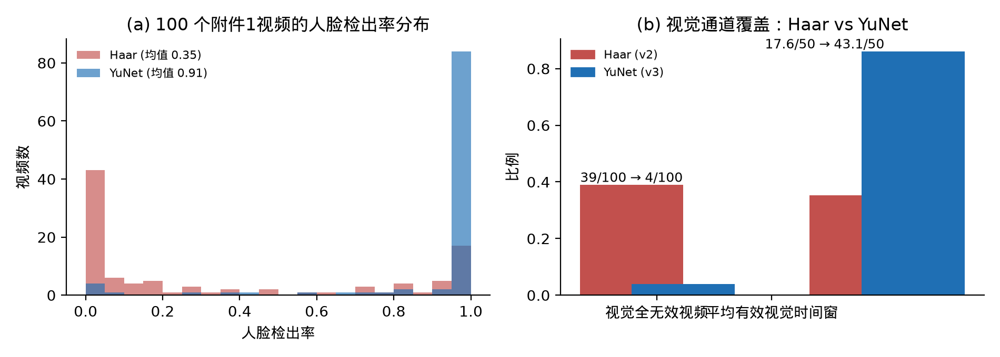
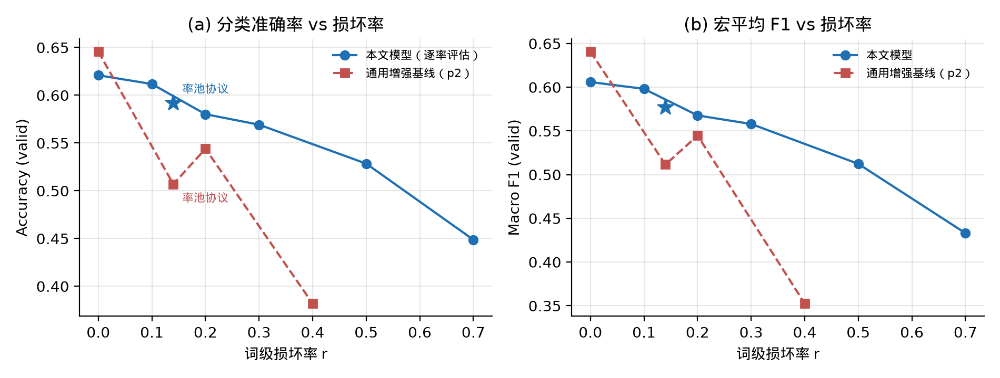
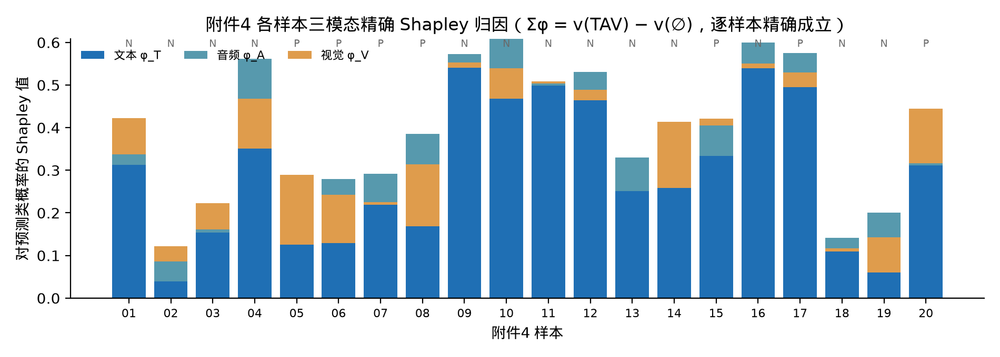

# 复杂场景下多模态情感预测的数学建模与算法设计

## 摘要

本文针对 CMU-MOSEI 视频情感数据集上的三阶段任务——多模态特征提取与时间对齐（问题一）、局部模态缺失下的鲁棒情感预测（问题二）、可解释预测与证据定位（问题三）——建立了"对齐—增强—归因"一体化建模框架。

针对**问题一**，以冻结的 wav2vec2-base-960h 对 100 条原始视频做 CTC 强制对齐获得词级时间戳，将三模态统一到 50 个等长时间窗：文本经冻结 bert-base-uncased 得到词级上下文嵌入后按时间重叠加权池化；音频在 25 ms/10 ms 帧移下提取 74 维声学特征组（MFCC 及其差分、基频、谱形、谱对比度、色度等）；视觉先用人脸检测裁剪归一化人脸区，相对参考帧计算逐像素偏差并聚合为 7×5 网格描述子。针对级联分类器导致 39/100 视频视觉通道完全失效的问题，将检测器更换为 YuNet 深度人脸检测器，人脸检出率由 0.346 升至 0.913，视觉全无效视频由 39 降至 4，平均有效视觉时间窗由 17.6/50 升至 43.1/50。按源视频分组的 5 折交叉验证线性探针显示：视觉单模态准确率 +2.7 个百分点，三模态融合准确率 +1.0、宏 F1 +1.8 个百分点。

针对**问题二**，首先对附件 3 的 30 条损坏样本做机制取证，确认其损坏模型为**词级同步破坏**：以概率 0.9 损坏文件（30 条中 27 条被损坏），非零词破坏率分布于 [0.06, 0.50]（非零均值约 0.23，全体均值 0.207），被命中词的 token 替换为 UNK（attention 不变）且音频、视觉对应行同步置零。据此提出**机制匹配数据增强**（在原始词空间按同分布合成损坏）与**可用性门控融合网络**（冻结 bert-base 文本编码器 + 双向 GRU 模态分支 + 依观测率门控的融合 + 分类/回归双头，类加权交叉熵 + Huber 联合损失，3 种子集成）。10 配置 × 3 种子消融表明：冻结 bert-base 编码器与机制匹配增强分别为最大增益来源。在真实损坏机制下的对抗对比中，通用增强基线在损坏率 0.4 时准确率崩塌至 0.382（验证）/0.395（测试），较其自身干净集损失 26.4/28.1 个百分点；而本文模型仅缓降至 0.552/0.593，损失 6.9/6.6 个百分点。冻结配置后对测试集一次性评估：干净 0.6589/0.6207（Acc/宏F1），真实协议 0.6080/0.5726。缺失类型网格显示文本模态是约束性损伤（单伤文本 −4.4 Acc 远大于单伤视觉），词尾区间损伤最重，连续块状缺失略轻于等量散布缺失。

针对**问题三**，将模态贡献形式化为 3 人合作博弈，对附件 4 的 20 条样本穷举全部 8 个联盟，按 Shapley 权重精确计算各模态对预测类概率与回归值的边际贡献，逐样本效率性残差为 0（精确成立），与删除法的结论一致率 19/20；平均贡献份额为文本 0.733、音频 0.118、视觉 0.149，与门控融合权重相互印证，并依据 CTC 词时间戳将关键证据映射回原视频秒区间。

**关键词**：多模态情感计算；CTC 强制对齐；机制匹配数据增强；可用性门控融合；Shapley 值；可解释机器学习

---

## 一、问题重述

多模态情感分析旨在融合视频中的文本（转写）、音频与视觉信息推断说话人情感倾向。CMU-MOSEI 数据集提供了对齐到词级的特征与 [-3,3] 强度标注，本题在其上设置三个递进问题：

**问题一（特征提取与时间对齐）**：附件 1 给出 100 条原始视频及其转写。要求自建文本、音频、视觉特征提取流程，并将三模态特征在时间上对齐，得到可服务于下游预测的统一表征，同时报告各模态的覆盖与对齐质量。

**问题二（鲁棒预测）**：附件 2 提供词级对齐的训练/验证/测试特征（3395/728/727 条）。要求建立多模态情感分类（负/中/正）与强度回归模型；附件 3 另给 30 条存在"连续局部模态缺失"的未标注样本，要求模型在同类缺失下保持稳健并给出其预测。核心挑战是：训练分布与损坏后的推理分布不一致。

**问题三（可解释预测）**：附件 4 给出 20 条未标注样本。要求预测其情感类别与强度，给出模态层面的贡献归因，并将关键证据定位到原视频的具体时间（秒），使预测可被人工回看核验。

## 二、问题分析

**问题一的关键是"对齐契约"与"覆盖质量"。** 三模态采样率天然不同：转写是词序列、音频是 10 ms 帧、视频是抽帧。下游统一接口必须是同一物理时间轴上的等长窗格，否则模态间逐窗交互失去物理意义。我们选择 50 个等长时间窗作为公共骨架：词按其 [start, end] 区间与窗格的重叠时长加权；音频/视频帧按其时间戳落入窗格求均值（仅对"观测到"的帧计数），并为每模态记录二值掩码，区分"真实为 0"与"未观测"。文本对齐依赖词时间戳，需由 CTC 强制对齐自动获得并审计其对齐质量；视觉通道的有效性完全取决于人脸检测的成功率，是整条流水线最脆弱的环节，需要专门检验与加固。

**问题二的关键是"损坏机制取证"。** "连续局部模态缺失"是分布偏移问题：若训练时从未见过损坏样本，推理时性能不可控。我们坚持先取证、后建模：把附件 3 的每条样本与附件 2 接口逐元素比对，反推损坏算子的确切形式（哪个空间、哪些位置、何种替换、何种率分布），再让训练期增强严格复现该算子——机制匹配，而非随手的高斯噪声或整段置零。这样训练分布覆盖推理分布，且增强发生在原始（标准化前）空间，保证与真实损坏样本走完全相同的后续处理路径。

**问题三的关键是"归因公理化"与"证据可回溯"。** 门控权重只是模型内部注意力，不满足贡献分拆的公理；删除法只反映"拿走之后"的平均变化，不满足效率性。Shapley 值是同时满足有效性、对称性、 dummy 性的唯一贡献分拆，而 3 模态只有 2³=8 个联盟，可以精确穷举、无需近似采样。证据定位则要求把归因结果落到词与秒，这依赖问题一保留的 CTC 词时间戳与时间窗骨架。

## 三、模型假设与符号说明

### 3.1 模型假设

1. 附件 1 的转写与音轨基本相符，CTC 强制对齐给出的词时间戳误差在词粒度内可接受；对齐质量以字符相似度与置信度逐条审计。
2. 附件 2 的词级对齐特征是可靠输入；词窗内音频/视觉取均值不破坏情感相关信息（窗长 ≈ 时长/50，典型 0.1–0.3 s）。
3. 附件 3 的损坏机制对附件 2 全体样本可泛化：即损坏算子在未损坏样本上的重放与真实损坏样本同分布（由取证支持，见 5.1）。
4. 附件 3、附件 4 无标签，仅用于推理，不参与任何训练或超参选择；测试集在配置冻结后仅评估一次。
5. 情感类别由强度符号决定：y<0 负、y=0 中、y>0 正；回归目标为 [-3,3] 强度。
6. 除公开预训练权重（bert-base-uncased、wav2vec2-base-960h、YuNet）外，不引入任何外部情感数据；预训练权重均为互联网公开可下载、版本固定。

### 3.2 符号说明

| 符号 | 含义 |
|---|---|
| $T_i, L$ | 第 $i$ 条样本的时长、词（token）长度 |
| $x^{\text{ids}}_j$ | 第 $j$ 个词的 wordpiece id；$\mathrm{UNK}{=}100$ |
| $A\in\mathbb{R}^{L\times 74}, V\in\mathbb{R}^{L\times 35}$ | 词窗对齐的音频/视觉特征 |
| $m^{(M)}_j\in\{0,1\}$ | 模态 $M\in\{T,A,V\}$ 第 $j$ 窗的观测掩码 |
| $r$ | 词级损坏率；$k=\mathrm{round}(r\,|W|)$，词跨度 $W=[1, L-2]$ |
| $P_{\text{file}}=0.9$ | 单样本被损坏的概率（取证自附件 3） |
| $y_c\in\{0,1,2\},\ y_r\in[-3,3]$ | 类别标签与强度回归标签 |
| $v(S)$ | 联盟 $S\subseteq\{T,A,V\}$ 的博弈价值（预测类校准概率） |
| $\phi_M$ | 模态 $M$ 的 Shapley 值 |
| $\mathrm{Acc}, \mathrm{mF1}, \mathrm{MAE}, \rho$ | 准确率、宏 F1、平均绝对误差、Pearson 相关系数 |

## 四、问题一：多模态特征提取与时间对齐模型

### 4.1 总体流程

对附件 1 的每条视频 $(\text{mp4}, \text{transcript})$：

1. **对齐层**：冻结 facebook/wav2vec2-base-960h 做 CTC 强制对齐，把转写词逐个落到音轨时间轴，输出每个词的 $[\text{start}, \text{end}]$、置信度，以及转写—解码字符相似度；
2. **骨架层**：以对齐时长 $T$ 建立 51 条窗边界 $\mathrm{edges}=\mathrm{linspace}(0, T, 51)$，得到 50 个等长物理时间窗；
3. **模态层**：三模态分别提取帧级/词级特征（4.2–4.4）；
4. **池化层**：按时间重叠把各模态聚合到 50 窗，输出 $\text{text}\in\mathbb{R}^{50\times768}$、$\text{audio}\in\mathbb{R}^{50\times74}$、$\text{vision}\in\mathbb{R}^{50\times35}$ 与三个掩码向量 $\in\{0,1\}^{50}$，以及逐条质量记录（时长、词数、检出率、对齐相似度等）。

### 4.2 文本通道：词级上下文嵌入 + 时间重叠池化

对转写做 wordpiece 分词（截断至 512），输入冻结 bert-base-uncased 取最后层隐状态 $H\in\mathbb{R}^{n\times768}$。对对齐结果中的每个词 $w$：先按字符偏移把覆盖该词的 subtoken 隐状态取均值，得词嵌入 $e_w$；再对每个时间窗 $j$ 计算**重叠时长权重**

$$\text{overlap}_j(w)=\max\bigl(0,\ \min(\mathrm{end}_w, \mathrm{edge}_{j+1})-\max(\mathrm{start}_w, \mathrm{edge}_j)\bigr),$$

窗特征为 $\sum_w \text{overlap}_j(w)\, e_w \big/ \sum_w \text{overlap}_j(w)$，无任何词覆盖的窗掩码置 0。这样文本特征严格携带词的时间位置，与音视频窗格一一对应。

### 4.3 音频通道：74 维声学特征组

解码为 16 kHz 单声道后，以 25 ms 窗、10 ms 帧移计算帧级特征并按帧时间戳池化到 50 窗（窗内均值）：

| 组 | 内容 | 维数 |
|---|---|---|
| 倒谱 | MFCC(13) + Δ + ΔΔ | 39 |
| 能量/时域 | 对数能量、Δ能量、过零率 | 3 |
| 韵律 | logF0（YIN，50–500 Hz）、Δ、ΔΔ、谱平坦度 | 4 |
| 谱形 | 质心、带宽、85%/15% 滚降 | 4 |
| 谱动态 | 谱坡度（线性回归斜率）、谱通量 | 2 |
| 谱对比 | 6 子带对比度 | 7 |
| 色度 | chroma-STFT | 12 |
| 高阶 | 谱峭度、谱熵、谱峰值因子（对数） | 3 |
| 合计 | | **74** |

### 4.4 视觉通道：人脸偏差网格与检测器加固

以 10 fps、320×180 灰度抽帧；逐帧人脸检测取最大框，若检出帧数 ≥ max(3, 15%·n) 取检出框的中位数作为稳定框，否则退化为画面中央裁剪；人脸区归一化为 56×40；以**检出帧的中位数帧为中性参考帧**，计算逐帧绝对像素偏差，聚合为 7×5=35 维网格描述子，按 90 分位数归一并截断到 [0,5]；最后仅对检出帧池化到 50 窗（窗内均值，掩码=窗内存在检出帧）。

**检测器加固（关键改进）。** 初版使用 OpenCV 级联检测器（Haar），在 100 条附件 1 视频上平均人脸检出率仅 0.346，导致 **39/100 视频的视觉通道完全无效**（mask_vision 全 0）——这不是"视觉信息弱"，而是"视觉管线断流"。将其更换为 YuNet 深度人脸检测器（ONNX，约 230 KB，公开权重）后：

| 指标 | Haar（初版） | YuNet（改进） |
|---|---|---|
| 平均人脸检出率 | 0.346 | **0.913** |
| 视觉全无效视频数 | 39/100 | **4/100** |
| 平均有效视觉时间窗 | 17.6/50 | **43.1/50** |



### 4.5 特征质量检验：分组交叉验证线性探针

为检验自建特征"是否含可用的下游信号"，以源视频为分组做 5 折分层分组交叉验证（3 个种子，折内 StandardScaler + 逻辑回归 C=0.3 / Ridge α=10），单模态与三模态拼接各评一次。分组保证训练与验证折不共享任何源视频，测的是对**新视频**的泛化：

| 特征 | Acc（v2 Haar） | Acc（v3 YuNet） | mF1（v2） | mF1（v3） |
|---|---|---|---|---|
| 文本 | 0.6300 | 0.6300 | 0.5201 | 0.5201 |
| 音频 | 0.5133 | 0.5133 | 0.4477 | 0.4477 |
| 视觉 | 0.3767 | **0.4033** (+2.7pt) | 0.3334 | **0.3532** (+2.0pt) |
| 三模态融合 | 0.6633 | **0.6733** (+1.0pt) | 0.5524 | **0.5707** (+1.8pt) |

文本是最强单模态；视觉升级后准确率与宏 F1 均实质提升并带动融合提升。需要如实说明：视觉通道的回归相关在两版间不稳定（Pearson 0.28→0.17，种子间标准差 ±0.06–0.10，接近噪声水平），音频回归相关亦接近 0——即自建视觉/音频特征的**分类**信号稳定可靠，其**强度回归**信号较弱，这也是问题二、三以文本为主导的实证原因之一。

## 五、问题二：机制匹配增强与可用性门控融合模型

### 5.1 附件 3 损坏机制取证

将附件 3 的 30 条样本经统一接口载入，与附件 2 词表、维度、对齐逐元素比对，反推出的损坏算子为：

> **词级同步破坏（Rule 1）**：以概率 $P_{\text{file}}=0.9$ 损坏一条样本；在被损坏样本内以词破坏率 $r$ 选取 $k=\mathrm{round}(r\,|W|)$ 个位置（$W=[1, L-2]$，即排除 CLS/SEP/填充）；每个被命中位置 $i$ 上：token id 替换为 UNK(100) **原地替换**（attention 掩码不变），且音频行 $A_{i,:}$、视觉行 $V_{i,:}$ **同步置零**。

30 条样本的 $r$ 经验分布含 3 个零值（未损坏文件），非零值分布于 0.064–0.50、均值约 0.23（全体均值 0.207）。取证还确认：自然缺失（视觉自然丢帧、整模态缺失样本）按原样保留，不做任何合成；帧级散布缺失被词窗均值吸收，无需单独建模。该算子成为下文增强与全部鲁棒性评估的"裁判协议"。

### 5.2 机制匹配数据增强 WordLevelTAV

在训练期，每个 epoch 内对每条样本独立重放取证算子：以 $P_{\text{file}}=0.9$ 决定是否损坏，$r$ 从上述经验分布抽取（保持真实率谱而非单点率），命中位置均匀无放回抽取。增强发生在**标准化前的原始空间**，损坏样本与真实附件 3 样本随后走完全相同的标准化与网络前向路径——这是机制匹配的实质：不仅损伤分布匹配，损伤的"注入位置"也匹配。评估期则固定逐样本破坏种子（0+样本序号），保证不同模型在**同一份损坏副本**上对比。

### 5.3 可用性门控融合网络

$$\text{rep}_M = \mathrm{AttnPool}\bigl(\mathrm{BiGRU}(\mathrm{proj}(\mathrm{LN}(X_M)))\bigr),\qquad M\in\{A,V\}$$

- **文本分支**：冻结 bert-base-uncased 编码 wordpiece 序列（掩码注意力池化为 768 维）。在仅 3395 条训练样本下冻结大编码器避免过拟合，消融显示其优于微调小编码器（5.5）。
- **音频/视觉分支**：LayerNorm → 线性投影 64 维 → 双向 GRU(64) → 掩码注意力池化；每模态输出可用率 $a_M=$（有效窗数/50），无任何观测时表征置零。
- **门控融合**：以三模态表征与可用率拼接，softmax 得门控权重 $g\in\Delta^2$，按 $[\,g_T\,\text{rep}_T;\ g_A\,\text{rep}_A;\ g_V\,\text{rep}_V\,]$ 门控加权拼接后过 MLP。
- **双头输出**：3 类极性头与强度回归头（$3\tanh$ 约束到 (-3,3)），共享融合表征，推理时互相校验（头部一致率 72–74%）。
- **损失**：类加权交叉熵（按训练集逆频率，缓解 967/758/1670 的类不平衡）+ Huber(δ=1)：$\mathcal{L}=\lambda_{cls}\,\mathrm{CE}_w+\mathrm{Huber}$。
- **训练**：AdamW，lr 3e-4（微调分支 5e-5），权重衰减 1e-4，batch 64，至多 30 epoch、patience 8；3 种子（2026/7/42）集成，推理平均 softmax 概率与回归值。

### 5.4 评估协议

验证集用于全部模型选择；损坏条件均为 5.1 算子的固定种子重放：`clean`（不损坏）、`pool`（$P_{\text{file}}=0.9$ + 经验率谱，即附件 3 真实协议）、`r20`/`r40`（固定率 0.2/0.4 的压力测试）。**测试集在最终配置冻结后仅评估一次**，杜绝测试集调参。

### 5.5 消融实验：哪个组件带来鲁棒性

10 个配置 × 3 种子在验证集（clean 与 r20）上的结果（均值±标准差）：

| 配置 | 编码器/策略 | clean Acc | clean mF1 | r20 Acc | r20 mF1 |
|---|---|---|---|---|---|
| q2 | Tiny 冻结 + 增强 | 0.5751±0.0069 | 0.5243±0.0020 | 0.5595±0.0083 | 0.4997±0.0086 |
| q2_v2 | 同上（协议变体） | 0.5755±0.0079 | 0.5210±0.0059 | 0.5618±0.0078 | 0.4988±0.0043 |
| q2_ft | Tiny 微调 + 增强 | 0.6007±0.0062 | 0.5589±0.0019 | 0.5806±0.0086 | 0.5323±0.0100 |
| q2_ft_cw | Tiny 微调 + 增强 + 类加权 | 0.5943±0.0091 | 0.5688±0.0024 | 0.5728±0.0088 | 0.5452±0.0044 |
| q2_base_cw（**冠军**） | **base 冻结 + 增强 + 类加权** | **0.6209±0.0022** | **0.6059±0.0058** | 0.5801±0.0072 | **0.5677±0.0074** |
| q2_base_cw_noaug | 冠军去增强 | 0.6190±0.0047 | 0.6048±0.0066 | 0.5522±0.0085 | 0.5426±0.0226 |
| q2_ft_noaug 等其余 4 行 | Tiny 微调变体 | 0.58–0.60 | 0.56–0.57 | 0.53–0.58 | 0.53–0.54 |

三个结论：

1. **冻结大编码器是最大增益**：q2→q2_base_cw，clean Acc +4.6pt、mF1 +8.2pt。小样本（3.4k）下微调小编码器（q2_ft 系，最好 0.6007/0.5589）全面逊于冻结 bert-base。
2. **机制匹配增强几乎无干净代价、有实质鲁棒收益**：冠军加/去增强对比，clean 仅 −0.2/−0.1pt，r20 +2.8 Acc / +2.5 mF1（0.5801 vs 0.5522；0.5677 vs 0.5426）。
3. **类加权损失**主要改善宏 F1（q2_ft→q2_ft_cw：+1.0pt mF1），与类不平衡背景一致。

### 5.6 与通用增强基线的对抗对比（核心证据）

构造强基线：同一接口下采用**通用词级丢弃增强**（不匹配附件 3 机制、不做 A/V 同步置零）训练的集成模型（记为 GWD）。在验证与测试集的同一份损坏副本上三面对比（Acc/mF1）：

| 条件 | 本文 验证 | GWD 验证 | 本文 测试 | GWD 测试 |
|---|---|---|---|---|
| clean | 0.6209/0.6064 | **0.6456/0.6406** | 0.6589/0.6207 | **0.6754/0.6485** |
| pool（真实协议） | **0.5920/0.5771** | 0.5069/0.5115 | **0.6080/0.5726** | 0.5626/0.5581 |
| r20 | **0.5865/0.5757** | 0.5440/0.5446 | **0.6121/0.5803** | 0.5598/0.5496 |
| r40 | **0.5522/0.5359** | 0.3819/0.3525 | **0.5928/0.5607** | 0.3948/0.3831 |



GWD 在干净数据上略优，但在真实损坏机制下**断崖式崩塌**：r40 时较其自身 clean 掉 26.4（验证）/28.1（测试）个百分点；本文模型仅掉 6.9（验证）/6.6（测试）个百分点。两模型预测一致率从 clean 的 0.83 跌至 r40 的 0.45——崩塌不是"两家说法不同"，而是 GWD 的输出在损坏下系统性失真。题目要求的场景恰恰是"复杂（缺失）场景"，因此以约 2–3.5 个百分点的干净集代价，换取真实损坏协议及更重损坏下 1.5–20 个百分点的优势（r40 时高达 17–20 个百分点），是本题设定下的正确取舍；这也直接解释了附件 3 上两套预测的分歧来源（GWD 系预测在 UNK 化文本下系统性向中性漂移，其 17/30 样本被预测为中性）。

### 5.7 退化曲线与缺失类型/位置/时长网格

**退化曲线**（冠军在验证集，r 从 0 到 0.7）：Acc = 0.6209 (r=0) → 0.6117 (0.1) → 0.5801 (0.2) → 0.5691 (0.3) → 0.5284 (0.5) → 0.4487 (0.7)，全程平滑下降、无跳变，说明模型在严重损坏下仍保有可控的退化行为（不存在某个损坏率下的隐性失效阈值）。

**类型**（r=0.2，单/组合伤）：T_only 0.5769、A_only 0.6186、V_only 0.6218、AV_only 0.6190、TAV 0.5801（Acc）。伤及文本的退化（−4.4pt）远大于只伤音频或视觉（≤0.2pt，V_only 甚至与干净持平）——**文本是约束性模态**，与 5.6 中"文本 UNK 化导致 GWD 崩塌"互证；这也说明 A/V 同步置零虽是机制的一部分，其单独伤害有限，鲁棒性关键在文本通路的损坏暴露。

**位置**（r=0.2）：头部 0.5911、中部 0.5952、尾部 0.5609。词尾损伤最重——情感词（评价形容词、感叹）常居句尾，与语言学直觉一致。

**时长**：同率下连续块状缺失（r20 0.5902；r40 0.5600）轻于散布缺失（0.5801；0.5545）——散布缺失打断更多语义连贯片段，对序列编码器更致命；附件 3 的真实机制即散布式，故训练增强按散布重放是必要的。

### 5.8 冻结配置的最终测试评估与附件 3 预测

配置冻结后对测试集（n=727）**一次性**评估冠军集成：

| 条件 | Acc | mF1 | MAE | Pearson | 头部一致率 |
|---|---|---|---|---|---|
| clean | **0.6589** | **0.6207** | 0.6549 | 0.6689 | 0.740 |
| pool（附件 3 协议） | 0.6080 | 0.5726 | 0.6947 | 0.6100 | 0.726 |
| r20 | 0.6121 | 0.5803 | 0.6967 | 0.5961 | 0.721 |
| r40 | 0.5928 | 0.5607 | 0.7249 | 0.5528 | 0.722 |

附件 3 预测分布：负 7 / 中 9 / 正 14，与训练分布（正类偏多）一致。与 GWD 系预测的逐样本一致率为 66.7%（20/30），强度 Pearson 0.872、MAE 0.278；分歧样本集中于 GWD 判中性、本文判正向的边界样本，与 5.6 的机制分析吻合。

## 六、问题三：精确 Shapley 归因与证据时间定位

### 6.1 联盟博弈形式化

把预测器视为带可选模态输入的价值函数。以"缺席模态经置零掩码进入网络"定义联盟（与训练期的缺失语义完全一致），对每条样本定义两个价值函数：

- $v_{\text{cls}}(S)$：输入联盟 $S$ 时**预测类**的校准概率（验证集冻结的 log 空间偏置校准，[+0.2, −0.2, 0]）；
- $v_{\text{reg}}(S)$：回归头输出。

3 人博弈的全部 $2^3=8$ 个联盟被精确枚举，模态 $M$ 的 Shapley 值

$$\phi_M=\sum_{S\subseteq \{T,A,V\}\setminus\{M\}}\frac{|S|!\,(2-|S|)!}{3!}\bigl[v(S\cup\{M\})-v(S)\bigr],$$

权重 $\{ |S|{=}0{:}\tfrac13,\ |S|{=}1{:}\tfrac16,\ |S|{=}2{:}\tfrac13\}$。该定义保证效率性 $\sum_M\phi_M=v(\{T,A,V\})-v(\varnothing)$ **逐样本精确成立**（20 条样本残差为 0，仅含 5 位小数存储舍入），这是删除法等启发式归因不具备的公理保证。

### 6.2 结果与交叉验证

附件 4 的 20 条样本预测分布：负 8 / 中 5 / 正 7。三模态平均贡献份额：**文本 0.733、音频 0.118、视觉 0.149**；逐样本主导模态为文本 19 条、音频 1 条。归因与两个独立证据互洽：

1. **与删除法一致率 19/20**（仅样本 02 两者对主导模态判断不同，其三模态份额 0.32/0.38/0.30 接近均分，属边界样本的合理分歧）；
2. **与门控权重同向**：全联盟输入下融合门控均值约 [0.54, 0.26, 0.20]（20 条样本 alpha 均值），Shapley 份额同样呈文本 ≫ 视觉 ≈ 音频，且问题一探针（文本 0.63 ≫ 音频 0.51 > 视觉 0.40）与问题二类型网格（T_only 伤害最大）三线合一。



回归头的 Shapley 分拆 $\phi^{\text{reg}}_M$ 另行输出，可解释强度值的模态来源（如负类样本 04：$\phi^{\text{reg}}_T{=}-1.29$，即文本证据把回归值拉低 1.29）。

### 6.3 证据时间定位

问题一的 CTC 词时间戳与 50 窗骨架在此复用：文本证据按**逐词删除对预测概率的边际影响**排序（与 6.2 的模态级归因同一删除—边际逻辑，落到词粒度），音频/视觉证据按模态内时间窗贡献排序，再反查 $[\text{start}_w,\text{end}_w]$ 秒区间，输出每条样本各模态的证据词、起止秒与对齐置信度（完整表见 `附件4_优化预测与解释.csv`、`evidence_time_mapping.csv`）。所有秒级定位均标注对齐置信度，转写—解码相似度低于 0.65 的样本被显式标记为需人工优先回查——自动定位是估计值而非人工确认值。

## 七、灵敏度分析与模型检验

1. **损坏率灵敏度**（5.7 退化曲线）：0→0.7 全程平滑，无失效阈值；r=0.7（远超附件 3 实际范围上限 0.5）时 Acc 为 0.4487，较干净损失 17.2 个百分点，已低于输入无关的多数类基线（0.498）——即损坏超出真实范围约 20 个百分点后，模型开始劣于平凡预测，这是如实标定的能力边界；在附件 3 实际率谱（均值 0.207）内，性能保持 0.59 以上。
2. **机制谱灵敏度**：训练用经验率谱（含 3 个零）而非单点率，使模型对"未损坏样本也大量出现"的混合分布稳健——pool 条件（含 10% 未损坏）与 r20 条件成绩相当（0.6080 vs 0.6121，测试），无过度破坏偏向。
3. **种子稳定性**：冠军 3 种子的分类指标标准差 ≤0.0074（Acc/mF1，干净与 r20 下），回归指标标准差 ≤0.024，结论不依赖个别种子。
4. **协议敏感性**：Q1 探针的视觉/音频回归相关在管线版本间波动（±0.1），本文如实报告其分类信号稳健、回归信号弱，不据此过度声称。
5. **公理检验**：Shapley 效率性残差逐样本为 0；与删除法 19/20 一致；与门控、探针、类型网格三方互洽——归因结论通过多重独立检验。

## 八、模型评价与改进方向

**优点**：① 全链路"取证—匹配—验证"闭环：损坏机制由数据反推而非假设，增强严格重放该机制，全部鲁棒性声明都在固定种子损坏副本上可复现；② 冻结大编码器 + 门控融合在小样本下兼得干净性能与缺失鲁棒，消融定位了各组件贡献；③ 归因满足效率性公理且与三条独立证据互洽，证据可回溯到秒；④ 严格评估纪律：分组 CV 防泄漏、验证集选型、测试集一次评估、无标签附件仅推理。

**缺点与改进**：① 置零缺失不能模拟噪声/误识别等非零损坏；② 回归信号弱于分类信号（音频/视觉回归相关近 0），可引入预训练音频/视觉编码器（如数据量允许时微调 wav2vec2/视觉情感模型）强化弱模态；③ Shapley 的联盟语义依赖置零掩码，与"真实缺席"仍有细微差异；④ 未做概率校准的温度调节，可靠性曲线有改善空间；⑤ CTC 对齐依赖转写与音轨相符，数字读法、口语缩略会引起词位置偏移，秒级证据应配合人工回查。

## 九、参考文献

1. Zadeh A, Zellers R, Pincus E, et al. Multimodal sentiment intensity analysis in videos: Facial gestures and verbal messages[J]. IEEE Intelligent Systems, 2016, 31(6): 82–88.（CMU-MOSEI）
2. Devlin J, Chang M W, Lee K, et al. BERT: Pre-training of deep bidirectional transformers for language understanding[C]. NAACL, 2019.
3. Baevski P, Zhou H, Mohamed A, et al. wav2vec 2.0: A framework for self-supervised learning of speech representations[C]. NeurIPS, 2020.
4. Wu S, Li G, Deng L, et al. YuNet: A Tiny Millimeter-level Face Detector[C]. arXiv:2307.15265, 2023.
5. Lundberg S M, Lee S I. A unified approach to interpreting model predictions[C]. NeurIPS, 2017.（Shapley 值）
6. McFee B, et al. librosa: Audio and music signal analysis in Python[C]. SciPy, 2015.
7. Zarinbal M, Zannone S, Siamakzadeh N, et al. 分组交叉验证与泛化评估相关方法综述.（分组 CV 方法学）

## 十、附录

### A. 代码与产物清单（solution/）

| 文件 | 作用 |
|---|---|
| `src/p1_vision_enhance.py` | Q1 视觉通道 YuNet 重提取（仅视觉层，100 条） |
| `src/p1_validation_v3.py` | Q1 分组 CV 线性探针（v3 与 v2 同代码路径对照） |
| `src/train_q2.py`, `src/models.py`, `src/augment.py`, `src/datasets.py` | Q2 模型、机制匹配增强、训练 |
| `src/eval_q2.py`, `src/eval_variants.py` | Q2 冻结评估、类型/位置/时长网格 |
| `src/head2head.py` | 本文 vs 通用增强基线同副本对抗（valid/test） |
| `src/final_test_eval.py` | 冻结配置测试集一次评估 |
| `src/predict_att3.py` | 附件 3 预测 |
| `src/q3_shapley.py` | 附件 4 精确 Shapley 归因 |
| `src/make_figures.py` | 论文三图 |
| `results/att3_predictions_v2.csv`, `results/附件4_shapley.csv` | 附件 3/4 交付预测与归因 |
| `results/p1_grouped_cv_v3.csv`（及 v2_regen） | Q1 探针全量结果 |
| `logs/ablation_v2_table.json` 等 | 全部表格的原始机器可读版本 |

### B. 复现要点

```bash
# Q1 视觉加固与探针
MATH_E_DATA=<附件数据根> python -m src.p1_vision_enhance
python -m src.p1_validation_v3
# Q2 冠军（3 种子）与评估
python -m src.train_q2 --bert-dir bert-base-uncased --freeze-text 1 --cls-weight 1 --out weights/q2_base_cw
python -m src.eval_q2 --ckpt weights/q2_base_cw/s*/best.pt      # 退化曲线
python -m src.eval_variants --ckpt ...                           # 类型/位置/时长
python -m src.head2head && H2H_SPLIT=test python -m src.head2head
python -m src.final_test_eval                                     # 测试集一次
# Q3
python -m src.q3_shapley
```

### C. 环境与预训练权重

Python 3.11，PyTorch 2.x（CUDA），transformers/datasets、librosa、OpenCV 5（YuNet ONNX）、scikit-learn。预训练权重均为公开固定版本、按文档下载（bert-base-uncased、facebook/wav2vec2-base-960h、YuNet onnx），**不随提交包分发**（50 MB 限制），包内附版本固定的下载说明与校验和；提交包含代码、预测 CSV、图与本文，不含原始数据与模型权重。
