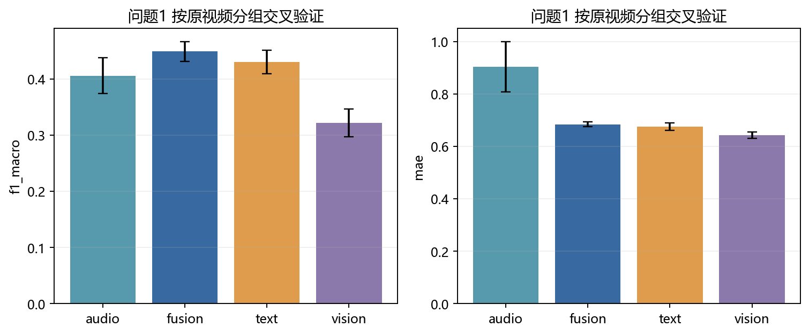
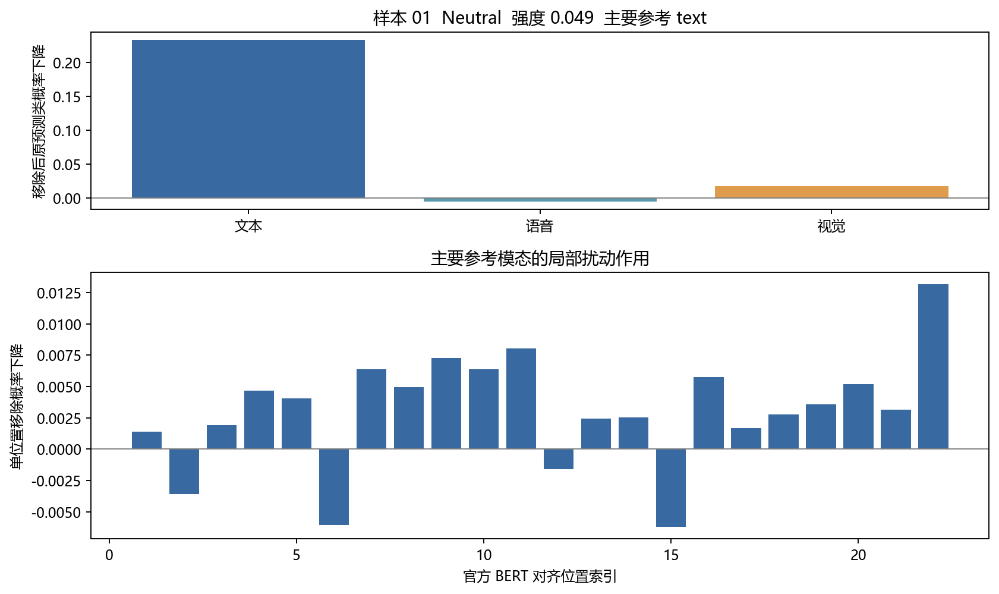
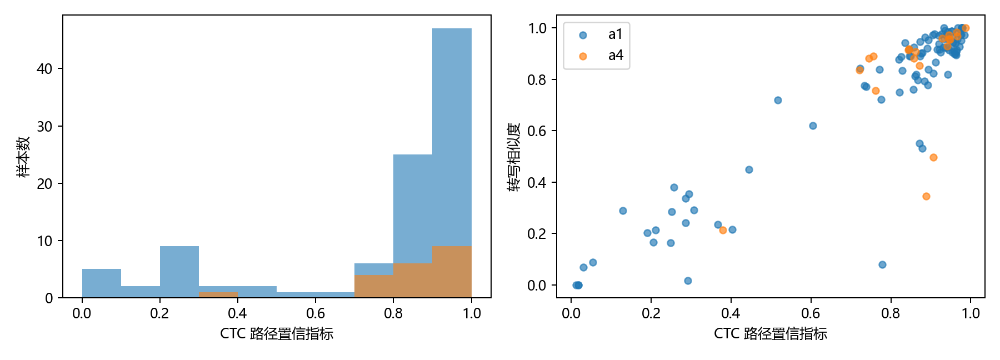
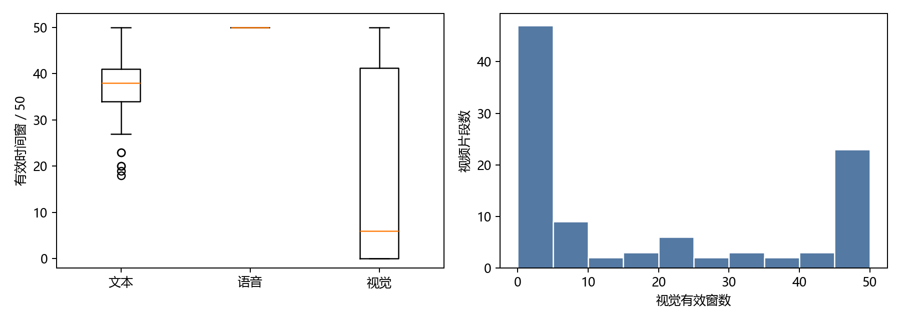
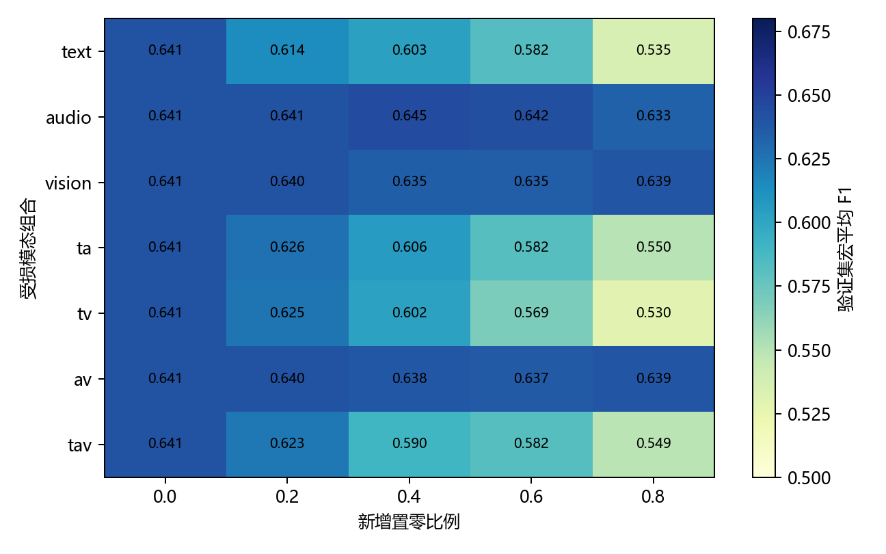
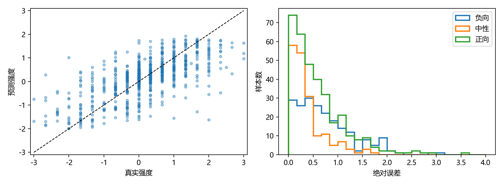
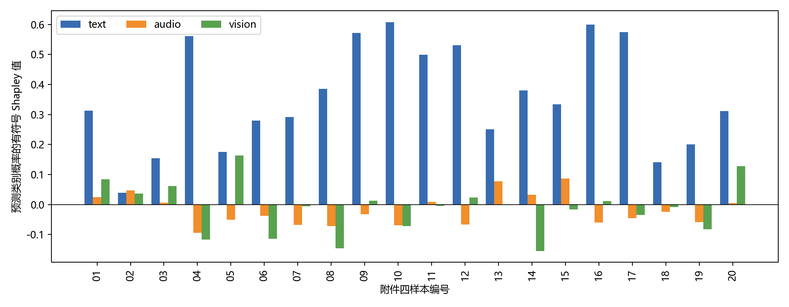

# 基于有效位置建模与精确模态归因的多模态情感分析

## 摘要

针对视频多模态特征构造、局部模态缺失下的情感预测以及可回查的预测解释，建立统一的输入审计和预测流程。问题一将冻结文本编码、声学描述符和视觉变化描述符映射到 50 个物理时间窗，使用 CTC 强制对齐记录词与视频秒数的对应关系；100 条视频均生成三模态特征及有效位置掩码。问题二在官方训练集学习模态专属时序表示和有效比例门控，通过局部遮蔽训练处理不完整输入；独立测试集的三分类准确率为 0.6754、宏平均 F1 为 0.6485，情感强度 MAE 为 0.6145。问题三使用同一数据协议训练可解释专项模型，对文本、语音、视觉三个模态的 8 个联盟进行精确 Shapley 分解，并用逐位置删除作用及自动词时间定位给出可回查证据；专项模型独立测试集准确率为 0.6327、宏平均 F1 为 0.5874。给出附件三 30 条预测和附件四 20 条预测及解释。模型选择仅使用验证集；无标签专项附件仅用于最终推理。解释反映已训练模型对输入扰动的响应，不等同于情绪形成的因果机制。

**关键词：** 多模态情感分析；局部缺失；有效位置掩码；时间对齐；Shapley 归因

## 1 问题与数据协议

附件一包含 100 个视频片段，源自 37 个原视频；附件二提供 aligned 特征，训练、验证、测试分别为 3395、728、727 条；附件三有 30 条无标签缺失样本，附件四有 20 条无标签解释样本。情感强度记为 $y\in[-3,3]$，极性按 $y<0$、$y=0$、$y>0$ 分为 Negative、Neutral、Positive。主评价指标为三分类准确率、宏平均 F1、强度 MAE 和 Pearson 相关系数。模型在训练集拟合，在验证集选择训练轮次和分类决策偏置；测试集只用于固定模型的最终评价。附件三、四不参与参数估计、缺失生成规则选择、阈值选择或模型筛选。

为避免错误合并不同特征接口，问题一的自建物理时间窗特征单独评估；问题二、三直接使用附件二及相同接口下的专项数据。附件二中的 `text` 为 768 维连续特征，`text_bert` 是词元索引和掩码接口，不是第四个情感模态。冻结的 BERT 与 wav2vec2 仅用于特征提取和时间定位，不在其他情感数据上训练。

基本假设是：aligned 版本的模态序列保持题目给定的位置关系；提供的转写大体对应音轨；局部置零可模拟一部分观测丢失。最后一项只覆盖“信息不可用”的情形，不代表噪声、遮挡、识别错误等所有真实损坏。填充位置和观测缺失分别记录，不把填充计入缺失率。

## 2 问题一：三模态特征与时间组织

### 2.1 特征构造

文本使用冻结 BERT 的 768 维最后层表示，以字符偏移将子词聚合到原转写词。音频以 16 kHz 单声道解码，25 ms 窗、10 ms 步提取 74 维描述符，含 MFCC 及差分、能量、过零率、基频、谱形、谱对比、色度与谱统计。视觉以 10 fps 抽帧并检测人脸，在样本内固定人脸裁剪区域上构造 7×5 网格的相对像素变化，共 35 维。该视觉量是外观变化描述符，可能同时受表情、头部运动和光照影响，不作为精确面部动作单元解释。

使用冻结 wav2vec2 的 CTC 输出对已知转写做单调强制对齐。令 $D(t,s)$ 为声学帧 $t$ 到字符状态 $s$ 的最优对数路径分数，递推为 $D(t,s)=\log p_t(c_s)+\max\{D(t-1,s),D(t-1,s-1),D(t-1,s-2)\}$，最后一项只在非空白且相邻状态不重复时允许。回溯得到词起止秒数。对时长 $T$ 建立 $I_j=[jT/50,(j+1)T/50)$，音视频特征在窗内对有效帧求均值，文本按词区间和时间窗的交叠长度加权。无有效观测的窗数值置零且掩码置零，未用复制值伪造观测。

每条样本保存形状为 `(50,768)`、`(50,74)`、`(50,35)` 的特征及三个掩码、51 个时间边界和元数据。100 条均完成，处理失败数为 0；实际解码音轨时长范围 2.228～29.110 秒。自动词时间未逐词人工校核，因此仅用于定位候选片段。典型样本的原素材、波形、词区间和特征窗如下。

### 2.2 特征有效性检验

按原视频 `video_id` 分组进行 5 折 StratifiedGroupKFold，使用种子 2026、2027、2028；同一原视频不会跨训练和验证折。每折仅从训练折估计标准化参数，再训练逻辑回归和 Ridge。下表是每个种子的折外预测指标再取平均，反映 100 条自建特征的内部预测信息，不代表附件二官方特征的性能。

| 特征 | Accuracy | 宏平均 F1 | MAE | Pearson |
| --- | --- | --- | --- | --- |
| text | 0.5767 | 0.4306 | 0.6757 | 0.3232 |
| audio | 0.4867 | 0.4061 | 0.9040 | -0.1086 |
| vision | 0.3567 | 0.3217 | 0.6426 | 0.1441 |
| fusion | 0.6067 | 0.4492 | 0.6847 | 0.2866 |

### 2.3 全量样本特征清单

下表的有效窗数直接对应已提交的 100 个 NPZ。三模态固定形状如上；检测率为视频抽帧中的人脸检出比例，并非情感识别准确率。

| 样本编号 | 解码时长/s | 文本/语音/视觉有效窗 | 人脸检测率 |
| --- | --- | --- | --- |
| -3g5yACwYnA\$_\$13 | 5.40 | 32/50/50 | 1.00 |
| -3g5yACwYnA\$_\$3 | 14.33 | 37/50/50 | 1.00 |
| -3g5yACwYnA\$_\$2 | 9.23 | 23/50/50 | 1.00 |
| -3g5yACwYnA\$_\$9 | 8.70 | 37/50/50 | 1.00 |
| -3nNcZdcdvU\$_\$5 | 7.79 | 40/50/0 | 0.00 |
| -HwX2H8Z4hY\$_\$2 | 3.92 | 20/50/0 | 0.00 |
| -HwX2H8Z4hY\$_\$5 | 5.54 | 40/50/2 | 0.05 |
| -HwX2H8Z4hY\$_\$6 | 3.26 | 28/50/3 | 0.09 |
| -HwX2H8Z4hY\$_\$9 | 7.64 | 43/50/0 | 0.00 |
| -NFrJFQijFE\$_\$1 | 5.66 | 33/50/0 | 0.00 |
| -NFrJFQijFE\$_\$2 | 6.70 | 41/50/0 | 0.00 |
| -THoVjtIkeU\$_\$12 | 14.81 | 44/50/19 | 0.17 |
| -THoVjtIkeU\$_\$2 | 4.23 | 35/50/4 | 0.09 |
| -THoVjtIkeU\$_\$6 | 7.98 | 41/50/11 | 0.16 |
| -UuX1xuaiiE\$_\$1 | 10.27 | 40/50/0 | 0.00 |
| -UuX1xuaiiE\$_\$0 | 3.58 | 40/50/17 | 0.46 |
| -UuX1xuaiiE\$_\$3 | 4.04 | 30/50/33 | 0.80 |
| -UuX1xuaiiE\$_\$6 | 7.94 | 39/50/39 | 0.73 |
| -a55Q6RWvTA\$_\$3 | 22.08 | 45/50/0 | 0.00 |
| -aNfi7CP8vM\$_\$7 | 8.54 | 40/50/50 | 0.97 |
| -aqamKhZ1Ec\$_\$0 | 10.89 | 42/50/48 | 0.92 |
| -dxfTGcXJoc\$_\$1 | 16.02 | 46/50/0 | 0.01 |
| -dxfTGcXJoc\$_\$0 | 20.41 | 45/50/1 | 0.01 |
| -dxfTGcXJoc\$_\$2 | 16.63 | 48/50/50 | 0.96 |
| -dxfTGcXJoc\$_\$6 | 12.63 | 45/50/11 | 0.13 |
| -egA8-b7-3M\$_\$26 | 5.92 | 37/50/42 | 0.83 |
| -egA8-b7-3M\$_\$17 | 7.10 | 33/50/46 | 0.90 |
| -egA8-b7-3M\$_\$18 | 8.27 | 40/50/47 | 0.87 |
| -egA8-b7-3M\$_\$16 | 5.48 | 39/50/41 | 0.80 |
| -egA8-b7-3M\$_\$13 | 4.02 | 32/50/28 | 0.71 |
| -egA8-b7-3M\$_\$1 | 10.16 | 38/50/46 | 0.84 |
| -egA8-b7-3M\$_\$6 | 6.18 | 39/50/47 | 0.92 |
| -egA8-b7-3M\$_\$9 | 4.94 | 37/50/44 | 0.90 |
| -egA8-b7-3M\$_\$20 | 6.47 | 38/50/48 | 0.95 |
| -iRBcNs9oI8\$_\$3 | 5.54 | 23/50/0 | 0.00 |
| -iRBcNs9oI8\$_\$7 | 4.01 | 41/50/0 | 0.00 |
| -iRBcNs9oI8\$_\$6 | 2.82 | 20/50/0 | 0.00 |
| -iRBcNs9oI8\$_\$9 | 3.37 | 19/50/0 | 0.00 |
| -iRBcNs9oI8\$_\$8 | 8.03 | 40/50/0 | 0.00 |
| -lzEya4AM_4\$_\$5 | 7.57 | 34/50/0 | 0.00 |
| -lzEya4AM_4\$_\$6 | 14.74 | 43/50/3 | 0.03 |
| -mJ2ud6oKI8\$_\$1 | 6.05 | 50/50/0 | 0.00 |
| -mJ2ud6oKI8\$_\$2 | 5.70 | 50/50/0 | 0.00 |
| -mJ2ud6oKI8\$_\$6 | 2.23 | 36/50/0 | 0.00 |
| -mJ2ud6oKI8\$_\$9 | 6.91 | 38/50/17 | 0.34 |
| -mJ2ud6oKI8\$_\$8 | 4.17 | 37/50/0 | 0.00 |
| -mqbVkbCndg\$_\$0 | 6.39 | 35/50/49 | 0.97 |
| -t217m2on-s\$_\$2 | 5.63 | 30/50/0 | 0.00 |
| -t217m2on-s\$_\$7 | 17.03 | 41/50/0 | 0.00 |
| -tANM6ETl_M\$_\$3 | 6.60 | 42/50/1 | 0.01 |
| -tPCytz4rww\$_\$11 | 5.38 | 37/50/0 | 0.00 |
| -tPCytz4rww\$_\$10 | 4.68 | 34/50/0 | 0.00 |
| -tPCytz4rww\$_\$12 | 11.74 | 39/50/0 | 0.00 |
| -tPCytz4rww\$_\$16 | 7.14 | 30/50/0 | 0.00 |
| -tPCytz4rww\$_\$18 | 6.57 | 33/50/0 | 0.00 |
| -vxjVxOeScU\$_\$4 | 9.04 | 39/50/22 | 0.35 |
| -wMB_hJL-3o\$_\$7 | 5.98 | 38/50/1 | 0.02 |
| -wny0OAz3g8\$_\$1 | 6.78 | 43/50/5 | 0.09 |
| -wny0OAz3g8\$_\$0 | 3.27 | 37/50/20 | 0.61 |
| -wny0OAz3g8\$_\$3 | 6.10 | 42/50/9 | 0.18 |
| -wny0OAz3g8\$_\$2 | 6.52 | 41/50/32 | 0.58 |
| -wny0OAz3g8\$_\$5 | 6.74 | 42/50/8 | 0.17 |
| -wny0OAz3g8\$_\$7 | 7.91 | 49/50/6 | 0.12 |
| -wny0OAz3g8\$_\$9 | 6.04 | 48/50/28 | 0.48 |
| -571d8cVauQ\$_\$0 | 4.99 | 35/50/38 | 0.77 |
| -571d8cVauQ\$_\$5 | 15.12 | 44/50/21 | 0.27 |
| -I_e4mIh0yE\$_\$1 | 7.44 | 36/50/50 | 1.00 |
| -I_e4mIh0yE\$_\$3 | 8.99 | 36/50/50 | 1.00 |
| -UacrmKiTn4\$_\$10 | 7.24 | 37/50/50 | 1.00 |
| -UacrmKiTn4\$_\$4 | 4.68 | 39/50/47 | 1.00 |
| -hnBHBN8p5A\$_\$7 | 7.31 | 35/50/0 | 0.00 |
| -hnBHBN8p5A\$_\$6 | 6.33 | 28/50/8 | 0.16 |
| -qDkUB0GgYY\$_\$6 | 4.61 | 33/50/46 | 1.00 |
| -uywlfIYOS8\$_\$4 | 5.88 | 40/50/49 | 0.98 |
| -6rXp3zJ3kc\$_\$8 | 12.74 | 39/50/49 | 0.98 |
| -9y-fZ3swSY\$_\$0 | 6.76 | 38/50/0 | 0.00 |
| -9y-fZ3swSY\$_\$4 | 2.66 | 34/50/0 | 0.00 |
| -9y-fZ3swSY\$_\$8 | 4.92 | 35/50/0 | 0.00 |
| -AUZQgSxyPQ\$_\$2 | 22.40 | 47/50/50 | 0.97 |
| -HeZS2-Prhc\$_\$2 | 8.15 | 37/50/46 | 0.91 |
| -MeTTeMJBNc\$_\$0 | 9.22 | 38/50/0 | 0.00 |
| -MeTTeMJBNc\$_\$13 | 5.26 | 33/50/0 | 0.00 |
| -MeTTeMJBNc\$_\$7 | 10.41 | 43/50/5 | 0.06 |
| -RfYyzHpjk4\$_\$11 | 5.07 | 35/50/7 | 0.13 |
| -RfYyzHpjk4\$_\$8 | 4.53 | 38/50/6 | 0.13 |
| -RfYyzHpjk4\$_\$2 | 5.39 | 42/50/0 | 0.00 |
| -UUCSKoHeMA\$_\$0 | 7.73 | 34/50/50 | 0.99 |
| -ri04Z7vwnc\$_\$0 | 2.76 | 27/50/0 | 0.00 |
| -ri04Z7vwnc\$_\$2 | 5.91 | 46/50/0 | 0.00 |
| -ri04Z7vwnc\$_\$5 | 3.44 | 36/50/9 | 0.26 |
| -s9qJ7ATP7w\$_\$1 | 4.64 | 33/50/0 | 0.00 |
| -s9qJ7ATP7w\$_\$0 | 6.71 | 39/50/0 | 0.00 |
| -s9qJ7ATP7w\$_\$5 | 8.40 | 34/50/0 | 0.00 |
| -s9qJ7ATP7w\$_\$4 | 4.25 | 30/50/0 | 0.00 |
| -s9qJ7ATP7w\$_\$7 | 6.84 | 40/50/4 | 0.09 |
| -s9qJ7ATP7w\$_\$6 | 2.31 | 18/50/0 | 0.00 |
| -s9qJ7ATP7w\$_\$8 | 3.18 | 32/50/24 | 0.73 |
| -yRb-Jum7EQ\$_\$1 | 29.11 | 46/50/22 | 0.23 |
| -yRb-Jum7EQ\$_\$5 | 13.04 | 43/50/31 | 0.36 |
| -yRb-Jum7EQ\$_\$6 | 11.24 | 32/50/20 | 0.29 |

## 3 问题二：局部缺失下的极性与强度预测

### 3.1 缺失定义与模型

对模态 $m$、位置 $j$，用 $S_{mj}$ 表示内容支持、$O_{mj}$ 表示实际观测、$A_{mj}$ 表示训练时人工保留，输入掩码为 $M_{mj}=S_{mj}O_{mj}A_{mj}$。标准化均值和方差只从训练集已观测位置计算；缺失位置在标准化后仍为零。人工缺失率以遮蔽前可见位置数为分母，连续段在有序有效位置上抽取，实际删除数和存储轴段数另行审计。附件三已丢失内容的原始长度未知，故不能反推其真实原始缺失率。

三个模态分别投影到 96 维，经一层四头 Transformer 和注意力池化得到 $z_m$。有效观测比例 $a_m=\sum_j M_{mj}/\sum_j S_{mj}$ 参与门控：$\alpha_m=\operatorname{softmax}_m(g(z_m)+\log a_m)$，完全不可用模态在融合时屏蔽，融合向量 $z=\sum_m\alpha_mz_m$。分类头输出三类概率，回归头输出 $3\tanh(f(z)/3)$。训练目标为 $L=L_{CE}+0.6L_{Huber}+0.1L_{rec}$；重建损失仅作用于人工遮蔽而原本可见的位置，分别按位置与特征维数归一化。

优化器为 AdamW，学习率 $6\times10^{-4}$，权重衰减 $10^{-4}$，batch 64，最多 35 轮，验证分数为宏平均 F1 减去 MAE/6，7 轮无改善提前停止。问题二训练样本以 0.6 概率加 0.1～0.8 的局部缺失，随机选择模态组合及 1～3 个连续段。2026、2027、2028 三个种子等权集成分类概率与回归值；分类对数概率偏置由验证集选择，问题二为 `[-0.2,0,0]`。测试集不参与上述选择。

### 3.2 验证与独立测试

下表是冻结后的问题二模型结果。宏平均 F1 对每类等权，能揭示中性类识别不足；独立测试集中中性类 F1 为 0.4871，负向和正向分别为 0.7070、0.7514。分类概率尚未做可靠性校准，表中 Accuracy 不能直接当作逐例置信度。

| 数据划分 | 样本数 | Accuracy | 宏平均 F1 | MAE | Pearson |
| --- | --- | --- | --- | --- | --- |
| 验证集 | 728 | 0.6456 | 0.6406 | 0.5786 | 0.6700 |
| 测试集 | 727 | 0.6754 | 0.6485 | 0.6145 | 0.6912 |

在验证集上固定新增缺失率 0.4，以下为不同受损模态组合的宏平均 F1 和 MAE。此实验只验证预设的人工置零机制，不把附件三的无标签样本用于估计损坏分布。

| 人工受损模态 | 宏平均 F1 | MAE |
| --- | --- | --- |
| text | 0.6033 | 0.5870 |
| audio | 0.6447 | 0.5811 |
| vision | 0.6346 | 0.5806 |
| ta | 0.6056 | 0.5932 |
| tv | 0.6022 | 0.5921 |
| av | 0.6383 | 0.5830 |
| tav | 0.5896 | 0.5976 |

图中另给出 0.2 和 0.8 缺失率；缺失位置、段数和实际掩码另见结果 CSV。

### 3.3 附件三的 30 条最终预测

极性由分类头给出，强度由独立回归头给出；中性类的回归强度可以非零。方向冲突标志只在正类却回归负值或负类却回归正值时为“是”，不擅自覆盖原预测。附件三无标签，不能计算准确率。

| 编号 | 极性 | 强度 | 最大分类概率 | 方向冲突 |
| --- | --- | --- | --- | --- |
| 01 | Negative | -0.3708 | 0.588 | 否 |
| 02 | Neutral | 0.1499 | 0.824 | 否 |
| 03 | Neutral | 0.1238 | 0.819 | 否 |
| 04 | Neutral | 0.2817 | 0.459 | 否 |
| 05 | Negative | -1.1869 | 0.809 | 否 |
| 06 | Positive | 0.6185 | 0.657 | 否 |
| 07 | Neutral | 0.2752 | 0.459 | 否 |
| 08 | Neutral | 0.3809 | 0.488 | 否 |
| 09 | Positive | 1.1982 | 0.874 | 否 |
| 10 | Neutral | 0.0404 | 0.821 | 否 |
| 11 | Neutral | -0.0039 | 0.569 | 否 |
| 12 | Positive | 0.7450 | 0.671 | 否 |
| 13 | Neutral | -0.0976 | 0.538 | 否 |
| 14 | Negative | -0.3899 | 0.515 | 否 |
| 15 | Positive | 0.8337 | 0.722 | 否 |
| 16 | Positive | 1.6068 | 0.931 | 否 |
| 17 | Neutral | -0.1250 | 0.598 | 否 |
| 18 | Neutral | 0.3274 | 0.598 | 否 |
| 19 | Neutral | -0.1006 | 0.672 | 否 |
| 20 | Neutral | 0.0866 | 0.760 | 否 |
| 21 | Positive | 0.4535 | 0.482 | 否 |
| 22 | Positive | 0.4380 | 0.517 | 否 |
| 23 | Neutral | 0.1979 | 0.733 | 否 |
| 24 | Negative | 0.1117 | 0.448 | 是 |
| 25 | Neutral | 0.1522 | 0.729 | 否 |
| 26 | Positive | 0.4926 | 0.574 | 否 |
| 27 | Positive | 0.6065 | 0.566 | 否 |
| 28 | Neutral | 0.3115 | 0.586 | 否 |
| 29 | Neutral | 0.2877 | 0.568 | 否 |
| 30 | Neutral | 0.2327 | 0.602 | 否 |

## 4 问题三：预测依据的定量解释

### 4.1 预测模型与两级归因

问题三沿用三模态编码和训练集/验证集协议，局部缺失训练概率为 0.1，关闭重建项；使用三种子等权集成，验证集选出的分类偏置为 `[0.2,-0.2,0]`。其冻结模型在验证集 728 条上 Accuracy 0.6401、宏平均 F1 0.6242、MAE 0.5764、Pearson 0.6665；独立测试集 727 条相应为 0.6327、0.5874、0.6322、0.6803。中性类测试 F1 为 0.3704，是该解释模型的主要预测短板。

对每条附件四样本，先固定完整输入的预测类别 $c$，把保留模态集合 $S\subseteq\{T,A,V\}$ 的该类概率记为 $v(S)=p(c\mid x_S)$。对于模态 $m$，精确三参与者 Shapley 值为

$$\phi_m=\sum_{S\subseteq M\setminus\{m\}}\frac{|S|!(2-|S|)!}{3!}[v(S\cup\{m\})-v(S)].$$

枚举全部 8 个联盟并使用模型定义的缺失掩码，主参考模态取 $|\phi_m|$ 最大者，展示份额为 $|\phi_m|/\sum_k|\phi_k|$；有符号值保留在结果 CSV。每例满足 $\sum_m\phi_m=v(TAV)-v(\varnothing)$，浮点显示精度内残差为零。这个恒等式只是归因算法的内部核验，不证明真实因果忠实度。对每个有效词元另做单位置删除，记录原预测类概率变化 $\Delta_j=p(c\mid x)-p(c\mid x\setminus j)$；正值表示该位置支持当前预测。再把通过词元编号校验的位置映射到自动 CTC 词时间。没有可靠对应的位置留空，不虚构秒数。

### 4.2 解释有效性与质量控制

在固定的 128 条验证样本上，把注意力排序靠前的 10%、20%、40% 位置删除，并与 5 次等量随机删除配对。下表的概率下降差值及样本 bootstrap 区间只说明注意力可作为候选位置筛选；不等于对 Shapley 的独立因果验证。

| 删除比例 | 样本数 | 注意力候选下降 | 随机下降 | 配对差 | 95%区间 |
| --- | --- | --- | --- | --- | --- |
| 0.1 | 128 | 0.0212 | 0.0050 | 0.0162 | [0.0059, 0.0276] |
| 0.2 | 128 | 0.0424 | 0.0075 | 0.0349 | [0.0201, 0.0502] |
| 0.4 | 128 | 0.0735 | 0.0153 | 0.0582 | [0.0402, 0.0773] |

附件四 20 例中，Shapley 主参考模态为文本 19 例、语音 1 例、视觉 0 例；文本、语音、视觉的平均绝对贡献份额分别为 0.733、0.118、0.149。该比例仅描述这 20 条模型响应，不代表所有视频中的情感原因。样本 13 的对齐视觉特征全零，视觉证据不应作实体表情解释。自动语音识别与给定转写相似度不足的样本须优先人工回看。

### 4.3 附件四的 20 条最终预测与解释

下表展示全部样本的极性、强度、主参考模态和三模态贡献份额。份额是绝对 Shapley 值归一化结果，方向须查看完整 CSV 中的有符号 `phi_*_cls`。局部词证据为删除作用，可能与全模态归因的主模态不同。

| 编号 | 极性 | 强度 | 主模态 | 文本份额 | 语音份额 | 视觉份额 |
| --- | --- | --- | --- | --- | --- | --- |
| 01 | Neutral | 0.049 | text | 0.741 | 0.060 | 0.200 |
| 02 | Neutral | 0.158 | audio | 0.321 | 0.383 | 0.296 |
| 03 | Neutral | -0.087 | text | 0.693 | 0.030 | 0.277 |
| 04 | Negative | -0.390 | text | 0.728 | 0.121 | 0.151 |
| 05 | Positive | 0.777 | text | 0.450 | 0.131 | 0.419 |
| 06 | Positive | 0.520 | text | 0.650 | 0.086 | 0.264 |
| 07 | Positive | 0.586 | text | 0.799 | 0.184 | 0.016 |
| 08 | Positive | 0.568 | text | 0.639 | 0.119 | 0.242 |
| 09 | Negative | -1.522 | text | 0.928 | 0.052 | 0.020 |
| 10 | Negative | -1.116 | text | 0.813 | 0.092 | 0.095 |
| 11 | Negative | -1.147 | text | 0.975 | 0.018 | 0.008 |
| 12 | Negative | -1.093 | text | 0.854 | 0.107 | 0.039 |
| 13 | Neutral | 0.187 | text | 0.762 | 0.237 | 0.000 |
| 14 | Neutral | 0.486 | text | 0.670 | 0.058 | 0.272 |
| 15 | Positive | 0.887 | text | 0.763 | 0.200 | 0.037 |
| 16 | Negative | -1.675 | text | 0.893 | 0.090 | 0.017 |
| 17 | Positive | 1.257 | text | 0.879 | 0.068 | 0.053 |
| 18 | Negative | -0.422 | text | 0.817 | 0.137 | 0.046 |
| 19 | Negative | 0.397 | text | 0.589 | 0.170 | 0.242 |
| 20 | Positive | 0.871 | text | 0.702 | 0.011 | 0.287 |

首位文本候选词与自动定位如下。完整的文本、语音、视觉候选位置、删除作用值和时间均见结果 CSV；自动时间仅供回看定位。

| 编号 | 首位文本候选词 | 自动时间/s | 证据对齐置信度 | 备注 |
| --- | --- | --- | --- | --- |
| 01 | requirements | 7.69–8.27 | 0.964 | — |
| 02 | to | 0.74–0.78 | 0.995 | — |
| 03 | Bankwest | 3.01–3.69 | 0.991 | — |
| 04 | not | 6.03–6.25 | 0.990 | — |
| 05 | is | 2.31–2.37 | 0.600 | — |
| 06 | impressive | 3.97–4.41 | 0.934 | — |
| 07 | enthusiastically | 6.00–7.02 | 0.958 | — |
| 08 | Grand | 3.39–3.69 | 0.969 | — |
| 09 | not | 1.37–1.47 | 0.911 | — |
| 10 | terrible | 8.69–9.21 | 0.708 | — |
| 11 | ashamed | 0.92–1.34 | 0.969 | — |
| 12 | low | 12.03–12.27 | 0.992 | — |
| 13 | take | 1.10–1.24 | 0.976 | 视觉全零 |
| 14 | co | 0.78–0.88 | 1.000 | — |
| 15 | transform | 6.75–6.99 | 0.291 | — |
| 16 | terrible | 1.83–2.18 | 0.994 | — |
| 17 | and | 6.44–6.56 | 0.999 | — |
| 18 | denied | 9.03–9.43 | 0.962 | — |
| 19 | unfortunately | 5.34–6.06 | 0.970 | 方向冲突 |
| 20 | course | 0.82–1.04 | 0.949 | — |

## 5 数据接口、对齐和观测审计

### 5.1 题目数据与三类位置

附件二与专项附件都以长度 50 的数组存储序列，但“存储位置”“内容位置”“实际观测位置”并不相同。存储位置包括 [CLS]、[SEP] 与补零；内容位置是题目提供的有效文本词元位置；实际观测位置还要求所对应模态数值有限且不是全零。若把补零直接当成缺失，就会把短语句误判为严重损坏；若把模态特征全零直接当成补零，则会把真正丢失的音视频片段排除在分析之外。因此数据读取先根据文本词元构造内容支持掩码，再逐模态检查观测掩码。训练统计量、注意力掩码和鲁棒性实验均使用同一套定义。

附件三的一条样本可能只剩少量文本词元，但这不说明被删除的原句有多长。以“当前可见文本支持序列”为分母可以描述其现有音视频缺口，却不能报告“原始文本缺失率”。附件四是另一类专项任务，虽然有视频和特征，也没有情感标签，不可用于补充训练集。审计表覆盖附件三 30 条和附件四 20 条、每条三模态，共 150 行；正文附录保留逐条数值。

下表的内容位与观测位为每条样本的平均数，均以 50 位存储轴为上限。附件三语音和视觉的平均观测位较少，且是当前可见内容上的统计；附件四第 13 条的视觉全零提示某些模态根本没有可解释的实体证据。

| 专项附件 | 模态 | 平均内容位 | 平均观测位 | 内容内平均全零位 |
| --- | --- | --- | --- | --- |
| a3 | audio | 20.17 | 15.80 | 4.37 |
| a3 | text | 20.17 | 20.17 | 0.00 |
| a3 | vision | 20.17 | 15.67 | 4.50 |
| a4 | audio | 28.20 | 28.20 | 0.00 |
| a4 | text | 28.20 | 28.20 | 0.00 |
| a4 | vision | 28.20 | 26.70 | 1.50 |

### 5.2 文本连续接口校验

附件三提供 `text_bert`，必须用与附件二 `text` 一致的冻结文本编码接口转成连续特征。我们在训练与验证集中共选 8 条样本，把词元编号直接送入冻结 BERT，并与题目提供的 `text` 在有效位置上逐维比较；另对“沿词元轴重采样再插值”的做法做诊断。直接编码 RMSE 的量级约为 $10^{-6}$，插值后的误差高出多个数量级。这一核查仅验证选取的 8 条样本接口，不能证明所有文本都绝对正确；实际推理仍保留词元逐位核对和异常记录。

| 划分 | 行号 | 有效位置数 | 直接编码 RMSE | 插值 RMSE | 直接相关 | 插值相关 |
| --- | --- | --- | --- | --- | --- | --- |
| train | 0 | 41 | 0.00000070 | 0.4613 | 1.000000 | 0.5017 |
| train | 1 | 20 | 0.00000098 | 0.5424 | 1.000000 | 0.4088 |
| train | 2 | 26 | 0.00000081 | 0.4541 | 1.000000 | 0.4957 |
| train | 3 | 12 | 0.00000064 | 0.4971 | 1.000000 | 0.4182 |
| valid | 0 | 28 | 0.00000105 | 0.4793 | 1.000000 | 0.4405 |
| valid | 1 | 50 | 0.00000084 | 0.3026 | 1.000000 | 0.8269 |
| valid | 2 | 18 | 0.00000070 | 0.4298 | 1.000000 | 0.5077 |
| valid | 3 | 35 | 0.00000073 | 0.4783 | 1.000000 | 0.4626 |

### 5.3 物理时间与位置时间的边界

问题一的 50 个窗覆盖视频真实时间，边界由解码时长计算；问题二和三的 50 个位置是官方 aligned 特征的词元存储轴。这两套横轴不具有简单的一一对应关系。将第 $j$ 个词元误解释为视频第 $j$ 个等长时间窗，会产生系统性的证据定位错误。本研究仅用 CTC 对齐后的词起止秒数标注证据，而不从词元序号线性推算时间。对齐失败时保留缺失时间标志，词元到转写词的编号不吻合时标记人工复核。

对齐质量是自动算法产生的路径置信指标和转写相似度，并非人工核实的“时间准确率”。100 条问题一片段中 24 条被标为优先回查；20 条附件四片段中 3 条被标为优先回查。绝对阈值只用于排序人工复核工作，不参与情感模型的参数选择。下图显示两项质量指标的分布与关系。

| 数据部分 | 片段数 | 路径指标均值 | 相似度均值 | 优先回查数 |
| --- | --- | --- | --- | --- |
| a1 | 100 | 0.761 | 0.748 | 24 |
| a4 | 20 | 0.853 | 0.831 | 3 |

### 5.4 问题一的视觉可用性

三模态数组都生成成功，不等于三模态在每条视频中都含有可靠观测。100 条片段的语音物理窗均有样本，文本平均 37.3 个有效窗，视觉平均 17.6 个有效窗；39 条片段的视觉有效窗为零。视觉检出受脸部方向、画面裁剪、亮度和检测器能力影响。模型在这些样本上的视觉通道应视为不可用，而不应把零特征当成“面部没有情绪”。问题一融合交叉验证的宏平均 F1 为 0.4492；样本量有限且弱视觉较多，不能把融合表现归因于精确表情识别。

按原视频聚合后仍可看到视觉可用性差异。下表只用于描述数据覆盖情况，不能作为原视频的情感标签或独立测试成绩。

| 原视频 ID | 片段数 | 平均时长/s | 文本窗均值 | 视觉窗均值 | 人脸检出率均值 |
| --- | --- | --- | --- | --- | --- |
| -3g5yACwYnA | 4 | 9.41 | 32.2 | 50.0 | 1.00 |
| -3nNcZdcdvU | 1 | 7.79 | 40.0 | 0.0 | 0.00 |
| -571d8cVauQ | 2 | 10.05 | 39.5 | 29.5 | 0.52 |
| -6rXp3zJ3kc | 1 | 12.74 | 39.0 | 49.0 | 0.98 |
| -9y-fZ3swSY | 3 | 4.78 | 35.7 | 0.0 | 0.00 |
| -AUZQgSxyPQ | 1 | 22.40 | 47.0 | 50.0 | 0.97 |
| -HeZS2-Prhc | 1 | 8.15 | 37.0 | 46.0 | 0.91 |
| -HwX2H8Z4hY | 4 | 5.09 | 32.8 | 1.2 | 0.04 |
| -I_e4mIh0yE | 2 | 8.22 | 36.0 | 50.0 | 1.00 |
| -MeTTeMJBNc | 3 | 8.30 | 38.0 | 1.7 | 0.02 |
| -NFrJFQijFE | 2 | 6.18 | 37.0 | 0.0 | 0.00 |
| -RfYyzHpjk4 | 3 | 5.00 | 38.3 | 4.3 | 0.09 |
| -THoVjtIkeU | 3 | 9.01 | 40.0 | 11.3 | 0.14 |
| -UUCSKoHeMA | 1 | 7.73 | 34.0 | 50.0 | 0.99 |
| -UacrmKiTn4 | 2 | 5.96 | 38.0 | 48.5 | 1.00 |
| -UuX1xuaiiE | 4 | 6.46 | 37.2 | 22.2 | 0.50 |
| -a55Q6RWvTA | 1 | 22.08 | 45.0 | 0.0 | 0.00 |
| -aNfi7CP8vM | 1 | 8.54 | 40.0 | 50.0 | 0.97 |
| -aqamKhZ1Ec | 1 | 10.89 | 42.0 | 48.0 | 0.92 |
| -dxfTGcXJoc | 4 | 16.42 | 46.0 | 15.5 | 0.28 |
| -egA8-b7-3M | 9 | 6.50 | 37.0 | 43.2 | 0.86 |
| -hnBHBN8p5A | 2 | 6.82 | 31.5 | 4.0 | 0.08 |
| -iRBcNs9oI8 | 5 | 4.75 | 28.6 | 0.0 | 0.00 |
| -lzEya4AM_4 | 2 | 11.16 | 38.5 | 1.5 | 0.02 |
| -mJ2ud6oKI8 | 5 | 5.01 | 42.2 | 3.4 | 0.07 |
| -mqbVkbCndg | 1 | 6.39 | 35.0 | 49.0 | 0.97 |
| -qDkUB0GgYY | 1 | 4.61 | 33.0 | 46.0 | 1.00 |
| -ri04Z7vwnc | 3 | 4.04 | 36.3 | 3.0 | 0.09 |
| -s9qJ7ATP7w | 7 | 5.19 | 32.3 | 4.0 | 0.12 |
| -t217m2on-s | 2 | 11.33 | 35.5 | 0.0 | 0.00 |
| -tANM6ETl_M | 1 | 6.60 | 42.0 | 1.0 | 0.01 |
| -tPCytz4rww | 5 | 7.10 | 34.6 | 0.0 | 0.00 |
| -uywlfIYOS8 | 1 | 5.88 | 40.0 | 49.0 | 0.98 |
| -vxjVxOeScU | 1 | 9.04 | 39.0 | 22.0 | 0.35 |
| -wMB_hJL-3o | 1 | 5.98 | 38.0 | 1.0 | 0.02 |
| -wny0OAz3g8 | 7 | 6.20 | 43.1 | 15.4 | 0.32 |
| -yRb-Jum7EQ | 3 | 17.80 | 40.3 | 24.3 | 0.30 |

## 6 训练选择、鲁棒性与误差结构

### 6.1 特征与模型复杂度

对照模型使用已观测位置的模态均值表示，训练集上拟合标准化，逻辑回归和 Ridge 的超参数只用验证集选择。其作用是给复杂网络一个简单、可复现的参照，不能预先假设 Transformer 必然占优。文本均值模型在验证集的宏平均 F1 为 0.5905，三模态均值模型为 0.5757；这提醒我们在当前特征质量下，融合未必自动改善所有类别。主模型包含 462546 个可训练参数，三个模态分别编码再门控融合；三个种子集成带来更高推理成本。

| 输入 | 分类 C | 回归 α | Accuracy | 宏平均 F1 | MAE | Pearson |
| --- | --- | --- | --- | --- | --- | --- |
| text | 0.01 | 1000.0 | 0.6030 | 0.5905 | 0.6285 | 0.6038 |
| audio | 0.1 | 1000.0 | 0.3860 | 0.3752 | 0.7921 | 0.0586 |
| vision | 0.1 | 1000.0 | 0.4217 | 0.4154 | 0.7663 | 0.2126 |
| fusion | 0.01 | 1000.0 | 0.5893 | 0.5757 | 0.6319 | 0.6016 |

### 6.2 训练轮次与随机种子

每个专项模型固定三个训练种子。下表记录各自依据验证目标选择的最佳轮次及验证指标；没有根据测试集重新选择种子。单种子指标有差异，说明单次训练偶然性不小。仅对问题二的 2026 种子做过一次去掉重建项的消融，其宏平均 F1 与带重建项近似，不能从这一个种子得出“重建显著有效”的结论。三个种子与单种子消融也不是等计算量比较。

| 任务/消融 | 种子 | 最佳轮次 | Accuracy | 宏平均 F1 | MAE | Pearson |
| --- | --- | --- | --- | --- | --- | --- |
| p2 | 2026 | 5 | 0.6223 | 0.6173 | 0.5830 | 0.6679 |
| p2 | 2027 | 4 | 0.6113 | 0.6059 | 0.5878 | 0.6578 |
| p2 | 2028 | 9 | 0.6387 | 0.6284 | 0.6269 | 0.6242 |
| p3 | 2026 | 2 | 0.6291 | 0.6216 | 0.6232 | 0.6173 |
| p3 | 2027 | 7 | 0.6071 | 0.5974 | 0.5995 | 0.6461 |
| p3 | 2028 | 3 | 0.6250 | 0.6188 | 0.5913 | 0.6506 |
| p2_no_reconstruction | 2026 | 5 | 0.6236 | 0.6181 | 0.5831 | 0.6679 |

### 6.3 类别结构与混淆矩阵

整体准确率会受到正向类别较多的影响，宏平均 F1 则对三类等权。测试集的真实负向、中性、正向样本数分别为 207、158、362；中性类数量较少，而且靠近强度零边界，常与弱正向或弱负向相混。下面四张混淆矩阵按真实标签为行、预测标签为列展示，不应与回归强度预测直接等同。尤其问题三测试集中性类 F1 仅 0.3704，应以此约束解释结论：能解释模型为何预测，不表示这个预测一定正确。

**P2 验证集混淆矩阵。**

| 真实/预测 | Negative | Neutral | Positive |
| --- | --- | --- | --- |
| Negative | 137 | 40 | 29 |
| Neutral | 22 | 119 | 43 |
| Positive | 35 | 89 | 214 |

**P2 测试集混淆矩阵。**

| 真实/预测 | Negative | Neutral | Positive |
| --- | --- | --- | --- |
| Negative | 146 | 36 | 25 |
| Neutral | 28 | 85 | 45 |
| Positive | 32 | 70 | 260 |

**P3 验证集混淆矩阵。**

| 真实/预测 | Negative | Neutral | Positive |
| --- | --- | --- | --- |
| Negative | 158 | 24 | 24 |
| Neutral | 43 | 91 | 50 |
| Positive | 56 | 65 | 217 |

**P3 测试集混淆矩阵。**

| 真实/预测 | Negative | Neutral | Positive |
| --- | --- | --- | --- |
| Negative | 160 | 25 | 22 |
| Neutral | 51 | 55 | 52 |
| Positive | 58 | 59 | 245 |

### 6.4 独立测试结果的抽样不确定性

对固定模型在 727 条测试片段的结果做普通样本 bootstrap，可估计“在同类独立样本假设下”指标的样本波动。题目片段可能来自相同原视频，而该重采样没有按视频分组，因此区间可能偏窄。区间用于说明本次测试数值的有限样本波动，不能用来宣称方法之间存在显著差异，也不能推导附件三、四的无标签正确率。

| 模型 | 指标 | 2.5% | 97.5% |
| --- | --- | --- | --- |
| p2 | acc | 0.6410 | 0.7043 |
| p2 | f1_macro | 0.6130 | 0.6791 |
| p2 | mae | 0.5761 | 0.6564 |
| p2 | pearson | 0.6380 | 0.7308 |
| p3 | acc | 0.5970 | 0.6657 |
| p3 | f1_macro | 0.5491 | 0.6206 |
| p3 | mae | 0.5936 | 0.6706 |
| p3 | pearson | 0.6275 | 0.7191 |

### 6.5 缺失率、模态组合与位置

鲁棒实验在验证集上运行，分类与回归指标仍使用固定的模型、训练统计量和验证集选定的分类偏置。人工缺失是对当前已观测位置再置零；率为 0 时对应原输入。图中各格是不同模态组合和缺失率下的宏平均 F1。即使目标率相同，不同样本的有效位置数和取整会让实际删除比例略有差别；对照 `robustness_mask_audit.csv` 可查看实际率和段数。连续段在“有效位置序列”上定义，遇到天然空洞时在存储轴上可能断成更多段。

完整的 53 组验证情境如下。`rate` 行改变受损比例；`segments` 行固定比例改变连续段数；`position` 行固定比例改变遮蔽在前、中、后的位置。标准差仅对产生随机遮蔽的情境有意义；确定性位置重复种子不增加独立证据。

| 实验族 | 模态 | 目标率 | 段数 | 位置 | Accuracy | 宏平均 F1 | MAE |
| --- | --- | --- | --- | --- | --- | --- | --- |
| rate | audio | 0.0 | 1 | random | 0.6456 | 0.6406 | 0.5786 |
| rate | audio | 0.2 | 1 | random | 0.6461 | 0.6408 | 0.5794 |
| rate | audio | 0.4 | 1 | random | 0.6497 | 0.6447 | 0.5811 |
| rate | audio | 0.6 | 1 | random | 0.6479 | 0.6423 | 0.5822 |
| rate | audio | 0.8 | 1 | random | 0.6392 | 0.6333 | 0.5837 |
| rate | vision | 0.0 | 1 | random | 0.6456 | 0.6406 | 0.5786 |
| rate | vision | 0.2 | 1 | random | 0.6451 | 0.6400 | 0.5795 |
| rate | vision | 0.4 | 1 | random | 0.6397 | 0.6346 | 0.5806 |
| rate | vision | 0.6 | 1 | random | 0.6406 | 0.6353 | 0.5827 |
| rate | vision | 0.8 | 1 | random | 0.6438 | 0.6386 | 0.5841 |
| rate | text | 0.0 | 1 | random | 0.6456 | 0.6406 | 0.5786 |
| rate | text | 0.2 | 1 | random | 0.6209 | 0.6141 | 0.5843 |
| rate | text | 0.4 | 1 | random | 0.6113 | 0.6033 | 0.5870 |
| rate | text | 0.6 | 1 | random | 0.5934 | 0.5825 | 0.5992 |
| rate | text | 0.8 | 1 | random | 0.5440 | 0.5353 | 0.6406 |
| rate | av | 0.0 | 1 | random | 0.6456 | 0.6406 | 0.5786 |
| rate | av | 0.2 | 1 | random | 0.6447 | 0.6401 | 0.5798 |
| rate | av | 0.4 | 1 | random | 0.6424 | 0.6383 | 0.5830 |
| rate | av | 0.6 | 1 | random | 0.6410 | 0.6370 | 0.5872 |
| rate | av | 0.8 | 1 | random | 0.6438 | 0.6390 | 0.5900 |
| rate | tv | 0.0 | 1 | random | 0.6456 | 0.6406 | 0.5786 |
| rate | tv | 0.2 | 1 | random | 0.6310 | 0.6248 | 0.5793 |
| rate | tv | 0.4 | 1 | random | 0.6085 | 0.6022 | 0.5921 |
| rate | tv | 0.6 | 1 | random | 0.5742 | 0.5687 | 0.6092 |
| rate | tv | 0.8 | 1 | random | 0.5343 | 0.5295 | 0.6504 |
| rate | ta | 0.0 | 1 | random | 0.6456 | 0.6406 | 0.5786 |
| rate | ta | 0.2 | 1 | random | 0.6337 | 0.6259 | 0.5830 |
| rate | ta | 0.4 | 1 | random | 0.6122 | 0.6056 | 0.5932 |
| rate | ta | 0.6 | 1 | random | 0.5884 | 0.5820 | 0.6054 |
| rate | ta | 0.8 | 1 | random | 0.5582 | 0.5499 | 0.6344 |
| rate | tav | 0.0 | 1 | random | 0.6456 | 0.6406 | 0.5786 |
| rate | tav | 0.2 | 1 | random | 0.6310 | 0.6235 | 0.5822 |
| rate | tav | 0.4 | 1 | random | 0.5952 | 0.5896 | 0.5976 |
| rate | tav | 0.6 | 1 | random | 0.5865 | 0.5818 | 0.6081 |
| rate | tav | 0.8 | 1 | random | 0.5527 | 0.5485 | 0.6360 |
| segments | text | 0.4 | 2 | random | 0.6190 | 0.6105 | 0.5865 |
| segments | text | 0.4 | 4 | random | 0.6232 | 0.6142 | 0.5811 |
| segments | text | 0.4 | 8 | random | 0.6177 | 0.6097 | 0.5835 |
| position | text | 0.4 | 1 | front | 0.6154 | 0.6084 | 0.6062 |
| position | text | 0.4 | 1 | middle | 0.6223 | 0.6138 | 0.5881 |
| position | text | 0.4 | 1 | back | 0.6099 | 0.5994 | 0.5827 |
| segments | audio | 0.4 | 2 | random | 0.6442 | 0.6392 | 0.5805 |
| segments | audio | 0.4 | 4 | random | 0.6502 | 0.6447 | 0.5805 |
| segments | audio | 0.4 | 8 | random | 0.6465 | 0.6411 | 0.5810 |
| position | audio | 0.4 | 1 | front | 0.6429 | 0.6376 | 0.5812 |
| position | audio | 0.4 | 1 | middle | 0.6497 | 0.6447 | 0.5809 |
| position | audio | 0.4 | 1 | back | 0.6525 | 0.6471 | 0.5804 |
| segments | vision | 0.4 | 2 | random | 0.6419 | 0.6369 | 0.5800 |
| segments | vision | 0.4 | 4 | random | 0.6415 | 0.6369 | 0.5800 |
| segments | vision | 0.4 | 8 | random | 0.6429 | 0.6381 | 0.5803 |
| position | vision | 0.4 | 1 | front | 0.6429 | 0.6374 | 0.5797 |
| position | vision | 0.4 | 1 | middle | 0.6415 | 0.6367 | 0.5808 |
| position | vision | 0.4 | 1 | back | 0.6442 | 0.6390 | 0.5805 |

下面按三个随机种子汇总实际遮蔽比例。最大取整误差按单样本记录，其量级取决于短序列长度；目标率与平均实际率接近并不说明每条样本都恰好达到目标率。

| 实验族 | 模态 | 目标率 | 段数 | 位置 | 平均实际率 | 平均实际段数 | 最大取整误差 |
| --- | --- | --- | --- | --- | --- | --- | --- |
| rate | audio | 0.0 | 1 | random | 0.000 | 0.00 | 0.00 |
| rate | audio | 0.2 | 1 | random | 0.199 | 0.99 | 0.20 |
| rate | audio | 0.4 | 1 | random | 0.397 | 0.99 | 0.40 |
| rate | audio | 0.6 | 1 | random | 0.603 | 1.00 | 0.40 |
| rate | audio | 0.8 | 1 | random | 0.801 | 1.00 | 0.20 |
| rate | vision | 0.0 | 1 | random | 0.000 | 0.00 | 0.00 |
| rate | vision | 0.2 | 1 | random | 0.195 | 0.97 | 0.20 |
| rate | vision | 0.4 | 1 | random | 0.386 | 0.99 | 0.40 |
| rate | vision | 0.6 | 1 | random | 0.594 | 1.03 | 0.40 |
| rate | vision | 0.8 | 1 | random | 0.785 | 1.05 | 0.20 |
| rate | text | 0.0 | 1 | random | 0.000 | 0.00 | 0.00 |
| rate | text | 0.2 | 1 | random | 0.200 | 0.99 | 0.20 |
| rate | text | 0.4 | 1 | random | 0.397 | 0.99 | 0.40 |
| rate | text | 0.6 | 1 | random | 0.603 | 1.00 | 0.40 |
| rate | text | 0.8 | 1 | random | 0.800 | 1.00 | 0.20 |
| rate | av | 0.0 | 1 | random | 0.000 | 0.00 | 0.00 |
| rate | av | 0.2 | 1 | random | 0.197 | 0.98 | 0.20 |
| rate | av | 0.4 | 1 | random | 0.391 | 0.99 | 0.40 |
| rate | av | 0.6 | 1 | random | 0.598 | 1.02 | 0.40 |
| rate | av | 0.8 | 1 | random | 0.793 | 1.03 | 0.20 |
| rate | tv | 0.0 | 1 | random | 0.000 | 0.00 | 0.00 |
| rate | tv | 0.2 | 1 | random | 0.197 | 0.98 | 0.20 |
| rate | tv | 0.4 | 1 | random | 0.391 | 0.99 | 0.40 |
| rate | tv | 0.6 | 1 | random | 0.598 | 1.02 | 0.40 |
| rate | tv | 0.8 | 1 | random | 0.793 | 1.03 | 0.20 |
| rate | ta | 0.0 | 1 | random | 0.000 | 0.00 | 0.00 |
| rate | ta | 0.2 | 1 | random | 0.199 | 0.99 | 0.20 |
| rate | ta | 0.4 | 1 | random | 0.397 | 0.99 | 0.40 |
| rate | ta | 0.6 | 1 | random | 0.603 | 1.00 | 0.40 |
| rate | ta | 0.8 | 1 | random | 0.801 | 1.00 | 0.20 |
| rate | tav | 0.0 | 1 | random | 0.000 | 0.00 | 0.00 |
| rate | tav | 0.2 | 1 | random | 0.198 | 0.99 | 0.20 |
| rate | tav | 0.4 | 1 | random | 0.393 | 0.99 | 0.40 |
| rate | tav | 0.6 | 1 | random | 0.600 | 1.01 | 0.40 |
| rate | tav | 0.8 | 1 | random | 0.795 | 1.02 | 0.20 |
| segments | text | 0.4 | 2 | random | 0.397 | 1.98 | 0.40 |
| segments | text | 0.4 | 4 | random | 0.397 | 3.87 | 0.40 |
| segments | text | 0.4 | 8 | random | 0.397 | 6.84 | 0.40 |
| position | text | 0.4 | 1 | front | 0.397 | 0.99 | 0.40 |
| position | text | 0.4 | 1 | middle | 0.397 | 0.99 | 0.40 |
| position | text | 0.4 | 1 | back | 0.397 | 0.99 | 0.40 |
| segments | audio | 0.4 | 2 | random | 0.397 | 1.98 | 0.40 |
| segments | audio | 0.4 | 4 | random | 0.397 | 3.87 | 0.40 |
| segments | audio | 0.4 | 8 | random | 0.397 | 6.83 | 0.40 |
| position | audio | 0.4 | 1 | front | 0.397 | 0.99 | 0.40 |
| position | audio | 0.4 | 1 | middle | 0.397 | 0.99 | 0.40 |
| position | audio | 0.4 | 1 | back | 0.397 | 0.99 | 0.40 |
| segments | vision | 0.4 | 2 | random | 0.386 | 1.94 | 0.40 |
| segments | vision | 0.4 | 4 | random | 0.386 | 3.73 | 0.40 |
| segments | vision | 0.4 | 8 | random | 0.386 | 6.49 | 0.40 |
| position | vision | 0.4 | 1 | front | 0.386 | 0.99 | 0.40 |
| position | vision | 0.4 | 1 | middle | 0.386 | 1.00 | 0.40 |
| position | vision | 0.4 | 1 | back | 0.386 | 1.00 | 0.40 |

### 6.6 回归残差与逐例误差

仅看平均 MAE 会掩盖强情绪片段上的大错误。下图显示问题二验证集真实强度与预测强度以及不同真实极性下的绝对误差分布。部分片段的转写字面极性、语调和视频语境可能不一致；本研究不依据个别验证失败反向修改测试集结果，而是保留原始句子和误差以便复核。下表列出问题二和问题三各自验证集绝对误差最大的 8 条；完整转写保存在逐例 CSV 中，表内不截断或改写原句。

**问题二验证集高误差样本。**

| 样本 | 真类 | 预测类 | 真强度 | 预测强度 | 绝对误差 |
| --- | --- | --- | --- | --- | --- |
| f_ZJ7L14oYQ\$_\$21 | 2 | 0 | 2.000 | -1.624 | 3.624 |
| 102408\$_\$5 | 0 | 2 | -2.000 | 1.012 | 3.012 |
| 266791\$_\$23 | 0 | 1 | -2.667 | 0.286 | 2.953 |
| 130456\$_\$11 | 2 | 0 | 1.667 | -1.284 | 2.951 |
| 130456\$_\$3 | 2 | 0 | 2.333 | -0.481 | 2.815 |
| 102858\$_\$21 | 2 | 0 | 1.000 | -1.558 | 2.558 |
| 102858\$_\$20 | 2 | 0 | 2.000 | -0.543 | 2.543 |
| 102858\$_\$6 | 2 | 1 | 2.667 | 0.324 | 2.343 |

**问题三验证集高误差样本。**

| 样本 | 真类 | 预测类 | 真强度 | 预测强度 | 绝对误差 |
| --- | --- | --- | --- | --- | --- |
| f_ZJ7L14oYQ\$_\$21 | 2 | 0 | 2.000 | -1.412 | 3.412 |
| 266791\$_\$23 | 0 | 2 | -2.667 | 0.373 | 3.040 |
| 102408\$_\$5 | 0 | 2 | -2.000 | 0.838 | 2.838 |
| 102858\$_\$6 | 2 | 1 | 2.667 | -0.117 | 2.783 |
| rojyUp4FPSg\$_\$9 | 2 | 0 | 2.000 | -0.610 | 2.610 |
| 102858\$_\$4 | 2 | 2 | 3.000 | 0.487 | 2.513 |
| 102858\$_\$20 | 2 | 0 | 2.000 | -0.512 | 2.512 |
| 130456\$_\$11 | 2 | 0 | 1.667 | -0.714 | 2.380 |

从逐例错误可见，最大误差不全是“模型只输出接近零”造成：一些真值为强正向的片段被回归到负值，另一些真值负向片段被回归到正值。这类跨符号错误同时伤害回归 MAE 和三分类结果，单纯微调分类偏置无法修复回归头。验证集中的相关转写保留在 `p2_validation_details.csv` 与 `p3_validation_details.csv`；如果要判明是讽刺、语境、转写偏差还是特征噪声，必须逐条回看原视频，而不能只凭表中词句推断原因。正文因此把“可复核错误位置”与“已确认错误原因”明确区分。

## 7 解释值、词证据与复核条件

### 7.1 模态 Shapley 的定义与数值性质

Shapley 值以“完整输入预测的类别概率”为被解释量，在所有 8 个保留模态联盟上使用同一冻结模型。对三个模态，单个模态加入空集与加入两个模态联盟的权重都为 $1/3$，加入单模态联盟的两个边际作用权重各为 $1/6$。该加权平均会把交互作用分摊给相关模态，避免只看一次“单独删除”时把交互全部压到某一个通道。完整结果的有符号概率值相加等于全模态与全缺失预测之差；回归头也单独作相同分解。若某模态的 $\phi_m<0$，它在联盟平均意义下反而压低了最终预测类别的概率，绝对份额仍显示其敏感性大小，所以“份额大”并不总表示支持预测。

下图和表保留 20 条样本的有符号分类贡献。样本 02 的语音绝对作用略高于文本，因而主模态为语音；这不意味着其语音必然表达相同的情绪。样本 13 视觉输入全零，视觉 Shapley 接近零，不能解释成面部中性。

| 编号 | 预测极性 | 文本 φ | 语音 φ | 视觉 φ | 分类效率差 | 回归 φ 和 |
| --- | --- | --- | --- | --- | --- | --- |
| 01 | Neutral | 0.3126 | 0.0253 | 0.0843 | 0.4221 | 0.0949 |
| 02 | Neutral | 0.0392 | 0.0468 | 0.0362 | 0.1221 | 0.2036 |
| 03 | Neutral | 0.1543 | 0.0067 | 0.0618 | 0.2228 | -0.0412 |
| 04 | Negative | 0.5612 | -0.0935 | -0.1165 | 0.3511 | -0.3443 |
| 05 | Positive | 0.1760 | -0.0511 | 0.1638 | 0.2887 | 0.8221 |
| 06 | Positive | 0.2797 | -0.0368 | -0.1137 | 0.1292 | 0.5652 |
| 07 | Positive | 0.2922 | -0.0674 | -0.0059 | 0.2189 | 0.6312 |
| 08 | Positive | 0.3857 | -0.0719 | -0.1459 | 0.1679 | 0.6139 |
| 09 | Negative | 0.5724 | -0.0321 | 0.0123 | 0.5527 | -1.4769 |
| 10 | Negative | 0.6079 | -0.0689 | -0.0712 | 0.4677 | -1.0709 |
| 11 | Negative | 0.4989 | 0.0091 | -0.0040 | 0.5041 | -1.1012 |
| 12 | Negative | 0.5309 | -0.0666 | 0.0241 | 0.4885 | -1.0471 |
| 13 | Neutral | 0.2512 | 0.0782 | 0.0000 | 0.3295 | 0.2324 |
| 14 | Neutral | 0.3806 | 0.0328 | -0.1544 | 0.2590 | 0.5317 |
| 15 | Positive | 0.3339 | 0.0875 | -0.0163 | 0.4051 | 0.9325 |
| 16 | Negative | 0.5991 | -0.0602 | 0.0114 | 0.5503 | -1.6297 |
| 17 | Positive | 0.5748 | -0.0448 | -0.0346 | 0.4954 | 1.3024 |
| 18 | Negative | 0.1409 | -0.0237 | -0.0080 | 0.1092 | -0.3765 |
| 19 | Negative | 0.2011 | -0.0580 | -0.0826 | 0.0605 | 0.4425 |
| 20 | Positive | 0.3120 | 0.0048 | 0.1276 | 0.4445 | 0.9162 |

### 7.2 局部删除与位置解释

对有效词元逐个把某一模态的该位置设为不可用，计算完整输入预测类别概率的变化。这与 Shapley 的“三个完整模态联盟”是不同粒度：前者回答哪些局部位置让模型当前预测更有把握，后者回答在各种模态组合中某个模态平均改变预测多少。局部作用取正值排序用于候选词展示；负值在机读结果中保留，不能把其绝对值直接称为支持证据。注意力权重只用于减少候选计算或提供辅助排序，不被当作解释本身。

附件四每条样本的文本、语音、视觉至多各保存三个局部候选。词时间来自 CTC 对齐；对没有可靠语言对应关系的标点、词元不一致或视觉全零位置，时间或实体证据可以为空。总计 177 条候选记录，其中 167 条有自动起止秒数；附录列出全部记录。以下三类信号需要人工复核：情感极性和强度方向冲突、文本词元与转写对应不足、自动对齐质量差。前两类并不自动否定预测，只说明系统无法给出足够一致的机器证据。

| 编号 | 词元编号一致 | 内容位置 | 文本可映射位 | 路径置信指标 | 转写相似度 |
| --- | --- | --- | --- | --- | --- |
| 01 | 是 | 22 | 22 | 0.929 | 0.959 |
| 02 | 是 | 19 | 19 | 0.987 | 1.000 |
| 03 | 是 | 33 | 33 | 0.940 | 0.929 |
| 04 | 是 | 26 | 26 | 0.945 | 0.957 |
| 05 | 是 | 15 | 15 | 0.861 | 0.908 |
| 06 | 是 | 35 | 35 | 0.746 | 0.881 |
| 07 | 是 | 48 | 48 | 0.907 | 0.498 |
| 08 | 是 | 11 | 11 | 0.967 | 0.969 |
| 09 | 是 | 18 | 18 | 0.857 | 0.881 |
| 10 | 是 | 30 | 30 | 0.844 | 0.914 |
| 11 | 是 | 14 | 14 | 0.756 | 0.891 |
| 12 | 是 | 42 | 42 | 0.945 | 0.972 |
| 13 | 是 | 30 | 30 | 0.721 | 0.837 |
| 14 | 是 | 35 | 35 | 0.846 | 0.917 |
| 15 | 是 | 21 | 21 | 0.379 | 0.213 |
| 16 | 是 | 11 | 11 | 0.762 | 0.756 |
| 17 | 是 | 24 | 24 | 0.949 | 0.954 |
| 18 | 是 | 48 | 48 | 0.888 | 0.345 |
| 19 | 是 | 39 | 39 | 0.965 | 0.983 |
| 20 | 是 | 43 | 43 | 0.871 | 0.854 |

### 7.3 不确定性陈述

分类最大概率是模型内部归一化输出，尚未做概率校准。比如 0.8 不能直接解读为“正确概率 80%”。Shapley 的效率恒等式仅检验数值计算符合定义；不同遮蔽基准、特征扰动或输入噪声可能改变归因排序。CTC 路径置信指标也不是时间戳正确率。因此本论文把三类量分开表述：预测值用于交付题目要求，贡献值用于描述模型响应，质量标志用于安排人工回看。

## 8 结论与适用边界

三部分的最终输出分别为：100 条带物理时间窗与有效掩码的三模态特征；30 条缺失输入的极性、强度与冲突提示；20 条极性、强度、精确模态归因和可回查的局部时间证据。独立测试性能是固定模型在题目划分上的结果，不能外推为附件三或四的未知准确率。

目前主要限制有三点。第一，100 条自建样本量小，视觉像素变化易受头动与光照干扰；其分组交叉验证不能证明跨数据集泛化。第二，局部置零仅模拟观测丢失，附件三真实损坏机制未知；其无标签内容不应用于反推调参。第三，CTC 时间为自动估计，Shapley 与删除作用均依赖模型的遮蔽语义和预测函数，不能解释为真实情绪成因。对不一致类别/强度、低对齐相似度和视觉全零样本保留显式标志，供人工复查。

## 9 复现与提交文件

`data/p1_features` 保存 100 条 NPZ，`results/附件3_最终预测.csv` 和 `results/附件4_最终预测与解释.csv` 为两项专项结果。`results/附件4_shapley.csv` 保存 8 联盟推理得到的有符号归因及恒等式核验值。训练统计量、验证偏置及 6 份专项模型权重保存在项目中；完整运行命令与依赖见 README。预训练特征提取器体积较大，提供下载脚本而不纳入提交包。所有专题结果表均在正文展示，CSV 供机读和逐例审计。

## 参考文献

1. 赛题组，2026 年研究生数学建模 E 题题面与四份官方附件。
2. Zadeh A, et al. Multimodal Language Analysis in the Wild: CMU-MOSEI Dataset and Interpretable Dynamic Fusion Graph. ACL, 2018. https://aclanthology.org/P18-1208/
3. Devlin J, et al. BERT: Pre-training of Deep Bidirectional Transformers for Language Understanding. NAACL, 2019. https://aclanthology.org/N19-1423/
4. Baevski A, et al. wav2vec 2.0: A Framework for Self-Supervised Learning of Speech Representations. NeurIPS, 2020. https://arxiv.org/abs/2006.11477
5. Jain S, Wallace B C. Attention is not Explanation. NAACL, 2019. https://aclanthology.org/N19-1357/
6. Lundberg S M, Lee S-I. A Unified Approach to Interpreting Model Predictions. NeurIPS, 2017. https://arxiv.org/abs/1705.07874
7. Guo Z, et al. MPLMM: Multi-Modal Prompt Learning for Missing Modality. ACL, 2024. https://github.com/zrguo/MPLMM （方法背景；本文未使用其权重、训练数据或实验数字。）

# 附录：逐例审计数据

以下表格属于论文正文结果的核对材料，按样本编号给出输入质量和解释定位。它们不是额外训练样本，也没有作为超参数选择依据。为阅读方便仅展示最关键列；原始 CSV 另保留全部数值。图表与逐例表的单位和掩码定义均与正文一致。

## 附录 A：120 条自动对齐质量

`a1` 为问题一 100 条视频，`a4` 为附件四 20 条视频。“优先回查”是自动审计标志，不是人工已判错。相似度低或路径指标低时应结合视频实际发音复核词时间。

| 部分 | 样本编号 | CTC 路径指标 | 转写相似度 | 优先回查 |
| --- | --- | --- | --- | --- |
| a1 | -3g5yACwYnA__13 | 0.863 | 0.819 | 否 |
| a1 | -3g5yACwYnA__2 | 0.892 | 0.778 | 否 |
| a1 | -3g5yACwYnA__3 | 0.912 | 0.866 | 否 |
| a1 | -3g5yACwYnA__9 | 0.876 | 0.901 | 否 |
| a1 | -3nNcZdcdvU__5 | 0.975 | 0.971 | 否 |
| a1 | -571d8cVauQ__0 | 0.826 | 0.889 | 否 |
| a1 | -571d8cVauQ__5 | 0.938 | 0.971 | 否 |
| a1 | -6rXp3zJ3kc__8 | 0.953 | 0.938 | 否 |
| a1 | -9y-fZ3swSY__0 | 0.738 | 0.771 | 否 |
| a1 | -9y-fZ3swSY__4 | 0.517 | 0.719 | 否 |
| a1 | -9y-fZ3swSY__8 | 0.931 | 0.924 | 否 |
| a1 | -a55Q6RWvTA__3 | 0.909 | 0.977 | 否 |
| a1 | -aNfi7CP8vM__7 | 0.954 | 0.906 | 否 |
| a1 | -aqamKhZ1Ec__0 | 0.821 | 0.749 | 否 |
| a1 | -AUZQgSxyPQ__2 | 0.778 | 0.079 | 是 |
| a1 | -dxfTGcXJoc__0 | 0.871 | 0.551 | 是 |
| a1 | -dxfTGcXJoc__1 | 0.920 | 0.937 | 否 |
| a1 | -dxfTGcXJoc__2 | 0.879 | 0.531 | 是 |
| a1 | -dxfTGcXJoc__6 | 0.936 | 0.989 | 否 |
| a1 | -egA8-b7-3M__1 | 0.937 | 0.923 | 否 |
| a1 | -egA8-b7-3M__13 | 0.933 | 1.000 | 否 |
| a1 | -egA8-b7-3M__16 | 0.977 | 1.000 | 否 |
| a1 | -egA8-b7-3M__17 | 0.953 | 0.988 | 否 |
| a1 | -egA8-b7-3M__18 | 0.952 | 0.988 | 否 |
| a1 | -egA8-b7-3M__20 | 0.978 | 1.000 | 否 |
| a1 | -egA8-b7-3M__26 | 0.934 | 0.956 | 否 |
| a1 | -egA8-b7-3M__6 | 0.944 | 0.963 | 否 |
| a1 | -egA8-b7-3M__9 | 0.978 | 1.000 | 否 |
| a1 | -HeZS2-Prhc__2 | 0.860 | 0.811 | 否 |
| a1 | -hnBHBN8p5A__6 | 0.285 | 0.241 | 是 |
| a1 | -hnBHBN8p5A__7 | 0.252 | 0.284 | 是 |
| a1 | -HwX2H8Z4hY__2 | 0.605 | 0.620 | 是 |
| a1 | -HwX2H8Z4hY__5 | 0.885 | 0.965 | 否 |
| a1 | -HwX2H8Z4hY__6 | 0.845 | 0.915 | 否 |
| a1 | -HwX2H8Z4hY__9 | 0.776 | 0.722 | 否 |
| a1 | -I_e4mIh0yE__1 | 0.976 | 0.975 | 否 |
| a1 | -I_e4mIh0yE__3 | 0.894 | 0.839 | 否 |
| a1 | -iRBcNs9oI8__3 | 0.366 | 0.235 | 是 |
| a1 | -iRBcNs9oI8__6 | 0.403 | 0.215 | 是 |
| a1 | -iRBcNs9oI8__7 | 0.294 | 0.354 | 是 |
| a1 | -iRBcNs9oI8__8 | 0.286 | 0.337 | 是 |
| a1 | -iRBcNs9oI8__9 | 0.256 | 0.381 | 是 |
| a1 | -lzEya4AM_4__5 | 0.873 | 0.945 | 否 |
| a1 | -lzEya4AM_4__6 | 0.927 | 0.978 | 否 |
| a1 | -MeTTeMJBNc__0 | 0.954 | 0.961 | 否 |
| a1 | -MeTTeMJBNc__13 | 0.976 | 0.950 | 否 |
| a1 | -MeTTeMJBNc__7 | 0.920 | 0.969 | 否 |
| a1 | -mJ2ud6oKI8__1 | 0.018 | 0.000 | 是 |
| a1 | -mJ2ud6oKI8__2 | 0.017 | 0.000 | 是 |
| a1 | -mJ2ud6oKI8__6 | 0.444 | 0.448 | 是 |
| a1 | -mJ2ud6oKI8__8 | 0.206 | 0.165 | 是 |
| a1 | -mJ2ud6oKI8__9 | 0.306 | 0.290 | 是 |
| a1 | -mqbVkbCndg__0 | 0.979 | 1.000 | 否 |
| a1 | -NFrJFQijFE__1 | 0.012 | 0.000 | 是 |
| a1 | -NFrJFQijFE__2 | 0.128 | 0.289 | 是 |
| a1 | -qDkUB0GgYY__6 | 0.734 | 0.776 | 否 |
| a1 | -RfYyzHpjk4__11 | 0.916 | 0.916 | 否 |
| a1 | -RfYyzHpjk4__2 | 0.723 | 0.843 | 否 |
| a1 | -RfYyzHpjk4__8 | 0.944 | 0.958 | 否 |
| a1 | -ri04Z7vwnc__0 | 0.053 | 0.089 | 是 |
| a1 | -ri04Z7vwnc__2 | 0.031 | 0.070 | 是 |
| a1 | -ri04Z7vwnc__5 | 0.190 | 0.202 | 是 |
| a1 | -s9qJ7ATP7w__0 | 0.820 | 0.878 | 否 |
| a1 | -s9qJ7ATP7w__1 | 0.867 | 0.797 | 否 |
| a1 | -s9qJ7ATP7w__4 | 0.884 | 0.793 | 否 |
| a1 | -s9qJ7ATP7w__5 | 0.922 | 0.916 | 否 |
| a1 | -s9qJ7ATP7w__6 | 0.907 | 0.824 | 否 |
| a1 | -s9qJ7ATP7w__7 | 0.772 | 0.838 | 否 |
| a1 | -s9qJ7ATP7w__8 | 0.857 | 0.760 | 否 |
| a1 | -t217m2on-s__2 | 0.857 | 0.926 | 否 |
| a1 | -t217m2on-s__7 | 0.966 | 0.980 | 否 |
| a1 | -tANM6ETl_M__3 | 0.905 | 0.973 | 否 |
| a1 | -THoVjtIkeU__12 | 0.966 | 0.954 | 否 |
| a1 | -THoVjtIkeU__2 | 0.943 | 0.984 | 否 |
| a1 | -THoVjtIkeU__6 | 0.893 | 0.952 | 否 |
| a1 | -tPCytz4rww__10 | 0.963 | 0.894 | 否 |
| a1 | -tPCytz4rww__11 | 0.946 | 0.914 | 否 |
| a1 | -tPCytz4rww__12 | 0.873 | 0.891 | 否 |
| a1 | -tPCytz4rww__16 | 0.924 | 0.906 | 否 |
| a1 | -tPCytz4rww__18 | 0.959 | 0.899 | 否 |
| a1 | -UacrmKiTn4__10 | 0.956 | 0.944 | 否 |
| a1 | -UacrmKiTn4__4 | 0.984 | 0.973 | 否 |
| a1 | -UUCSKoHeMA__0 | 0.891 | 0.921 | 否 |
| a1 | -UuX1xuaiiE__0 | 0.835 | 0.941 | 否 |
| a1 | -UuX1xuaiiE__1 | 0.962 | 0.941 | 否 |
| a1 | -UuX1xuaiiE__3 | 0.828 | 0.833 | 否 |
| a1 | -UuX1xuaiiE__6 | 0.849 | 0.890 | 否 |
| a1 | -uywlfIYOS8__4 | 0.942 | 0.819 | 否 |
| a1 | -vxjVxOeScU__4 | 0.846 | 0.890 | 否 |
| a1 | -wMB_hJL-3o__7 | 0.968 | 1.000 | 否 |
| a1 | -wny0OAz3g8__0 | 0.962 | 0.898 | 否 |
| a1 | -wny0OAz3g8__1 | 0.971 | 0.926 | 否 |
| a1 | -wny0OAz3g8__2 | 0.963 | 0.908 | 否 |
| a1 | -wny0OAz3g8__3 | 0.965 | 0.914 | 否 |
| a1 | -wny0OAz3g8__5 | 0.959 | 0.910 | 否 |
| a1 | -wny0OAz3g8__7 | 0.940 | 0.924 | 否 |
| a1 | -wny0OAz3g8__9 | 0.878 | 0.904 | 否 |
| a1 | -yRb-Jum7EQ__1 | 0.292 | 0.017 | 是 |
| a1 | -yRb-Jum7EQ__5 | 0.248 | 0.164 | 是 |
| a1 | -yRb-Jum7EQ__6 | 0.211 | 0.214 | 是 |
| a4 | 01 | 0.929 | 0.959 | 否 |
| a4 | 02 | 0.987 | 1.000 | 否 |
| a4 | 03 | 0.940 | 0.929 | 否 |
| a4 | 04 | 0.945 | 0.957 | 否 |
| a4 | 05 | 0.861 | 0.908 | 否 |
| a4 | 06 | 0.746 | 0.881 | 否 |
| a4 | 07 | 0.907 | 0.498 | 是 |
| a4 | 08 | 0.967 | 0.969 | 否 |
| a4 | 09 | 0.857 | 0.881 | 否 |
| a4 | 10 | 0.844 | 0.914 | 否 |
| a4 | 11 | 0.756 | 0.891 | 否 |
| a4 | 12 | 0.945 | 0.972 | 否 |
| a4 | 13 | 0.721 | 0.837 | 否 |
| a4 | 14 | 0.846 | 0.917 | 否 |
| a4 | 15 | 0.379 | 0.213 | 是 |
| a4 | 16 | 0.762 | 0.756 | 否 |
| a4 | 17 | 0.949 | 0.954 | 否 |
| a4 | 18 | 0.888 | 0.345 | 是 |
| a4 | 19 | 0.965 | 0.983 | 否 |
| a4 | 20 | 0.871 | 0.854 | 否 |

## 附录 B：50 条专项输入的三模态观测审计

每条专项样本分别列出文本、语音、视觉。内容位来自当前词元接口；观测位还要排除全零和异常数值。缺失率只相对当前内容位计算，尤其附件三不能据此推测原始句子被删除了多少词。

| 部分 | 样本编号 | 模态 | 内容位 | 观测位 | 内容内全零位 | 当前缺失率 |
| --- | --- | --- | --- | --- | --- | --- |
| a3 | 附件3_01 | text | 6 | 6 | 0 | 0.000 |
| a3 | 附件3_01 | audio | 6 | 6 | 0 | 0.000 |
| a3 | 附件3_01 | vision | 6 | 6 | 0 | 0.000 |
| a3 | 附件3_02 | text | 28 | 28 | 0 | 0.000 |
| a3 | 附件3_02 | audio | 28 | 23 | 5 | 0.179 |
| a3 | 附件3_02 | vision | 28 | 23 | 5 | 0.179 |
| a3 | 附件3_03 | text | 32 | 32 | 0 | 0.000 |
| a3 | 附件3_03 | audio | 32 | 27 | 5 | 0.156 |
| a3 | 附件3_03 | vision | 32 | 23 | 9 | 0.281 |
| a3 | 附件3_04 | text | 31 | 31 | 0 | 0.000 |
| a3 | 附件3_04 | audio | 31 | 29 | 2 | 0.065 |
| a3 | 附件3_04 | vision | 31 | 29 | 2 | 0.065 |
| a3 | 附件3_05 | text | 12 | 12 | 0 | 0.000 |
| a3 | 附件3_05 | audio | 12 | 12 | 0 | 0.000 |
| a3 | 附件3_05 | vision | 12 | 12 | 0 | 0.000 |
| a3 | 附件3_06 | text | 25 | 25 | 0 | 0.000 |
| a3 | 附件3_06 | audio | 25 | 22 | 3 | 0.120 |
| a3 | 附件3_06 | vision | 25 | 22 | 3 | 0.120 |
| a3 | 附件3_07 | text | 21 | 21 | 0 | 0.000 |
| a3 | 附件3_07 | audio | 21 | 18 | 3 | 0.143 |
| a3 | 附件3_07 | vision | 21 | 18 | 3 | 0.143 |
| a3 | 附件3_08 | text | 15 | 15 | 0 | 0.000 |
| a3 | 附件3_08 | audio | 15 | 13 | 2 | 0.133 |
| a3 | 附件3_08 | vision | 15 | 13 | 2 | 0.133 |
| a3 | 附件3_09 | text | 14 | 14 | 0 | 0.000 |
| a3 | 附件3_09 | audio | 14 | 12 | 2 | 0.143 |
| a3 | 附件3_09 | vision | 14 | 12 | 2 | 0.143 |
| a3 | 附件3_10 | text | 6 | 6 | 0 | 0.000 |
| a3 | 附件3_10 | audio | 6 | 6 | 0 | 0.000 |
| a3 | 附件3_10 | vision | 6 | 6 | 0 | 0.000 |
| a3 | 附件3_11 | text | 14 | 14 | 0 | 0.000 |
| a3 | 附件3_11 | audio | 14 | 10 | 4 | 0.286 |
| a3 | 附件3_11 | vision | 14 | 10 | 4 | 0.286 |
| a3 | 附件3_12 | text | 13 | 13 | 0 | 0.000 |
| a3 | 附件3_12 | audio | 13 | 11 | 2 | 0.154 |
| a3 | 附件3_12 | vision | 13 | 11 | 2 | 0.154 |
| a3 | 附件3_13 | text | 19 | 19 | 0 | 0.000 |
| a3 | 附件3_13 | audio | 19 | 17 | 2 | 0.105 |
| a3 | 附件3_13 | vision | 19 | 17 | 2 | 0.105 |
| a3 | 附件3_14 | text | 23 | 23 | 0 | 0.000 |
| a3 | 附件3_14 | audio | 23 | 21 | 2 | 0.087 |
| a3 | 附件3_14 | vision | 23 | 21 | 2 | 0.087 |
| a3 | 附件3_15 | text | 27 | 27 | 0 | 0.000 |
| a3 | 附件3_15 | audio | 27 | 24 | 3 | 0.111 |
| a3 | 附件3_15 | vision | 27 | 24 | 3 | 0.111 |
| a3 | 附件3_16 | text | 34 | 34 | 0 | 0.000 |
| a3 | 附件3_16 | audio | 34 | 30 | 4 | 0.118 |
| a3 | 附件3_16 | vision | 34 | 30 | 4 | 0.118 |
| a3 | 附件3_17 | text | 22 | 22 | 0 | 0.000 |
| a3 | 附件3_17 | audio | 22 | 14 | 8 | 0.364 |
| a3 | 附件3_17 | vision | 22 | 14 | 8 | 0.364 |
| a3 | 附件3_18 | text | 17 | 17 | 0 | 0.000 |
| a3 | 附件3_18 | audio | 17 | 14 | 3 | 0.176 |
| a3 | 附件3_18 | vision | 17 | 14 | 3 | 0.176 |
| a3 | 附件3_19 | text | 24 | 24 | 0 | 0.000 |
| a3 | 附件3_19 | audio | 24 | 17 | 7 | 0.292 |
| a3 | 附件3_19 | vision | 24 | 17 | 7 | 0.292 |
| a3 | 附件3_20 | text | 48 | 48 | 0 | 0.000 |
| a3 | 附件3_20 | audio | 48 | 34 | 14 | 0.292 |
| a3 | 附件3_20 | vision | 48 | 34 | 14 | 0.292 |
| a3 | 附件3_21 | text | 9 | 9 | 0 | 0.000 |
| a3 | 附件3_21 | audio | 9 | 6 | 3 | 0.333 |
| a3 | 附件3_21 | vision | 9 | 6 | 3 | 0.333 |
| a3 | 附件3_22 | text | 17 | 17 | 0 | 0.000 |
| a3 | 附件3_22 | audio | 17 | 13 | 4 | 0.235 |
| a3 | 附件3_22 | vision | 17 | 13 | 4 | 0.235 |
| a3 | 附件3_23 | text | 13 | 13 | 0 | 0.000 |
| a3 | 附件3_23 | audio | 13 | 9 | 4 | 0.308 |
| a3 | 附件3_23 | vision | 13 | 9 | 4 | 0.308 |
| a3 | 附件3_24 | text | 8 | 8 | 0 | 0.000 |
| a3 | 附件3_24 | audio | 8 | 6 | 2 | 0.250 |
| a3 | 附件3_24 | vision | 8 | 6 | 2 | 0.250 |
| a3 | 附件3_25 | text | 9 | 9 | 0 | 0.000 |
| a3 | 附件3_25 | audio | 9 | 7 | 2 | 0.222 |
| a3 | 附件3_25 | vision | 9 | 7 | 2 | 0.222 |
| a3 | 附件3_26 | text | 22 | 22 | 0 | 0.000 |
| a3 | 附件3_26 | audio | 22 | 16 | 6 | 0.273 |
| a3 | 附件3_26 | vision | 22 | 16 | 6 | 0.273 |
| a3 | 附件3_27 | text | 21 | 21 | 0 | 0.000 |
| a3 | 附件3_27 | audio | 21 | 13 | 8 | 0.381 |
| a3 | 附件3_27 | vision | 21 | 13 | 8 | 0.381 |
| a3 | 附件3_28 | text | 33 | 33 | 0 | 0.000 |
| a3 | 附件3_28 | audio | 33 | 22 | 11 | 0.333 |
| a3 | 附件3_28 | vision | 33 | 22 | 11 | 0.333 |
| a3 | 附件3_29 | text | 18 | 18 | 0 | 0.000 |
| a3 | 附件3_29 | audio | 18 | 10 | 8 | 0.444 |
| a3 | 附件3_29 | vision | 18 | 10 | 8 | 0.444 |
| a3 | 附件3_30 | text | 24 | 24 | 0 | 0.000 |
| a3 | 附件3_30 | audio | 24 | 12 | 12 | 0.500 |
| a3 | 附件3_30 | vision | 24 | 12 | 12 | 0.500 |
| a4 | 01 | text | 22 | 22 | 0 | 0.000 |
| a4 | 01 | audio | 22 | 22 | 0 | 0.000 |
| a4 | 01 | vision | 22 | 22 | 0 | 0.000 |
| a4 | 02 | text | 19 | 19 | 0 | 0.000 |
| a4 | 02 | audio | 19 | 19 | 0 | 0.000 |
| a4 | 02 | vision | 19 | 19 | 0 | 0.000 |
| a4 | 03 | text | 33 | 33 | 0 | 0.000 |
| a4 | 03 | audio | 33 | 33 | 0 | 0.000 |
| a4 | 03 | vision | 33 | 33 | 0 | 0.000 |
| a4 | 04 | text | 26 | 26 | 0 | 0.000 |
| a4 | 04 | audio | 26 | 26 | 0 | 0.000 |
| a4 | 04 | vision | 26 | 26 | 0 | 0.000 |
| a4 | 05 | text | 15 | 15 | 0 | 0.000 |
| a4 | 05 | audio | 15 | 15 | 0 | 0.000 |
| a4 | 05 | vision | 15 | 15 | 0 | 0.000 |
| a4 | 06 | text | 35 | 35 | 0 | 0.000 |
| a4 | 06 | audio | 35 | 35 | 0 | 0.000 |
| a4 | 06 | vision | 35 | 35 | 0 | 0.000 |
| a4 | 07 | text | 48 | 48 | 0 | 0.000 |
| a4 | 07 | audio | 48 | 48 | 0 | 0.000 |
| a4 | 07 | vision | 48 | 48 | 0 | 0.000 |
| a4 | 08 | text | 11 | 11 | 0 | 0.000 |
| a4 | 08 | audio | 11 | 11 | 0 | 0.000 |
| a4 | 08 | vision | 11 | 11 | 0 | 0.000 |
| a4 | 09 | text | 18 | 18 | 0 | 0.000 |
| a4 | 09 | audio | 18 | 18 | 0 | 0.000 |
| a4 | 09 | vision | 18 | 18 | 0 | 0.000 |
| a4 | 10 | text | 30 | 30 | 0 | 0.000 |
| a4 | 10 | audio | 30 | 30 | 0 | 0.000 |
| a4 | 10 | vision | 30 | 30 | 0 | 0.000 |
| a4 | 11 | text | 14 | 14 | 0 | 0.000 |
| a4 | 11 | audio | 14 | 14 | 0 | 0.000 |
| a4 | 11 | vision | 14 | 14 | 0 | 0.000 |
| a4 | 12 | text | 42 | 42 | 0 | 0.000 |
| a4 | 12 | audio | 42 | 42 | 0 | 0.000 |
| a4 | 12 | vision | 42 | 42 | 0 | 0.000 |
| a4 | 13 | text | 30 | 30 | 0 | 0.000 |
| a4 | 13 | audio | 30 | 30 | 0 | 0.000 |
| a4 | 13 | vision | 30 | 0 | 30 | 1.000 |
| a4 | 14 | text | 35 | 35 | 0 | 0.000 |
| a4 | 14 | audio | 35 | 35 | 0 | 0.000 |
| a4 | 14 | vision | 35 | 35 | 0 | 0.000 |
| a4 | 15 | text | 21 | 21 | 0 | 0.000 |
| a4 | 15 | audio | 21 | 21 | 0 | 0.000 |
| a4 | 15 | vision | 21 | 21 | 0 | 0.000 |
| a4 | 16 | text | 11 | 11 | 0 | 0.000 |
| a4 | 16 | audio | 11 | 11 | 0 | 0.000 |
| a4 | 16 | vision | 11 | 11 | 0 | 0.000 |
| a4 | 17 | text | 24 | 24 | 0 | 0.000 |
| a4 | 17 | audio | 24 | 24 | 0 | 0.000 |
| a4 | 17 | vision | 24 | 24 | 0 | 0.000 |
| a4 | 18 | text | 48 | 48 | 0 | 0.000 |
| a4 | 18 | audio | 48 | 48 | 0 | 0.000 |
| a4 | 18 | vision | 48 | 48 | 0 | 0.000 |
| a4 | 19 | text | 39 | 39 | 0 | 0.000 |
| a4 | 19 | audio | 39 | 39 | 0 | 0.000 |
| a4 | 19 | vision | 39 | 39 | 0 | 0.000 |
| a4 | 20 | text | 43 | 43 | 0 | 0.000 |
| a4 | 20 | audio | 43 | 43 | 0 | 0.000 |
| a4 | 20 | vision | 43 | 43 | 0 | 0.000 |

## 附录 C：177 条附件四局部证据与自动时间

`Δp` 是删除该位置后原预测类别概率的下降量；负值表示删除后该类概率反而上升。自动时间为空表示词元与语音时间不能可靠对应，不应把空值补成推测秒数。视觉全零的记录不应被描述为观测到的表情证据。

| 编号 | 模态 | 排序 | 位置 | 候选词 | 自动时间/s | Δp | 对齐指标 |
| --- | --- | --- | --- | --- | --- | --- | --- |
| 01 | text | 1 | 22 | requirements | 7.69–8.27 | 0.0132 | 0.964 |
| 01 | text | 2 | 11 | essential | 3.78–4.26 | 0.0080 | 1.000 |
| 01 | text | 3 | 9 | belt | 3.04–3.22 | 0.0073 | 1.000 |
| 01 | audio | 1 | 22 | requirements | 7.69–8.27 | 0.0028 | 0.964 |
| 01 | audio | 2 | 1 | Replacing | 0.50–0.94 | 0.0004 | 0.978 |
| 01 | audio | 3 | 18 | to | 6.84–6.92 | 0.0002 | 1.000 |
| 01 | vision | 1 | 4 | components | 1.48–1.96 | 0.0008 | 0.987 |
| 01 | vision | 2 | 1 | Replacing | 0.50–0.94 | 0.0005 | 0.978 |
| 01 | vision | 3 | 3 | wear | 1.22–1.40 | 0.0004 | 0.743 |
| 02 | text | 1 | 3 | to | 0.74–0.78 | 0.0232 | 0.995 |
| 02 | text | 2 | 2 | want | 0.60–0.70 | 0.0201 | 0.997 |
| 02 | text | 3 | 1 | We | 0.48–0.54 | 0.0121 | 0.999 |
| 02 | audio | 1 | 4 | live | 0.82–0.94 | 0.0085 | 1.000 |
| 02 | audio | 2 | 18 | misery | 2.49–2.77 | 0.0059 | 0.971 |
| 02 | audio | 3 | 5 | by | 0.98–1.04 | 0.0059 | 0.999 |
| 02 | vision | 1 | 15 | other’s | 2.25–2.45 | 0.0006 | 0.979 |
| 02 | vision | 2 | 11 | - | — | 0.0005 | — |
| 02 | vision | 3 | 14 | each | 2.11–2.21 | 0.0005 | 0.968 |
| 03 | text | 1 | 15 | Bankwest | 3.01–3.69 | 0.0168 | 0.991 |
| 03 | text | 2 | 4 | one | 0.88–0.98 | 0.0119 | 0.936 |
| 03 | text | 3 | 13 | is | 2.61–2.71 | 0.0104 | 0.719 |
| 03 | audio | 1 | 22 | rental | 5.15–5.39 | 0.0034 | 0.831 |
| 03 | audio | 2 | 29 | rental | 7.52–7.82 | 0.0025 | 0.882 |
| 03 | audio | 3 | 21 | take | 4.81–4.99 | 0.0023 | 0.997 |
| 03 | vision | 1 | 24 | into | 5.91–6.13 | 0.0016 | 0.971 |
| 03 | vision | 2 | 14 | just | 2.73–2.89 | 0.0015 | 0.935 |
| 03 | vision | 3 | 23 | income | 5.49–5.79 | 0.0013 | 0.938 |
| 04 | text | 1 | 25 | not | 6.03–6.25 | 0.0984 | 0.990 |
| 04 | text | 2 | 21 | goodbye | 4.48–4.97 | 0.0887 | 0.869 |
| 04 | text | 3 | 10 | should | 2.18–2.34 | 0.0336 | 0.968 |
| 04 | audio | 1 | 7 | team | 1.28–1.44 | 0.0011 | 0.990 |
| 04 | audio | 2 | 10 | should | 2.18–2.34 | -0.0006 | 0.968 |
| 04 | audio | 3 | 6 | the | 1.18–1.24 | -0.0007 | 0.992 |
| 04 | vision | 1 | 3 | blow | 0.74–0.96 | -0.0013 | 0.869 |
| 04 | vision | 2 | 4 | it | 1.02–1.06 | -0.0016 | 0.541 |
| 04 | vision | 3 | 2 | I | 0.62–0.64 | -0.0027 | 1.000 |
| 05 | text | 1 | 5 | is | 2.31–2.37 | 0.0267 | 0.600 |
| 05 | text | 2 | 2 | , | — | 0.0193 | — |
| 05 | text | 3 | 4 | name | 2.12–2.25 | 0.0106 | 0.994 |
| 05 | audio | 1 | 5 | is | 2.31–2.37 | 0.0019 | 0.600 |
| 05 | audio | 2 | 15 | . | — | 0.0015 | — |
| 05 | audio | 3 | 14 | Marketing | 4.99–5.45 | 0.0015 | 0.834 |
| 05 | vision | 1 | 4 | name | 2.12–2.25 | 0.0099 | 0.994 |
| 05 | vision | 2 | 3 | my | 1.96–2.06 | 0.0099 | 1.000 |
| 05 | vision | 3 | 2 | , | — | 0.0093 | — |
| 06 | text | 1 | 21 | impressive | 3.97–4.41 | 0.0272 | 0.934 |
| 06 | text | 2 | 6 | fan | 0.82–0.94 | 0.0270 | 0.630 |
| 06 | text | 3 | 24 | then | 5.59–5.69 | 0.0176 | 0.505 |
| 06 | audio | 1 | 24 | then | 5.59–5.69 | 0.0020 | 0.505 |
| 06 | audio | 2 | 21 | impressive | 3.97–4.41 | 0.0016 | 0.934 |
| 06 | audio | 3 | 8 | dancing | 1.10–1.48 | 0.0012 | 0.978 |
| 06 | vision | 1 | 26 | might | 5.83–5.97 | -0.0015 | 0.991 |
| 06 | vision | 2 | 35 | that | 7.40–7.66 | -0.0015 | 0.559 |
| 06 | vision | 3 | 27 | want | 5.99–6.09 | -0.0017 | 0.694 |
| 07 | text | 1 | 21 | enthusiastically | 6.00–7.02 | 0.0554 | 0.958 |
| 07 | text | 2 | 26 | growing | 8.82–9.12 | 0.0109 | 0.980 |
| 07 | text | 3 | 20 | “ | — | 0.0082 | — |
| 07 | audio | 1 | 1 | As | 0.58–0.66 | 0.0022 | 0.993 |
| 07 | audio | 2 | 47 | the | 15.00–15.06 | 0.0009 | 0.999 |
| 07 | audio | 3 | 24 | topics | 7.70–8.14 | 0.0006 | 0.977 |
| 07 | vision | 1 | 17 | issue | 4.04–4.30 | 0.0008 | 0.982 |
| 07 | vision | 2 | 18 | , | — | 0.0007 | — |
| 07 | vision | 3 | 45 | with | 14.32–14.44 | 0.0007 | 0.991 |
| 08 | text | 1 | 10 | Grand | 3.39–3.69 | 0.0862 | 0.969 |
| 08 | text | 2 | 2 | brings | 0.86–1.06 | 0.0604 | 0.954 |
| 08 | text | 3 | 8 | Universal | 2.04–2.50 | 0.0393 | 0.994 |
| 08 | audio | 1 | 1 | That | 0.64–0.78 | 0.0103 | 0.912 |
| 08 | audio | 2 | 3 | us | 1.14–1.20 | 0.0031 | 0.990 |
| 08 | audio | 3 | 4 | to | 1.26–1.34 | -0.0018 | 0.998 |
| 08 | vision | 1 | 10 | Grand | 3.39–3.69 | -0.0130 | 0.969 |
| 08 | vision | 2 | 11 | Challenge | 3.79–4.27 | -0.0135 | 0.955 |
| 08 | vision | 3 | 9 | Design | 2.60–3.05 | -0.0143 | 0.998 |
| 09 | text | 1 | 7 | not | 1.37–1.47 | 0.0030 | 0.911 |
| 09 | text | 2 | 18 | it | 4.14–4.36 | 0.0022 | 0.399 |
| 09 | text | 3 | 6 | did | 1.23–1.33 | 0.0021 | 0.993 |
| 09 | audio | 1 | 7 | not | 1.37–1.47 | 0.0003 | 0.911 |
| 09 | audio | 2 | 14 | I | 2.81–2.83 | -0.0000 | 0.998 |
| 09 | audio | 3 | 8 | like | 1.49–1.61 | -0.0001 | 0.937 |
| 09 | vision | 1 | 14 | I | 2.81–2.83 | -0.0000 | 0.998 |
| 09 | vision | 2 | 13 | , | — | -0.0000 | — |
| 09 | vision | 3 | 10 | movie | 1.89–2.25 | -0.0001 | 0.833 |
| 10 | text | 1 | 30 | terrible | 8.69–9.21 | 0.0255 | 0.708 |
| 10 | text | 2 | 29 | pretty | 8.39–8.61 | 0.0132 | 0.999 |
| 10 | text | 3 | 28 | was | 7.51–7.67 | 0.0118 | 0.996 |
| 10 | audio | 1 | 13 | fluffy | 3.21–3.53 | -0.0000 | 0.808 |
| 10 | audio | 2 | 15 | flicks | 3.91–4.19 | -0.0002 | 0.721 |
| 10 | audio | 3 | 14 | chick | 3.65–3.85 | -0.0004 | 0.979 |
| 10 | vision | 1 | 5 | you | 1.34–1.42 | 0.0001 | 0.871 |
| 10 | vision | 2 | 6 | know | 1.46–1.58 | -0.0004 | 0.985 |
| 10 | vision | 3 | 4 | And | 1.22–1.30 | -0.0009 | 0.783 |
| 11 | text | 1 | 4 | ashamed | 0.92–1.34 | 0.0444 | 0.969 |
| 11 | text | 2 | 3 | be | 0.78–0.86 | 0.0203 | 0.999 |
| 11 | text | 3 | 2 | would | 0.62–0.74 | 0.0170 | 0.255 |
| 11 | audio | 1 | 3 | be | 0.78–0.86 | 0.0004 | 0.999 |
| 11 | audio | 2 | 2 | would | 0.62–0.74 | -0.0001 | 0.255 |
| 11 | audio | 3 | 12 | was | 4.64–4.72 | -0.0003 | 0.270 |
| 11 | vision | 1 | 2 | would | 0.62–0.74 | -0.0007 | 0.255 |
| 11 | vision | 2 | 5 | to | 3.23–3.29 | -0.0008 | 0.958 |
| 11 | vision | 3 | 4 | ashamed | 0.92–1.34 | -0.0008 | 0.969 |
| 12 | text | 1 | 41 | low | 12.03–12.27 | 0.0090 | 0.992 |
| 12 | text | 2 | 30 | let | 9.09–9.23 | 0.0081 | 0.972 |
| 12 | text | 3 | 15 | fault | 5.59–5.79 | 0.0074 | 0.998 |
| 12 | audio | 1 | 7 | had | 2.50–2.70 | 0.0001 | 0.999 |
| 12 | audio | 2 | 38 | scores | 11.33–11.59 | -0.0001 | 0.707 |
| 12 | audio | 3 | 6 | previously | 1.94–2.42 | -0.0002 | 0.924 |
| 12 | vision | 1 | 21 | perhaps | 7.11–7.49 | -0.0005 | 0.944 |
| 12 | vision | 2 | 18 | own | 6.27–6.39 | -0.0005 | 0.984 |
| 12 | vision | 3 | 34 | sag | 9.95–10.31 | -0.0005 | 0.771 |
| 13 | text | 1 | 6 | take | 1.10–1.24 | 0.0083 | 0.976 |
| 13 | text | 2 | 19 | a | 5.05–5.07 | 0.0082 | 0.009 |
| 13 | text | 3 | 20 | relationship | 5.11–5.68 | 0.0078 | 0.950 |
| 13 | audio | 1 | 16 | I | 4.69–4.71 | 0.0046 | 0.031 |
| 13 | audio | 2 | 13 | that | 3.91–4.03 | 0.0040 | 0.885 |
| 13 | audio | 3 | 17 | can | 4.75–4.83 | 0.0019 | 0.643 |
| 14 | text | 1 | 4 | co | 0.78–0.88 | 0.0217 | 1.000 |
| 14 | text | 2 | 12 | Vettese | 2.14–2.46 | 0.0121 | 0.635 |
| 14 | text | 3 | 8 | Rossen | 1.58–1.96 | 0.0115 | 0.675 |
| 14 | audio | 1 | 29 | at | 8.29–8.33 | 0.0024 | 0.996 |
| 14 | audio | 2 | 34 | University | 9.07–9.61 | 0.0023 | 0.975 |
| 14 | audio | 3 | 35 | . | — | 0.0023 | — |
| 14 | vision | 1 | 3 | the | 0.68–0.74 | -0.0020 | 0.254 |
| 14 | vision | 2 | 6 | founder | 1.02–1.32 | -0.0021 | 0.939 |
| 14 | vision | 3 | 4 | co | 0.78–0.88 | -0.0021 | 1.000 |
| 15 | text | 1 | 20 | transform | 6.75–6.99 | 0.0163 | 0.291 |
| 15 | text | 2 | 13 | because | 3.63–4.01 | 0.0136 | 0.222 |
| 15 | text | 3 | 19 | to | 6.43–6.51 | 0.0119 | 0.000 |
| 15 | audio | 1 | 20 | transform | 6.75–6.99 | 0.0011 | 0.291 |
| 15 | audio | 2 | 19 | to | 6.43–6.51 | 0.0006 | 0.000 |
| 15 | audio | 3 | 14 | they | 4.25–4.53 | 0.0003 | 0.382 |
| 15 | vision | 1 | 21 | lives | 7.03–7.29 | 0.0030 | 0.565 |
| 15 | vision | 2 | 20 | transform | 6.75–6.99 | 0.0001 | 0.291 |
| 15 | vision | 3 | 17 | its | 5.33–5.45 | -0.0010 | 0.667 |
| 16 | text | 1 | 10 | terrible | 1.83–2.18 | 0.0080 | 0.994 |
| 16 | text | 2 | 5 | terrible | 0.81–1.19 | 0.0049 | 0.969 |
| 16 | text | 3 | 1 | It's | 0.48–0.62 | 0.0026 | 0.547 |
| 16 | audio | 1 | 10 | terrible | 1.83–2.18 | 0.0002 | 0.994 |
| 16 | audio | 2 | 9 | a | 1.73–1.75 | 0.0000 | 0.967 |
| 16 | audio | 3 | 1 | It's | 0.48–0.62 | -0.0001 | 0.547 |
| 16 | vision | 1 | 7 | this | 1.51–1.59 | -0.0010 | 0.247 |
| 16 | vision | 2 | 9 | a | 1.73–1.75 | -0.0010 | 0.967 |
| 16 | vision | 3 | 10 | terrible | 1.83–2.18 | -0.0011 | 0.994 |
| 17 | text | 1 | 13 | and | 6.44–6.56 | 0.0060 | 0.999 |
| 17 | text | 2 | 14 | will | 6.82–6.96 | 0.0060 | 0.999 |
| 17 | text | 3 | 9 | is | 4.37–4.45 | 0.0056 | 0.886 |
| 17 | audio | 1 | 2 | these | 1.08–1.30 | 0.0014 | 0.998 |
| 17 | audio | 2 | 4 | design | 1.76–2.13 | 0.0012 | 0.989 |
| 17 | audio | 3 | 3 | four | 1.44–1.68 | 0.0010 | 0.977 |
| 17 | vision | 1 | 17 | think | 7.46–7.62 | -0.0007 | 1.000 |
| 17 | vision | 2 | 18 | you | 7.72–7.80 | -0.0007 | 0.995 |
| 17 | vision | 3 | 7 | your | 2.97–3.09 | -0.0007 | 0.991 |
| 18 | text | 1 | 29 | denied | 9.03–9.43 | 0.0722 | 0.962 |
| 18 | text | 2 | 40 | failed | 12.79–13.09 | 0.0629 | 0.954 |
| 18 | text | 3 | 35 | fact | 11.67–11.89 | 0.0368 | 0.979 |
| 18 | audio | 1 | 10 | fishery | 2.82–3.24 | 0.0033 | 0.956 |
| 18 | audio | 2 | 9 | Cod | 2.46–2.72 | 0.0030 | 0.954 |
| 18 | audio | 3 | 8 | Baltic | 2.00–2.36 | 0.0023 | 0.867 |
| 18 | vision | 1 | 36 | that | 11.93–12.05 | -0.0002 | 0.980 |
| 18 | vision | 2 | 37 | the | 12.07–12.13 | -0.0003 | 0.991 |
| 18 | vision | 3 | 38 | fishery | 12.19–12.55 | -0.0003 | 0.945 |
| 19 | text | 1 | 15 | unfortunately | 5.34–6.06 | 0.0400 | 0.970 |
| 19 | text | 2 | 17 | haters | 6.39–6.75 | 0.0353 | 0.990 |
| 19 | text | 3 | 12 | mistakes | 3.90–4.40 | 0.0305 | 0.973 |
| 19 | audio | 1 | 33 | for | 11.35–11.43 | 0.0031 | 1.000 |
| 19 | audio | 2 | 5 | forgiving | 1.80–2.22 | 0.0019 | 0.997 |
| 19 | audio | 3 | 19 | out | 6.83–6.93 | 0.0017 | 0.972 |
| 19 | vision | 1 | 3 | surprisingly | 0.96–1.70 | -0.0007 | 0.995 |
| 19 | vision | 2 | 36 | part | 11.83–12.01 | -0.0009 | 0.981 |
| 19 | vision | 3 | 37 | , | — | -0.0009 | — |
| 20 | text | 1 | 3 | course | 0.82–1.04 | 0.0080 | 0.949 |
| 20 | text | 2 | 18 | and | 4.56–4.64 | 0.0055 | 0.946 |
| 20 | text | 3 | 23 | more | 5.22–5.46 | 0.0047 | 0.933 |
| 20 | audio | 1 | 1 | And | 0.56–0.64 | 0.0003 | 0.997 |
| 20 | audio | 2 | 12 | of | 2.66–2.70 | 0.0002 | 0.999 |
| 20 | audio | 3 | 38 | end | 9.05–9.11 | 0.0002 | 0.999 |
| 20 | vision | 1 | 17 | , | — | 0.0016 | — |
| 20 | vision | 2 | 15 | for | 3.32–3.46 | 0.0016 | 0.617 |
| 20 | vision | 3 | 16 | more | 3.54–3.78 | 0.0016 | 0.968 |

## 附录 D：复现步骤与结果校验规则

1. 核对官方四份附件目录，训练/验证/测试划分保持原样；专项附件的无标签内容只用于固定模型最终推理。
2. 问题一从原视频与音轨提取三模态物理时间窗特征，逐条保存输入路径、时长、有效掩码、词时间和异常状态；用原视频 ID 分组做 5 折交叉验证。
3. 问题二、三从附件二 aligned 版本读取连续特征，支持掩码先于观测掩码构造；只从训练观测估计标准化参数。训练三个固定种子，验证集选择轮次与类别偏置，保存全部权重。
4. 固定权重后在独立测试集计算三分类与回归指标；鲁棒性置零实验在验证集完成，记录目标率、实际率、段数与随机种子。
5. 附件三、四只执行推理。核对 30 与 20 个样本编号无重复无遗漏，极性和强度分别原样保存，方向冲突单独标注。
6. 附件四枚举 8 个模态联盟，逐样本验证 $\sum_m\phi_m=v(TAV)-v(\varnothing)$；局部证据先核对词元位置，再附上自动词时间。无可靠映射不补造时间。
7. 由同一结果 CSV 生成正文表格、图和 PDF，避免手工抄写产生数字差异；文件大小与压缩包完整性独立检查。

这些规则是本研究的复现路径。独立测试集、附件三与附件四的用途彼此不同；任何在专项无标签输入上新决定的阈值、缺失率或模型结构都应视为新的探索，不能追认成本论文的验证结论。
